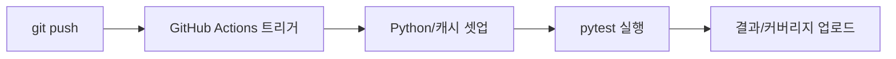

# CI에서 테스트 실행하기

> Testing 101 시리즈 (9/10)

<!-- a-grade-intro:begin -->

**핵심 질문**: 테스트가 *내 노트북에서만* 통과한다면, 그것은 *통과한 것*일까요?

> CI는 *모든 커밋에 같은 잣대* 를 들이댑니다. *팀 전체의 안전망* 입니다.

<!-- a-grade-intro:end -->

## 이 글에서 배울 것

- *CI(지속적 통합)* 의 정의와 목적
- *GitHub Actions* 워크플로우의 기본 구조
- *매트릭스* 빌드와 *캐시* 로 속도 올리기
- 테스트 *병렬화* 와 *결과 아티팩트*
- 흔한 함정 5가지

## 왜 중요한가

로컬 환경은 *사람마다 다릅니다*. *CI* 는 *동일한 컨테이너* 에서 *모든 PR* 을 검증합니다. *깨진 코드를 메인에 들여보내지 않는* 마지막 문 입니다.

> CI 없는 테스트는 *우연히 통과한 테스트* 입니다.

## 개념 한눈에 보기



## 핵심 용어 정리

- **CI**: *Continuous Integration*. 모든 커밋을 *자동 검증*.
- **Workflow**: GitHub Actions의 *YAML 정의 파일*.
- **Matrix**: 여러 *Python 버전/OS* 를 *동시에* 돌리는 설정.
- **Cache**: 의존성 설치를 *재사용* 해 속도 향상.
- **Artifact**: CI 실행이 *남기는 파일* (로그, 리포트).

## Before/After

**Before (수동 테스트)**

```text
- 개발자가 *자기 노트북* 에서만 pytest 실행
- 깜빡하면 *실패한 채로 머지*
```

**After (CI 자동화)**

```yaml
on: [push, pull_request]
jobs:
  test:
    runs-on: ubuntu-latest
    steps:
      - uses: actions/checkout@v4
      - uses: actions/setup-python@v5
        with: { python-version: '3.12' }
      - run: pip install -r requirements.txt
      - run: pytest -v
```

## 실습: CI 구축 5단계

### 1단계 — 워크플로우 파일 만들기

```bash
mkdir -p .github/workflows
touch .github/workflows/test.yml
```

### 2단계 — 매트릭스로 다중 버전 테스트

```yaml
strategy:
  matrix:
    python-version: ["3.11", "3.12"]
steps:
  - uses: actions/setup-python@v5
    with: { python-version: ${{ matrix.python-version }} }
```

### 3단계 — 의존성 캐싱

```yaml
- uses: actions/setup-python@v5
  with:
    python-version: ${{ matrix.python-version }}
    cache: 'pip'           # requirements.txt 자동 감지
- run: pip install -r requirements.txt
```

### 4단계 — 병렬 실행으로 속도 올리기

```bash
pip install pytest-xdist
pytest -n auto             # CPU 수만큼 병렬
```

### 5단계 — 커버리지 아티팩트 업로드

```yaml
- run: pytest --cov=src --cov-report=html
- uses: actions/upload-artifact@v4
  with:
    name: coverage-html
    path: htmlcov/
```

## 이 코드에서 주목할 점

- *trigger* 는 보통 `push`와 `pull_request` *둘 다* 둡니다.
- 캐시 키는 *requirements 해시* 로 자동 관리됩니다.
- 매트릭스는 *조합 폭발* 에 주의. 보통 *2-3개 버전* 이면 충분합니다.

## 자주 하는 실수 5가지

1. **CI에서만 *플레이키* 한 테스트.** 보통 *순서 의존* 또는 *외부 자원* 문제.
2. **모든 PR마다 *전체 E2E* 실행.** *unit -> integration -> E2E* 단계로 나누세요.
3. **캐시를 *키 없이* 쓰면 *낡은 의존성* 으로 통과.** 항상 *해시 기반 키* 사용.
4. **시크릿을 *로그에 출력*.** 절대 `echo $SECRET` 금지.
5. **빌드 시간이 *10분 초과* 인데 방치.** 병렬화/캐싱으로 *5분 이내* 를 목표.

## 실무에서는 이렇게 쓰입니다

대규모 팀은 *unit job* (1-2분), *integration job* (5분), *E2E job* (15분, nightly) 으로 *분리* 합니다. PR에는 *unit과 integration* 만 강제하고 *E2E* 는 머지 후 야간에 돌립니다.

## 시니어 엔지니어는 이렇게 생각합니다

- *PR이 빨간 채로* 머지되면 *시스템 실패* 다.
- CI 시간은 *개발 속도* 와 직결된다. *5분 룰* 을 지킨다.
- *플레이키 테스트* 는 *즉시 격리* 하고 수리한다.
- *시크릿* 은 *환경별로 분리* 한다.
- *배지* 는 *README의 첫 신호* 다.

## 체크리스트

- [ ] `.github/workflows/test.yml` 이 *존재* 한다.
- [ ] *매트릭스* 로 최소 *2개 Python 버전* 을 돌린다.
- [ ] *의존성 캐시* 가 켜져 있다.
- [ ] *PR이 빨간 채로* 머지되지 않는다.

## 연습 문제

1. 본인 프로젝트에 *test.yml* 워크플로우를 추가해 첫 *그린 빌드* 를 만드세요.
2. 매트릭스에 *Python 3.11, 3.12* 를 추가하세요.
3. *pytest-xdist* 를 도입해 실행 시간을 *측정/비교* 하세요.

## 정리 및 다음 단계

CI는 *팀 전체의 안전망* 입니다. 다음 글에서는 지금까지 배운 모든 테스트를 묶어 *전략* 을 세웁니다.

<!-- toc:begin -->
- [테스트란 무엇인가?](./01-what-is-testing.md)
- [단위 테스트](./02-unit-test.md)
- [통합 테스트](./03-integration-test.md)
- [E2E 테스트](./04-e2e-test.md)
- [테스트 더블](./05-test-double.md)
- [Mock과 Stub](./06-mock-and-stub.md)
- [테스트 커버리지](./07-test-coverage.md)
- [회귀 테스트](./08-regression-test.md)
- **CI에서 테스트 실행하기 (현재 글)**
- 테스트 전략 세우기 (예정)
<!-- toc:end -->

## 참고 자료

- [GitHub Actions 공식 문서](https://docs.github.com/en/actions)
- [pytest-xdist](https://pytest-xdist.readthedocs.io/)
- [Martin Fowler — Continuous Integration](https://martinfowler.com/articles/continuousIntegration.html)
- [Google Testing Blog — Flaky Tests](https://testing.googleblog.com/2016/05/flaky-tests-at-google-and-how-we.html)

Tags: Testing, CI, GitHub Actions, Automation, Quality
