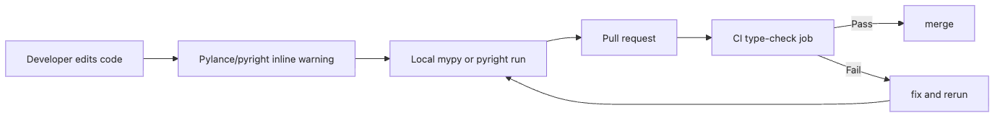

# Using mypy and pyright

Writing type hints is only the first half of the job. Until a checker runs, a wrong return type and a missing `None` check are still just one merge away from production.

This is post 8 in the Type Hints in Python 101 series. In this article, we will turn type hints into an actual engineering gate with mypy and pyright, then walk through the repository-scale rollout patterns that keep teams from drowning in hundreds of new errors.

## What You Will Learn

- Differences between mypy and pyright and how to choose
- Installing and configuring mypy for your project
- Strict mode and gradual adoption strategies
- Integrating type checking into CI pipelines

## Why It Matters

Type hints without verification are comments with extra syntax. A function signature might say `-> str` but return `None` — and nobody notices until production. Static analysis tools close this gap by catching type errors at development time, before tests, before code review, before deployment.

> Type checking = bugs caught before your code runs.

mypy and pyright are the two most widely used type checkers for Python.

## Concept at a Glance

> Static type checkers analyze source code without executing it. They read type hints and report mismatches.

```text
Source code (.py)
     │
     ├─── mypy ──── type error report
     │
     └─── pyright ── type error report
              │
         VS Code real-time display
```



*Type-check feedback loop from local editing to the CI gate*

## Key Concepts

| Term | Description |
| --- | --- |
| mypy | The official Python type checker, maintained by the mypy team |
| pyright | A fast type checker by Microsoft, built into Pylance for VS Code |
| strict mode | Configuration that requires type hints on all functions |
| stub file | A `.pyi` file providing type information for untyped libraries |
| type: ignore | A comment that suppresses a type error on a specific line |

## Before / After

**Before — No type checking:**

```python
def get_user_name(user_id: int) -> str:
    return None  # No error until runtime


name = get_user_name(1)
print(name.upper())  # AttributeError: NoneType
```

**After — mypy catches it:**

```python
def get_user_name(user_id: int) -> str:
    return None  # mypy: error: Incompatible return value type
    # (got "None", expected "str")
```

## Hands-On Steps

### Step 1: Install and Run mypy

```bash
pip install mypy
mypy app.py
```

```python
# app.py
def greet(name: str) -> str:
    return "Hello, " + name


greet(42)  # mypy: error: Argument 1 has incompatible type "int"
```

mypy works on files or directories. `mypy .` checks the entire project.

### Step 2: Configure mypy in pyproject.toml

```toml
# pyproject.toml
[tool.mypy]
python_version = "3.11"
warn_return_any = true
warn_unused_configs = true
disallow_untyped_defs = true
check_untyped_defs = true

[[tool.mypy.overrides]]
module = "tests.*"
disallow_untyped_defs = false
```

Key options:

- `disallow_untyped_defs`: flags functions without type hints as errors
- `warn_return_any`: warns when a function returns Any
- `overrides`: per-module configuration overrides

### Step 3: Install and Configure pyright

```bash
pip install pyright
pyright app.py
```

```json
// pyrightconfig.json
{
    "pythonVersion": "3.11",
    "typeCheckingMode": "basic",
    "reportMissingImports": true,
    "reportMissingTypeStubs": false,
    "include": ["src"],
    "exclude": ["tests"]
}
```

pyright is built into VS Code's Pylance extension, providing real-time type feedback in the editor.

### Step 4: Gradual Adoption Strategy

```toml
# Phase 1: Basic checking
[tool.mypy]
check_untyped_defs = true

# Phase 2: Require types on new code
# disallow_untyped_defs = true

# Phase 3: Full strict mode
# strict = true
```

For existing projects, applying strict mode all at once can produce hundreds of errors. Adopt incrementally, module by module:

```toml
# Strict for core modules
[[tool.mypy.overrides]]
module = "src.core.*"
strict = true

# Ignore legacy modules
[[tool.mypy.overrides]]
module = "src.legacy.*"
ignore_errors = true
```

### Step 5: CI Pipeline Integration

```yaml
# .github/workflows/type-check.yml
name: Type Check

on: [push, pull_request]

jobs:
  mypy:
    runs-on: ubuntu-latest
    steps:
      - uses: actions/checkout@v4
      - uses: actions/setup-python@v5
        with:
          python-version: "3.11"
      - run: pip install -r requirements.txt
      - run: pip install mypy
      - run: mypy src/
```

Adding type checking to CI prevents type errors from being merged into the main branch.

### Step 6: Ratchet Strictness One Directory at a Time

The most common migration failure is enabling strict mode for the entire repository in one shot. The error count spikes, the team loses trust, and type checking becomes "that thing we will clean up later." A better pattern is to measure the current baseline, then tighten one high-value directory at a time.

```bash
# Measure the current state
mypy src/

# Inspect only the modules you want to harden next
mypy src/core src/api
```

```toml
[tool.mypy]
python_version = "3.11"
check_untyped_defs = true

[[tool.mypy.overrides]]
module = "src.core.*"
strict = true

[[tool.mypy.overrides]]
module = "src.integrations.*"
disallow_any_generics = true

[[tool.mypy.overrides]]
module = "src.legacy.*"
ignore_errors = true
```

The important part is governance, not just config. `legacy` should be a temporary quarantine zone, not a permanent hiding place. Teams that succeed revisit which package graduates to strict next instead of leaving the rollout frozen for months.

### Step 7: Quarantine `type: ignore` and Record Why

Some ignores are legitimate: a third-party package has no stubs yet, a plugin uses dynamic metaprogramming, or a framework pattern defeats the checker. The mistake is leaving bare `type: ignore` comments with no explanation.

```python
from third_party_sdk import build_client


client = build_client()  # type: ignore[no-untyped-call]  # SDK v2 has no stubs yet
```

Treat these as debt items with metadata.

- Include the error code so the suppression scope is explicit.
- Note the reason in the code review or PR body.
- Keep `warn_unused_ignores = true` enabled so stale ignores do not accumulate silently.

### Step 8: Triage False Positives in a Fixed Order

When a checker reports something suspicious, do not jump straight to suppression. The safest order is:

1. Confirm whether it is a real bug.
2. Check whether the signature is too broad (`Any`, `object`, oversized Union).
3. Verify whether missing stubs or a version mismatch caused the noise.
4. Only then add the narrowest possible ignore.

When mypy and pyright disagree, the operational question is not "which tool is philosophically correct?" It is "which tool is our merge gate?" Pick one standard for CI, then use the other as editor support if it still adds value.

## What to Notice in This Code

- mypy uses `pyproject.toml`; pyright uses `pyrightconfig.json`
- Strict mode is adopted gradually, module by module
- CI integration enforces type checking across the entire team
- `type: ignore` is a last resort, not a first option

## 5 Common Mistakes

| Mistake | Problem | Fix |
| --- | --- | --- |
| Overusing `type: ignore` | Defeats the purpose of type checking | Fix the root cause; use ignore minimally |
| Missing stub packages | Errors on third-party imports | Install `types-requests`, etc. |
| Strict mode all at once | Hundreds of errors overwhelm the team | Adopt per-module over time |
| Ignoring mypy cache | Slow runs on large projects | Keep `.mypy_cache/` in `.gitignore` but do not delete it |
| Running both mypy and pyright as gates | Tools disagree on edge cases | Pick one as the CI standard |

## Real-World Applications

- CI/CD pipelines with mypy as a required gate blocking PRs with type errors
- VS Code + Pylance (pyright) for real-time type feedback during development
- pre-commit hooks running mypy before every commit
- Monorepos with per-module strict levels for gradual migration
- Custom stub files for internal C extensions without type information

## How Senior Engineers Think About This

Senior engineers treat type checking as infrastructure, not a nice-to-have. It sits alongside tests, linting, and formatting as a non-negotiable CI gate. New projects start with strict mode on day one. Existing projects adopt it gradually, with new code held to a higher standard than legacy code.

Tool choice matters less than consistency. mypy and pyright occasionally disagree on edge cases. Requiring both to pass creates unnecessary friction. Pick one as the team standard, configure it in CI, and use the other as a supplementary editor tool.

## Checklist

- [ ] Installed mypy or pyright and verified it runs
- [ ] Added configuration to pyproject.toml or pyrightconfig.json
- [ ] Established a gradual adoption strategy
- [ ] Added type checking to the CI pipeline
- [ ] Minimized `type: ignore` usage

## Exercises

1. Create a Python file with three intentional type errors. Run mypy, observe the error messages, and fix each one.

2. Configure `pyproject.toml` with strict mode for `src/` and relaxed rules for `tests/`. Verify that mypy applies different rules to each.

3. Write a GitHub Actions workflow that runs mypy on push and pull request events.

## Summary and Next Steps

mypy and pyright verify type hints statically, catching errors before runtime. Configure them in `pyproject.toml` or `pyrightconfig.json`, adopt strict mode gradually, and integrate into CI to enforce team-wide type safety. Pick one tool as the standard and use `type: ignore` sparingly.

In the next article, we will explore Pydantic — a library that uses type hints for runtime data validation.

<!-- toc:begin -->
- [What Are Python Type Hints?](./01-what-is-type-hint.md)
- [Basic Types and Collection Types](./02-basic-and-collection-types.md)
- [Optional and Union](./03-optional-and-union.md)
- [Function Type Hints](./04-function-type-hints.md)
- [TypedDict and dataclass](./05-typeddict-and-dataclass.md)
- [Protocol and Structural Typing](./06-protocol-and-structural-typing.md)
- [Understanding Generics](./07-generic.md)
- **Using mypy and pyright (current)**
- [Pydantic and Type Hints](./09-pydantic-and-type-hints.md)
- [Type Hint Best Practices](./10-type-hints-best-practices.md)
<!-- toc:end -->

## References

- [mypy documentation](https://mypy.readthedocs.io/en/stable/)
- [pyright documentation](https://github.com/microsoft/pyright)
- [mypy configuration reference](https://mypy.readthedocs.io/en/stable/config_file.html)
- [mypy docs — Using mypy with an existing codebase](https://mypy.readthedocs.io/en/stable/existing_code.html)
- [mypy docs — Error codes and ignores](https://mypy.readthedocs.io/en/stable/error_codes.html)
- [Real Python — Python Type Checking](https://realpython.com/python-type-checking/)

Tags: Python, Type Hints, mypy, pyright, Static Analysis, CI
