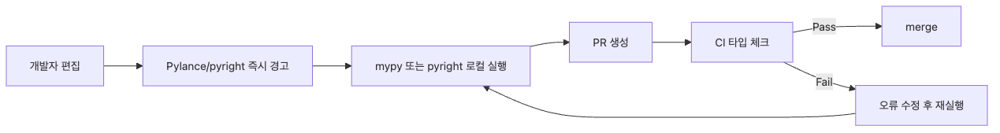

# mypy와 pyright 사용하기

타입 힌트를 붙였는데도 실제로 검사기를 돌리지 않으면 계약은 문서에만 머뭅니다. 특히 반환 타입이 어긋나거나 `None` 처리가 빠진 코드는 실행 전까지 조용히 숨어 있다가, 배포 뒤에야 문제를 드러내기 쉽습니다.

이 글은 Type Hints (Python) 101 시리즈의 8번째 글입니다. 여기서는 하나의 작은 예제 저장소를 기준으로 mypy와 pyright가 같은 오류를 어떻게 잡는지, 설정을 어떻게 점진적으로 강화하는지, 마지막으로 CI 게이트까지 어떻게 연결하는지를 순서대로 정리합니다.

## 이 글에서 다룰 문제

- 타입 힌트를 코드 실행 없이 어떻게 검증할까요?
- mypy와 pyright는 같은 코드에서 어떤 식으로 오류를 보여 줄까요?
- strict 모드는 기존 저장소에 어떻게 점진적으로 도입할까요?
- 타입 검사를 팀 공통 규칙으로 만들려면 CI를 어디까지 연결해야 할까요?

> 타입 힌트의 실전 가치는 "좋은 주석"이 아니라 "실패하는 검사"에서 생깁니다.

## 왜 이 주제가 중요한가

Python 인터프리터는 타입 힌트를 강제하지 않습니다. 즉, `-> str`이라고 적어도 실제 구현이 `None`을 돌려주면 런타임까지 조용히 지나갈 수 있습니다. 이 간극을 메우는 도구가 mypy와 pyright입니다.

둘 다 소스 코드를 실행하지 않고 읽으면서 타입 불일치를 찾지만, 운영 관점에서는 더 중요한 질문이 있습니다. "어떤 예제 코드에서 어떤 오류가 나고, 그 코드를 어떻게 고치며, 그 검사를 어떻게 CI까지 연결할 것인가?" 이 글은 그 질문에 답하도록 하나의 흐름으로 설명합니다.



*로컬 편집에서 CI 차단까지 이어지는 타입 검사 피드백 루프*

## 핵심 용어

| 용어 | 설명 |
| --- | --- |
| mypy | Python 생태계에서 가장 널리 쓰이는 정적 타입 검사기입니다 |
| pyright | Microsoft가 만든 빠른 타입 검사기이며 Pylance의 기반입니다 |
| strict mode | 타입 힌트 누락과 느슨한 추론을 더 적극적으로 오류로 보는 설정입니다 |
| override | 특정 패키지나 디렉터리에만 다른 검사 규칙을 적용하는 설정입니다 |
| CI gate | 검사 실패 시 PR 병합을 막는 자동화 단계입니다 |

## 바꾸기 전과 후

```python
def normalize_user_id(raw_user_id: str) -> int:
    return raw_user_id


def build_greeting(name: str | None) -> str:
    return "Hello, " + name.upper()
```

```text
$ mypy src
src/accounts.py:5: error: Incompatible return value type (got "str", expected "int")
src/accounts.py:9: error: Item "None" of "str | None" has no attribute "upper"
Found 2 errors in 1 file (checked 1 source file)
```

타입 힌트만 적어 둔 상태에서는 조용했던 코드가, 검사기를 붙이는 순간 배포 전에 실패하기 시작합니다. 이 실패가 바로 품질 게이트입니다.

## 하나의 예제 저장소로 끝까지 따라가기

이 글 전체에서는 아래 구조를 같은 예제로 사용합니다.

```text
typecheck-demo/
├── pyproject.toml
├── pyrightconfig.json
├── src/
│   └── accounts.py
└── .github/
    └── workflows/
        └── type-check.yml
```

### 1단계: 일부러 타입 오류를 넣은 코드 준비하기

```python
# src/accounts.py
from typing import TypedDict


class UserRow(TypedDict):
    id: int
    email: str
    display_name: str | None


def normalize_user_id(raw_user_id: str) -> int:
    return raw_user_id


def build_greeting(user: UserRow) -> str:
    return "Hello, " + user["display_name"].upper()


def list_admin_emails(rows: list[UserRow]) -> list[str]:
    return [row["email"] for row in rows if row["id"] in {1, 2, 3}]
```

의도적으로 넣어 둔 오류는 두 가지입니다.

- `normalize_user_id()`는 `int`를 약속했지만 `str`을 그대로 반환합니다.
- `build_greeting()`은 `display_name`이 `None`일 수 있는데 바로 `.upper()`를 호출합니다.

### 2단계: 같은 코드에 mypy를 실행해 실제 실패를 확인하기

```bash
python -m pip install mypy
mypy src
```

```text
src/accounts.py:10: error: Incompatible return value type (got "str", expected "int")  [return-value]
src/accounts.py:14: error: Item "None" of "str | None" has no attribute "upper"  [union-attr]
Found 2 errors in 1 file (checked 1 source file)
```

mypy는 반환 타입 오류와 `None` 가능성 누락을 바로 분리해서 보여 줍니다. 이 단계의 장점은 "무엇이 틀렸는지"를 코드 리뷰 전에 명확하게 확인할 수 있다는 점입니다.

### 3단계: 같은 코드에 pyright를 실행해 두 번째 관점을 얻기

```bash
python -m pip install pyright
pyright src
```

```text
/Users/username/typecheck-demo/src/accounts.py
  /Users/username/typecheck-demo/src/accounts.py:10:12 - error: Type "str" is not assignable to return type "int"
    "str" is not assignable to "int" (reportReturnType)
  /Users/username/typecheck-demo/src/accounts.py:14:38 - error: "upper" is not a known attribute of "None" (reportOptionalMemberAccess)
2 errors, 0 warnings, 0 informations
```

pyright도 같은 두 문제를 잡지만, 에디터에서 바로 보이는 오류 코드와 메시지 구조가 다릅니다. 그래서 많은 팀이 **로컬 편집 단계에서는 pyright/Pylance**, **병합 게이트에서는 mypy** 같은 식으로 역할을 나눠 씁니다.

### 4단계: 코드를 고쳐 두 검사기가 모두 통과하게 만들기

```python
# src/accounts.py
from typing import TypedDict


class UserRow(TypedDict):
    id: int
    email: str
    display_name: str | None


def normalize_user_id(raw_user_id: str) -> int:
    return int(raw_user_id)


def build_greeting(user: UserRow) -> str:
    display_name = user["display_name"]
    if display_name is None:
        return "Hello, anonymous"
    return "Hello, " + display_name.upper()


def list_admin_emails(rows: list[UserRow]) -> list[str]:
    return [row["email"] for row in rows if row["id"] in {1, 2, 3}]
```

```text
$ mypy src
Success: no issues found in 1 source file

$ pyright src
0 errors, 0 warnings, 0 informations
```

이제야 타입 힌트가 문서가 아니라 **검증 가능한 계약**이 됩니다. 중요한 것은 설치 명령 자체가 아니라, 같은 코드가 실패했다가 수정 후 통과하는 흐름입니다.

### 5단계: 느슨한 기본 설정에서 시작하기

처음부터 저장소 전체에 strict를 켜기보다, 통과하는 기준선을 먼저 만드는 편이 현실적입니다.

```toml
# pyproject.toml
[tool.mypy]
python_version = "3.11"
files = ["src"]
check_untyped_defs = true
warn_return_any = true
warn_unused_ignores = true
```

```json
{
  "include": ["src"],
  "pythonVersion": "3.11",
  "typeCheckingMode": "basic",
  "reportMissingImports": true,
  "reportMissingTypeStubs": false
}
```

이 단계에서는 다음 두 가지를 먼저 확보합니다.

- 검사기가 항상 같은 디렉터리를 보게 합니다.
- 팀이 "지금부터는 이 코드가 통과 기준"이라는 공통 감각을 갖게 합니다.

### 6단계: 핵심 모듈만 먼저 더 엄격하게 만들기

기존 코드베이스에서 가장 흔한 실패는 저장소 전체 strict입니다. 더 안전한 방법은 핵심 모듈만 먼저 올리는 것입니다.

```toml
[tool.mypy]
python_version = "3.11"
files = ["src"]
check_untyped_defs = true
warn_return_any = true
warn_unused_ignores = true

[[tool.mypy.overrides]]
module = "src.accounts"
strict = true

[[tool.mypy.overrides]]
module = "src.legacy.*"
ignore_errors = true
```

```json
{
  "include": ["src"],
  "pythonVersion": "3.11",
  "typeCheckingMode": "basic",
  "strict": ["src/accounts.py"],
  "exclude": ["src/legacy"]
}
```

핵심은 "전체를 완벽하게"가 아니라 **새 코드와 중요한 경로부터 실패하게 만들기**입니다. 이렇게 해야 오류 수가 팀의 처리 용량을 넘지 않습니다.

### 7단계: CI 게이트로 연결해 로컬 실수를 병합 전에 막기

```yaml
# .github/workflows/type-check.yml
name: Type Check

on:
  pull_request:
  push:
    branches:
      - master

jobs:
  static-type-check:
    runs-on: ubuntu-latest
    steps:
      - uses: actions/checkout@v4
      - uses: actions/setup-python@v5
        with:
          python-version: "3.11"
      - name: Install checkers
        run: |
          python -m pip install --upgrade pip
          python -m pip install mypy pyright
      - name: Run mypy
        run: mypy src
      - name: Run pyright
        run: pyright src
```

이제 개발자가 로컬에서 한 번 놓친 타입 오류도 PR 단계에서 다시 걸립니다. 팀이 타입 힌트를 실제 규칙으로 운영하려면 이 단계가 빠지면 안 됩니다.

### 8단계: 운영 규칙을 정해 noise를 줄이기

실무에서는 검사기를 붙인 뒤 아래 규칙까지 정해야 마찰이 줄어듭니다.

1. **표준 병합 게이트를 하나 정합니다.** 예를 들어 PR 차단은 mypy, 에디터 피드백은 pyright처럼 역할을 나눕니다.
2. **`type: ignore`에는 이유를 남깁니다.** 스텁 부재인지, 도구 한계인지, 임시 예외인지 기록합니다.
3. **strict 후보 디렉터리를 주기적으로 다시 선정합니다.** `legacy`를 영구 면책 구역으로 두면 안 됩니다.

```python
from third_party_sdk import build_client


client = build_client()  # type: ignore[no-untyped-call]  # SDK v2에 타입 스텁이 아직 없음
```

## 여기서 먼저 봐야 할 점

- 설치 명령보다 중요한 것은 **같은 코드가 실패하고, 수정 후 통과하는 흐름**입니다.
- mypy와 pyright는 같은 버그를 다른 형식으로 보여 줄 수 있습니다.
- strict는 전체 저장소가 아니라 핵심 모듈부터 올리는 편이 현실적입니다.
- CI까지 연결해야 타입 힌트가 개인 습관이 아니라 팀 규칙이 됩니다.

## 자주 헷갈리는 지점

| 실수 | 왜 문제인가 | 권장 방식 |
| --- | --- | --- |
| 설치 명령만 문서화하고 실제 실패 예제를 안 보여 줌 | 독자가 "무엇이 검출되는지"를 확인하지 못합니다 | 같은 코드에서 오류 출력까지 보여 줍니다 |
| strict를 저장소 전체에 바로 적용함 | 오류 양이 팀 수용 범위를 넘습니다 | 핵심 디렉터리부터 override로 올립니다 |
| 두 도구를 모두 필수 게이트로 강제함 | 엣지 케이스 차이로 운영 비용이 커집니다 | 하나를 병합 기준, 하나를 보조 도구로 둡니다 |
| `type: ignore`에 이유를 남기지 않음 | 예외가 기술 부채로 굳습니다 | 오류 코드와 사유를 함께 적습니다 |
| 로컬 실행만 믿고 CI를 연결하지 않음 | 사람마다 검사 습관이 달라집니다 | PR과 push에서 자동 실행합니다 |

## 실무에서는 이렇게 연결됩니다

- VS Code + Pylance로 pyright 오류를 실시간 확인합니다.
- PR 게이트에서는 mypy 또는 pyright 중 하나를 표준으로 둡니다.
- 새 패키지나 핵심 패키지부터 strict를 적용합니다.
- 레거시 디렉터리는 일시적으로 완화하되, 분기마다 축소 계획을 잡습니다.

## 실무 판단 기준

경험 많은 개발자는 타입 검사를 "옵션 기능"이 아니라 테스트, 린트와 같은 기본 인프라로 봅니다. 새 프로젝트라면 첫날부터 최소 설정과 CI 게이트를 붙이고, 기존 프로젝트라면 에러 개수를 팀이 감당할 수 있는 단위로 나눠 strict를 확장합니다.

도구 선택 자체보다 중요한 것은 일관성입니다. 어느 검사기가 merge gate인지, 어떤 디렉터리가 다음 strict 대상인지, ignore를 어떤 기준으로 허용할지까지 정해야 타입 힌트가 실제 운영 규칙이 됩니다.

## 체크리스트

- [ ] 하나의 예제 모듈에 mypy와 pyright를 모두 실행해 봤습니다
- [ ] 실제 오류 출력과 수정 후 통과 결과를 확인했습니다
- [ ] `pyproject.toml`과 `pyrightconfig.json`에 기준선을 만들었습니다
- [ ] strict 도입 대상을 모듈 단위로 정했습니다
- [ ] CI에서 타입 검사가 자동으로 실패하도록 연결했습니다

## 연습 문제

1. `src/` 아래에 반환 타입 오류와 `Optional` 처리 누락을 하나씩 넣고, mypy와 pyright가 각각 어떤 메시지를 내는지 비교해 보세요.

2. `src/core`만 strict로, `src/legacy`는 일시적으로 완화하는 설정을 직접 작성해 보세요.

3. PR에서는 mypy만 차단 게이트로 쓰고, pyright는 참고용 리포트로 두는 운영 정책을 팀 문서에 써 보세요.

## 정리와 다음 글

mypy와 pyright는 타입 힌트를 실제 품질 게이트로 바꿔 주는 도구입니다. 하나의 예제 코드에서 실패와 성공을 모두 확인하고, 설정을 단계적으로 강화한 뒤, CI까지 연결해야 타입 힌트가 문서가 아니라 운영 규칙이 됩니다.

다음 글에서는 이 정적 검증 바깥에서, 들어오는 데이터를 런타임에 검사하는 Pydantic을 살펴보겠습니다.

<!-- toc:begin -->
- [Python type hint란 무엇인가?](./01-what-is-type-hint.md)
- [기본 타입과 collection 타입](./02-basic-and-collection-types.md)
- [Optional과 Union](./03-optional-and-union.md)
- [함수 타입 힌트](./04-function-type-hints.md)
- [TypedDict와 dataclass](./05-typeddict-and-dataclass.md)
- [Protocol과 structural typing](./06-protocol-and-structural-typing.md)
- [Generic 이해하기](./07-generic.md)
- **mypy와 pyright 사용하기 (현재 글)**
- [Pydantic과 타입 힌트](./09-pydantic-and-type-hints.md)
- [타입 힌트를 잘 쓰는 기준](./10-type-hints-best-practices.md)
<!-- toc:end -->

## 참고 자료

- [mypy 공식 문서](https://mypy.readthedocs.io/en/stable/)
- [pyright 공식 문서](https://github.com/microsoft/pyright)
- [mypy 설정 레퍼런스](https://mypy.readthedocs.io/en/stable/config_file.html)
- [mypy 문서 — 기존 코드베이스에 도입하기](https://mypy.readthedocs.io/en/stable/existing_code.html)
- [pyright 설정 문서](https://microsoft.github.io/pyright/#/configuration)
- [Real Python — Python Type Checking](https://realpython.com/python-type-checking/)

Tags: Python, Type Hints, mypy, pyright, 정적 분석, CI
