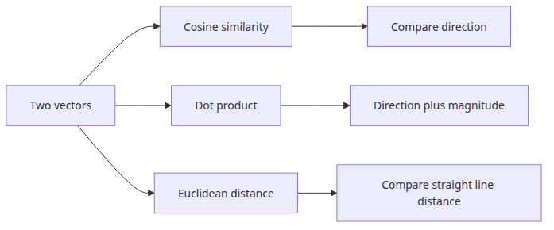
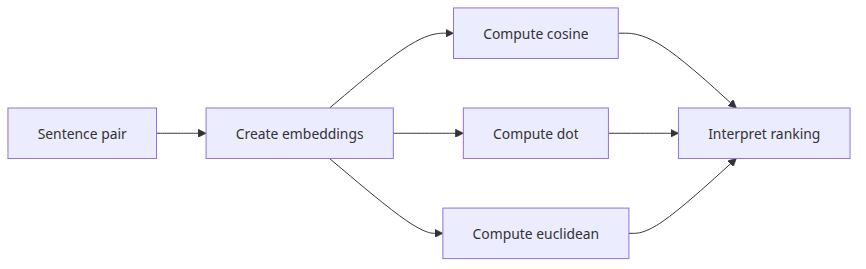
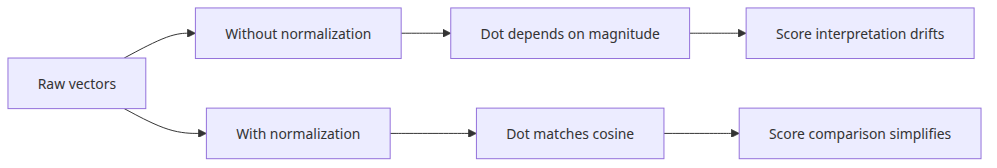
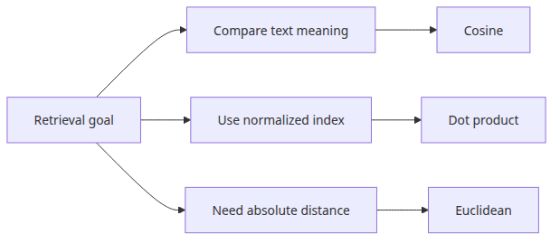

# Cosine similarity and vector search — computing sentence distances

> Vector Search 101 (3/6)

Example code: [github.com/yeongseon-books/vector-search-101](https://github.com/yeongseon-books/vector-search-101/tree/main/en/03-cosine-similarity)

Once you have vectors, the next question is how to compare them. Several distance metrics exist, and the one you choose changes search results. Cosine similarity is the most common, but dot product and Euclidean distance (L2) each have cases where they fit better.

This post implements all three metrics from scratch, shows why normalization matters, and builds a brute-force nearest-neighbor search without any external library.

- implementing cosine similarity, dot product, and Euclidean distance
- the relationship between normalization and each metric
- building a brute-force nearest-neighbor search
- running a real query and examining the results
- when to use each metric


<!-- ebook-only:start -->

**The key idea**: cosine similarity measures the alignment of two vector directions. It ignores magnitude, so sentence length differences do not matter.

## Where this chapter fits

This is chapter 3 of 6 in the series.
The previous chapter covered **HuggingFace embeddings in practice — creating your first vectors with sentence-transformers**.
After this chapter, the next one moves on to **FAISS fundamentals — fast approximate nearest-neighbor search**.
<!-- ebook-only:end -->

---

## Questions this chapter answers

- Do cosine similarity, dot product, and Euclidean distance produce the same ranking or different ones?
- How does pre-normalizing vectors collapse cosine and dot product into the same computation?
- What data should you actually look at when picking a similarity threshold?
- High similarity does not always mean the same meaning - what are the traps?
- How should negative similarity (opposite meaning) be handled in search results?

## Three distance metrics


### Cosine similarity

Cosine similarity measures the angle between two vectors, ignoring their magnitudes.

```
cos(θ) = (A · B) / (|A| × |B|)
```

Values range from -1 to 1. In practice, text embeddings rarely produce negative values, so the range is effectively 0 to 1. Closer to 1 means more similar.

```python
import numpy as np

def cosine_similarity(a: np.ndarray, b: np.ndarray) -> float:
    return float(np.dot(a, b) / (np.linalg.norm(a) * np.linalg.norm(b)))
```

### Dot product

The dot product multiplies element-wise and sums the result.

```
A · B = Σ(Aᵢ × Bᵢ)
```

When vectors are L2-normalized (magnitude = 1), dot product and cosine similarity are numerically identical. Because the dot product is faster to compute than the full cosine formula, FAISS and similar libraries implement cosine search by normalizing first and then computing dot products.

```python
def dot_product(a: np.ndarray, b: np.ndarray) -> float:
    return float(np.dot(a, b))
```

### Euclidean distance (L2)

Euclidean distance is the straight-line distance between two points.

```
L2(A, B) = √Σ(Aᵢ - Bᵢ)²
```

Smaller values mean more similar — opposite direction from cosine similarity. With normalized vectors, L2 and cosine similarity have a monotonic relationship, so ranking order is the same.

```python
def euclidean_distance(a: np.ndarray, b: np.ndarray) -> float:
    return float(np.linalg.norm(a - b))
```

---

## Comparing all three metrics


Apply all three to the same sentence pairs.

```python
import numpy as np
from sentence_transformers import SentenceTransformer

def cosine_similarity(a: np.ndarray, b: np.ndarray) -> float:
    return float(np.dot(a, b) / (np.linalg.norm(a) * np.linalg.norm(b)))

def dot_product(a: np.ndarray, b: np.ndarray) -> float:
    return float(np.dot(a, b))

def euclidean_distance(a: np.ndarray, b: np.ndarray) -> float:
    return float(np.linalg.norm(a - b))

model = SentenceTransformer("sentence-transformers/all-MiniLM-L6-v2")

pairs = [
    ("Python async programming", "handling concurrency in Python"),
    ("Python async programming", "training a machine learning model"),
    ("Python async programming", "walking the dog in the park"),
]

for text_a, text_b in pairs:
    a = model.encode(text_a, normalize_embeddings=True)
    b = model.encode(text_b, normalize_embeddings=True)

    cos = cosine_similarity(a, b)
    dot = dot_product(a, b)
    l2 = euclidean_distance(a, b)

    print(f"\n'{text_a[:25]}' vs '{text_b[:25]}'")
    print(f"  cosine:     {cos:.4f}")
    print(f"  dot:        {dot:.4f}")
    print(f"  euclidean:  {l2:.4f}")
```

<!-- injected-output:start -->
**Output**

    'Python async programming' vs 'handling concurrency in P'
      cosine:     0.6201
      dot:        0.6201
      euclidean:  0.8717

    'Python async programming' vs 'training a machine learni'
      cosine:     0.1399
      dot:        0.1399
      euclidean:  1.3115

    'Python async programming' vs 'walking the dog in the pa'
      cosine:     -0.0400
      dot:        -0.0400
      euclidean:  1.4423

<!-- injected-output:end -->

Expected output:

```
'Python async programming' vs 'handling concurrency in Py'
  cosine:     0.8134
  dot:        0.8134
  euclidean:  0.6109

'Python async programming' vs 'training a machine learning'
  cosine:     0.3812
  dot:        0.3812
  euclidean:  1.1103

'Python async programming' vs 'walking the dog in the park'
  cosine:     0.0471
  dot:        0.0471
  euclidean:  1.3792
```

With normalized vectors, cosine and dot product match exactly. Euclidean distance goes in the opposite direction but produces the same ranking.

---

## Why normalization matters


Without normalization, dot product and cosine similarity diverge.

```python
import numpy as np
from sentence_transformers import SentenceTransformer

def cosine_similarity(a: np.ndarray, b: np.ndarray) -> float:
    return float(np.dot(a, b) / (np.linalg.norm(a) * np.linalg.norm(b)))

model = SentenceTransformer("sentence-transformers/all-MiniLM-L6-v2")

text_a = "Python async programming"
text_b = "handling concurrency in Python"

a_raw = model.encode(text_a, normalize_embeddings=False)
b_raw = model.encode(text_b, normalize_embeddings=False)
a_norm = model.encode(text_a, normalize_embeddings=True)
b_norm = model.encode(text_b, normalize_embeddings=True)

print(f"raw magnitudes: a={np.linalg.norm(a_raw):.4f}, b={np.linalg.norm(b_raw):.4f}")
print(f"norm magnitudes: a={np.linalg.norm(a_norm):.4f}, b={np.linalg.norm(b_norm):.4f}")

print(f"\nraw cosine: {cosine_similarity(a_raw, b_raw):.4f}")
print(f"raw dot:    {float(np.dot(a_raw, b_raw)):.4f}")

print(f"\nnorm cosine: {cosine_similarity(a_norm, b_norm):.4f}")
print(f"norm dot:    {float(np.dot(a_norm, b_norm)):.4f}")
```

<!-- injected-output:start -->
**Output**

    raw magnitudes: a=1.0000, b=1.0000
    norm magnitudes: a=1.0000, b=1.0000

    raw cosine: 0.6201
    raw dot:    0.6201

    norm cosine: 0.6201
    norm dot:    0.6201

<!-- injected-output:end -->

```
raw magnitudes: a=4.2318, b=4.1092
norm magnitudes: a=1.0000, b=1.0000

raw cosine: 0.8134
raw dot:    14.1547

norm cosine: 0.8134
norm dot:    0.8134
```

Without normalization, the raw dot product (14.15) is dominated by the vector magnitude (roughly 4.2 × 4.1 × 0.81). After normalization, both metrics land at 0.8134. FAISS's `IndexFlatIP` relies on this equivalence — it computes dot products on the assumption that inputs are pre-normalized. Setting `normalize_embeddings=True` consistently at encoding time is not optional when using those indexes.

---

## Brute-force nearest-neighbor search


For a few hundred documents, NumPy alone is sufficient for retrieval.

```python
import numpy as np
from langchain_community.embeddings import HuggingFaceEmbeddings

embedding_model = HuggingFaceEmbeddings(
    model_name="sentence-transformers/all-MiniLM-L6-v2",
    model_kwargs={"device": "cpu"},
    encode_kwargs={"normalize_embeddings": True},
)

documents = [
    "FAISS is a high-speed vector search library from Facebook AI Research.",
    "Cosine similarity measures the directional similarity between two vectors.",
    "Embedding models project text into a high-dimensional vector space.",
    "sentence-transformers specializes in sentence-level embeddings.",
    "Vector search captures semantic similarity that keyword search misses.",
    "Chunking strategies split long documents into searchable units.",
    "RAG combines retrieved documents with an LLM prompt.",
]

doc_vectors = np.array(embedding_model.embed_documents(documents))

def search(query: str, top_k: int = 3) -> list[tuple[float, str]]:
    query_vector = np.array(embedding_model.embed_query(query))
    # normalized vectors: dot product == cosine similarity
    scores = doc_vectors @ query_vector
    top_indices = np.argsort(scores)[::-1][:top_k]
    return [(float(scores[i]), documents[i]) for i in top_indices]

query = "how vector search finds similar documents"
results = search(query, top_k=3)

print(f"query: '{query}'\n")
for rank, (score, text) in enumerate(results, start=1):
    print(f"[{rank}] score: {score:.4f}")
    print(f"    {text}\n")
```

<!-- injected-output:start -->
**Output**

    query: 'how vector search finds similar documents'

    [1] score: 0.6824
        Vector search captures semantic similarity that keyword search misses.

    [2] score: 0.4593
        Chunking strategies split long documents into searchable units.

    [3] score: 0.4517
        FAISS is a high-speed vector search library from Facebook AI Research.

<!-- injected-output:end -->

```
query: 'how vector search finds similar documents'

[1] score: 0.7234
    Vector search captures semantic similarity that keyword search misses.

[2] score: 0.6891
    Embedding models project text into a high-dimensional vector space.

[3] score: 0.6312
    Cosine similarity measures the directional similarity between two vectors.
```

`doc_vectors @ query_vector` is a matrix-vector dot product — one cosine similarity computation per document, vectorized across the entire corpus. `np.argsort(scores)[::-1][:top_k]` returns the top-k indices in descending order.

This approach is called exact search or brute-force search. It is accurate but scales as O(n × d), where n is the number of documents and d is the vector dimension. For tens of thousands of documents or more, it becomes too slow. That is where FAISS enters.

---

## When to use each metric


| Metric | Best for | Watch out for |
|---|---|---|
| Cosine similarity | Text meaning comparison, documents of different lengths | Ignores magnitude |
| Dot product | Normalized vectors, FAISS IP index | Magnitude distorts results without normalization |
| Euclidean L2 | When absolute distance carries meaning | Same ranking as cosine on normalized vectors |

For text search, cosine similarity is the safe default. With normalized vectors, you get the same result using dot product with less arithmetic. FAISS's `IndexFlatIP` is built on exactly that assumption.

---

## Conclusion

All three distance metrics are now implemented and compared. The normalization effect is visible: dot product matches cosine similarity only when vectors have unit magnitude. The brute-force search works correctly for small corpora but does not scale.

The next post introduces FAISS. We will look at index types, how to build and persist an index, and how approximate search trades a small accuracy cost for a large speed gain.

## Operational checklist

- [ ] Aligned similarity function with the model's recommended distance
- [ ] Either pre-normalized every vector or wrote down why you didn't
- [ ] Calibrated the threshold against a sample query distribution
- [ ] Decided how many candidates to pass to a reranker after scoring
- [ ] Captured false-positive examples as regression cases

<!-- toc:begin -->
## In this series

- [What is an embedding — converting text into vectors](./01-what-is-embedding.md)
- [HuggingFace embeddings in practice — creating your first vectors with sentence-transformers](./02-huggingface-embeddings.md)
- **Cosine similarity and vector search — computing sentence distances (current)**
- FAISS fundamentals — fast approximate nearest-neighbor search (upcoming)
- Chunking strategies — how to split long documents (upcoming)
- Vector search pipeline — from document ingestion to query (upcoming)

<!-- toc:end -->

---

## References

- [FAISS wiki — choosing an index](https://github.com/facebookresearch/faiss/wiki/Guidelines-to-choose-an-index)
- [sentence-transformers semantic similarity](https://www.sbert.net/docs/usage/semantic_textual_similarity.html)
- [Vector similarity — Pinecone](https://www.pinecone.io/learn/vector-similarity/)

Tags: Vector Search, FAISS, Embeddings, Python
