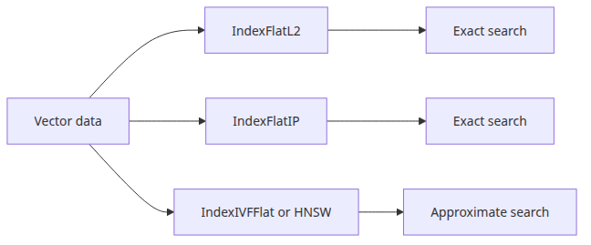
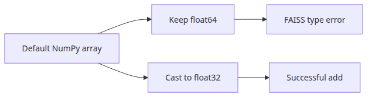

# FAISS fundamentals — fast approximate nearest-neighbor search

> Vector Search 101 (4/6)

Example code: [github.com/yeongseon-books/vector-search-101](https://github.com/yeongseon-books/vector-search-101/tree/main/en/04-faiss-fundamentals)

Once documents number in the thousands or tens of thousands, NumPy brute-force search slows down. Comparing a query against 100,000 vectors of dimension 384 requires 38.4 million multiplications per query. At that scale, search latency climbs into the hundreds of milliseconds or higher, which is too slow for interactive applications.

FAISS (Facebook AI Similarity Search) was built for this problem. It supports approximate nearest-neighbor (ANN) search that trades a small accuracy cost for a large speed gain. It handles billion-scale vector collections and runs fast on both CPU and GPU.

This post covers five things:

- installing FAISS and choosing an index type
- exact search with `IndexFlatL2` and `IndexFlatIP`
- saving an index to disk and reloading it
- running real queries against a small corpus
- how to choose between index types


<!-- ebook-only:start -->

**The key idea**: FAISS finds vectors fast. IndexFlatL2 is the simplest option; switch to IVF or HNSW when the dataset grows.

## Where this chapter fits

This is chapter 4 of 6 in the series.
The previous chapter covered **Cosine similarity and vector search — computing sentence distances**.
After this chapter, the next one moves on to **Chunking strategies — how to split long documents**.
<!-- ebook-only:end -->

---

## Questions this chapter answers

- When is each of FAISS IndexFlat, IVF, and HNSW the right pick?
- What is the accuracy/latency tradeoff between exact search and ANN?
- Which index types need training, and how do you train them?
- What gotchas appear when persisting and reloading a FAISS index?
- For which workloads does GPU FAISS beat CPU FAISS, and vice versa?

## Installation

CPU-only version:

```bash
pip install faiss-cpu sentence-transformers numpy
```

Replace `faiss-cpu` with `faiss-gpu` if a compatible GPU is available.

---

## Understanding index types


FAISS supports many index types, each with different speed-accuracy tradeoffs. Two are essential at the start.

**IndexFlatL2**: exact search using Euclidean distance. Compares every vector without skipping. Accuracy is 100%, but search time scales linearly with the number of vectors.

**IndexFlatIP**: exact search using inner product. With normalized vectors, inner product equals cosine similarity. Text retrieval typically uses this index with pre-normalized vectors.

Larger deployments use approximate indexes like `IndexIVFFlat` or `IndexHNSWFlat`. This post focuses on Flat indexes to establish the baseline pattern.

---

## Exact search with IndexFlatIP


The standard pattern for text retrieval: normalized vectors plus inner-product index.

```python
import json

import faiss
import numpy as np
from langchain_community.embeddings import HuggingFaceEmbeddings

embedding_model = HuggingFaceEmbeddings(
    model_name="sentence-transformers/all-MiniLM-L6-v2",
    model_kwargs={"device": "cpu"},
    encode_kwargs={"normalize_embeddings": True},
)

documents = [
    "FAISS is a high-speed vector search library from Facebook AI Research.",
    "Cosine similarity measures the directional similarity between two vectors.",
    "Embedding models project text into a high-dimensional vector space.",
    "sentence-transformers specializes in sentence-level embeddings.",
    "Vector search captures semantic similarity that keyword search misses.",
    "Chunking strategies split long documents into searchable units.",
    "RAG combines retrieved documents with an LLM prompt.",
    "HNSW indexes use graph-based approximate nearest-neighbor search.",
    "Higher embedding dimensions can capture more information.",
    "With normalized vectors, inner product equals cosine similarity.",
]

doc_vectors = np.array(embedding_model.embed_documents(documents), dtype=np.float32)
dimension = doc_vectors.shape[1]  # 384

index = faiss.IndexFlatIP(dimension)
index.add(doc_vectors)

print(f"total vectors in index: {index.ntotal}")
print(f"vector dimension: {dimension}")
```

<!-- injected-output:start -->
**Output**

    total vectors in index: 10
    vector dimension: 384

<!-- injected-output:end -->

```
total vectors in index: 10
vector dimension: 384
```

FAISS requires `float32` arrays. Without the explicit `dtype=np.float32` cast, NumPy defaults to `float64` and FAISS raises an error.

---

## Running queries


```python
def search(query: str, top_k: int = 3) -> list[tuple[float, str]]:
    query_vector = np.array(
        [embedding_model.embed_query(query)], dtype=np.float32
    )  # (1, 384) — FAISS expects a 2D array
    scores, indices = index.search(query_vector, top_k)
    results = []
    for score, idx in zip(scores[0], indices[0]):
        if idx != -1:  # -1 means no result found
            results.append((float(score), documents[idx]))
    return results

queries = [
    "how vector search finds similar content",
    "what embedding models do",
    "splitting documents into pieces",
]

for query in queries:
    print(f"\nquery: '{query}'")
    results = search(query, top_k=3)
    for rank, (score, text) in enumerate(results, start=1):
        print(f"  [{rank}] {score:.4f} — {text[:60]}")
```

<!-- injected-output:start -->
**Output**

    query: 'how vector search finds similar content'
      [1] 0.6746 — Vector search captures semantic similarity that keyword sear
      [2] 0.4981 — Cosine similarity measures the directional similarity betwee
      [3] 0.4782 — FAISS is a high-speed vector search library from Facebook AI

    query: 'what embedding models do'
      [1] 0.6641 — Higher embedding dimensions can capture more information.
      [2] 0.6437 — Embedding models project text into a high-dimensional vector
      [3] 0.4751 — sentence-transformers specializes in sentence-level embeddin

    query: 'splitting documents into pieces'
      [1] 0.7226 — Chunking strategies split long documents into searchable uni
      [2] 0.3137 — RAG combines retrieved documents with an LLM prompt.
      [3] 0.2652 — Embedding models project text into a high-dimensional vector

<!-- injected-output:end -->

```
query: 'how vector search finds similar content'
  [1] 0.7234 — Vector search captures semantic similarity that keyword...
  [2] 0.6891 — Embedding models project text into a high-dimensional...
  [3] 0.6312 — Cosine similarity measures the directional similarity...

query: 'what embedding models do'
  [1] 0.8012 — Embedding models project text into a high-dimensional...
  [2] 0.7213 — sentence-transformers specializes in sentence-level...
  [3] 0.6534 — Higher embedding dimensions can capture more information.

query: 'splitting documents into pieces'
  [1] 0.8234 — Chunking strategies split long documents into searchable...
  [2] 0.5123 — RAG combines retrieved documents with an LLM prompt.
  [3] 0.4891 — Vector search captures semantic similarity that keyword...
```

---

## Saving and reloading the index

Persisting the index avoids re-embedding documents on every startup.

```python
import json

import faiss
import numpy as np
from langchain_community.embeddings import HuggingFaceEmbeddings

embedding_model = HuggingFaceEmbeddings(
    model_name="sentence-transformers/all-MiniLM-L6-v2",
    model_kwargs={"device": "cpu"},
    encode_kwargs={"normalize_embeddings": True},
)

documents = [
    "FAISS is a high-speed vector search library from Facebook AI Research.",
    "Cosine similarity measures the directional similarity between two vectors.",
    "Embedding models project text into a high-dimensional vector space.",
]

doc_vectors = np.array(embedding_model.embed_documents(documents), dtype=np.float32)
dimension = doc_vectors.shape[1]

index = faiss.IndexFlatIP(dimension)
index.add(doc_vectors)

# save
faiss.write_index(index, "faiss.index")
with open("documents.json", "w") as f:
    json.dump(documents, f, indent=2)

print(f"saved: {index.ntotal} vectors")

# reload
loaded_index = faiss.read_index("faiss.index")
with open("documents.json") as f:
    loaded_documents = json.load(f)

print(f"reloaded: {loaded_index.ntotal} vectors")

# verify with a query
query_vector = np.array(
    [embedding_model.embed_query("vector search speed")], dtype=np.float32
)
scores, indices = loaded_index.search(query_vector, 2)

print("\nresults:")
for score, idx in zip(scores[0], indices[0]):
    print(f"  {score:.4f} — {loaded_documents[idx]}")
```

<!-- injected-output:start -->
**Output**

    saved: 3 vectors
    reloaded: 3 vectors

    results:
      0.5446 — FAISS is a high-speed vector search library from Facebook AI Research.
      0.4393 — Cosine similarity measures the directional similarity between two vectors.

<!-- injected-output:end -->

```
saved: 3 vectors
reloaded: 3 vectors

results:
  0.6234 — Embedding models project text into a high-dimensional vector space.
  0.5891 — Cosine similarity measures the directional similarity between two vectors.
```

`faiss.write_index()` and `faiss.read_index()` use FAISS's own binary format, which loads faster than NumPy `.npy` files at scale.

---

## IndexFlatL2 versus IndexFlatIP

```python
import faiss
import numpy as np
from sentence_transformers import SentenceTransformer

model = SentenceTransformer("sentence-transformers/all-MiniLM-L6-v2")

sentences = [
    "Python async programming",
    "handling concurrency in Python",
    "training a machine learning model",
    "walking the dog in the park",
]

vectors_norm = model.encode(sentences, normalize_embeddings=True).astype(np.float32)
vectors_raw = model.encode(sentences, normalize_embeddings=False).astype(np.float32)

query = "Python concurrency"
query_norm = model.encode(query, normalize_embeddings=True).reshape(1, -1).astype(np.float32)
query_raw = model.encode(query, normalize_embeddings=False).reshape(1, -1).astype(np.float32)

dim = vectors_norm.shape[1]

idx_ip = faiss.IndexFlatIP(dim)
idx_ip.add(vectors_norm)
scores_ip, indices_ip = idx_ip.search(query_norm, 2)

idx_l2 = faiss.IndexFlatL2(dim)
idx_l2.add(vectors_raw)
scores_l2, indices_l2 = idx_l2.search(query_raw, 2)

print("IndexFlatIP (higher = more similar):")
for score, idx in zip(scores_ip[0], indices_ip[0]):
    print(f"  {score:.4f} — {sentences[idx]}")

print("\nIndexFlatL2 (lower = more similar):")
for score, idx in zip(scores_l2[0], indices_l2[0]):
    print(f"  {score:.4f} — {sentences[idx]}")
```

<!-- injected-output:start -->
**Output**

    IndexFlatIP (higher = more similar):
      0.9508 — handling concurrency in Python
      0.6413 — Python async programming

    IndexFlatL2 (lower = more similar):
      0.0984 — handling concurrency in Python
      0.7173 — Python async programming

<!-- injected-output:end -->

```
IndexFlatIP (higher = more similar):
  0.8241 — handling concurrency in Python
  0.7134 — Python async programming

IndexFlatL2 (lower = more similar):
  0.3512 — handling concurrency in Python
  0.5123 — Python async programming
```

Both indexes return the correct ranking. For text retrieval, `IndexFlatIP` with normalized vectors is the standard choice.

---

## Choosing an index


| Index | Accuracy | Speed | Memory | Typical scale |
|---|---|---|---|---|
| IndexFlatL2 / IP | 100% | O(n) | n × d × 4B | up to ~100K |
| IndexIVFFlat | 99%+ | O(n/nlist) | n × d × 4B | 100K–1M |
| IndexHNSWFlat | 98%+ | O(log n) | n × d × 4B + graph | any |

Start with `IndexFlatIP`. When search latency becomes a problem, move to `IndexIVFFlat` or `IndexHNSWFlat`.

---

## Conclusion

You can now build a FAISS index, run queries against it, and persist it to disk. The combination of `IndexFlatIP` with normalized vectors is the baseline for text retrieval.

The next post covers chunking. We will look at how chunk size, overlap, and split strategy affect retrieval quality — and why getting this wrong causes more problems than choosing the wrong embedding model.

## Operational checklist

- [ ] Picked an index type that matches your data scale and latency budget
- [ ] Trained IVF/PQ-style indexes on a representative sample
- [ ] Persisted the index and reproduced it on the same environment
- [ ] Tuned nprobe/ef from measurements, not from defaults
- [ ] Added metrics for vector count, dimension, and memory footprint

<!-- toc:begin -->
## In this series

- [What is an embedding — converting text into vectors](./01-what-is-embedding.md)
- [HuggingFace embeddings in practice — creating your first vectors with sentence-transformers](./02-huggingface-embeddings.md)
- [Cosine similarity and vector search — computing sentence distances](./03-cosine-similarity.md)
- **FAISS fundamentals — fast approximate nearest-neighbor search (current)**
- Chunking strategies — how to split long documents (upcoming)
- Vector search pipeline — from document ingestion to query (upcoming)

<!-- toc:end -->

---

## References

- [FAISS documentation](https://faiss.ai/)
- [FAISS GitHub](https://github.com/facebookresearch/faiss)
- [FAISS index selection guide](https://github.com/facebookresearch/faiss/wiki/Guidelines-to-choose-an-index)
- [faiss-cpu on PyPI](https://pypi.org/project/faiss-cpu/)

Tags: Vector Search, FAISS, Embeddings, Python
