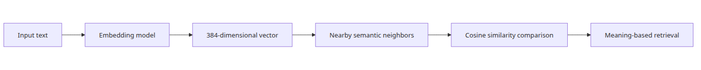
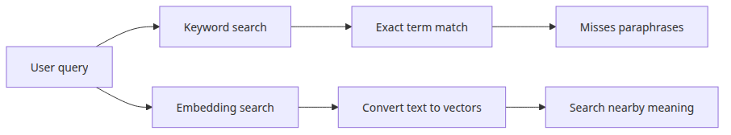
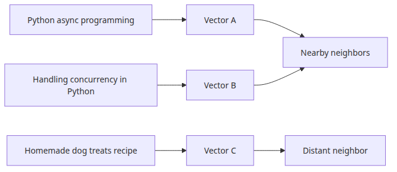
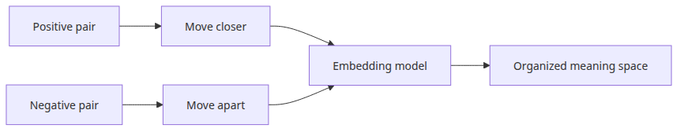
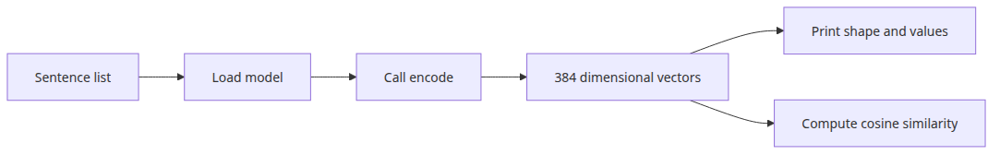
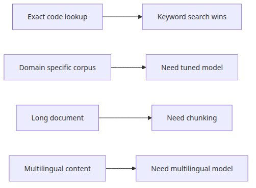

# 임베딩이란 무엇인가 — 텍스트를 벡터로 변환하기

이 글은 Vector Search 101 시리즈의 첫 번째 글입니다. 검색 엔진은 오랫동안 키워드를 비교해 왔지만, 표현이 달라도 의미가 같은 문장을 연결하는 일에는 한계가 있습니다. 예를 들어 "Python async programming"과 "handling concurrency in Python"은 같은 뜻이지만, 키워드 기반 검색만으로는 두 문장을 자연스럽게 이어 주기 어렵습니다.

임베딩은 이 문제를 다른 방식으로 풉니다. 텍스트를 숫자 벡터로 바꿔서 의미가 비슷한 문장이 고차원 공간에서 가깝게 놓이도록 만듭니다. 즉, 벡터 사이의 거리를 의미의 대리 지표로 사용하는 것입니다. 이 성질 덕분에 정확히 같은 단어가 없어도 의미 기반 검색이 가능해집니다.

이 글은 임베딩의 개념과 직관을 잡는 데 집중합니다. 코드는 최소한만 사용합니다. 여기서는 다음 다섯 가지를 다룹니다.

- 임베딩이 무엇이며 왜 등장했는가
- 의미가 벡터 공간의 거리로 표현되는 방식
- 임베딩 모델이 그 표현을 어떻게 학습하는가
- 실제 벡터를 만드는 첫 번째 실습
- 임베딩이 잘 작동하지 않는 상황과 주의점

예제 코드: [github.com/yeongseon-books/vector-search-101](https://github.com/yeongseon-books/vector-search-101/tree/main/en/01-what-is-embedding)



*키워드 검색과 임베딩 검색의 대비*
<!-- ebook-only:start -->

**핵심 아이디어**: 임베딩은 텍스트를 고차원 벡터로 압축합니다. 의미가 비슷한 문장은 그 공간 안에서 서로 가깝게 놓입니다.

## 이 장의 위치

이 글은 시리즈 6편 중 1편입니다.
이 글 다음에는 **HuggingFace 임베딩 실습 — sentence-transformers로 첫 벡터 만들기**로 이어집니다.
<!-- ebook-only:end -->

---

> 임베딩은 텍스트를 저장하는 형식이 아니라, 의미를 거리로 비교할 수 있게 만드는 표현 방식입니다.

## 이 글에서 다룰 문제

- 임베딩은 수학적으로 무엇이며, 왜 텍스트를 숫자 벡터로 바꿔야 할까요?
- 단어 임베딩, 문장 임베딩, 문서 임베딩은 실제로 어떻게 다를까요?
- 임베딩 차원 수가 커질수록 정확도와 비용은 어떻게 달라질까요?
- 같은 텍스트라도 모델이 다르면 왜 다른 벡터가 나올까요?
- 지금 만든 임베딩의 품질이 충분한지 어떻게 판단할 수 있을까요?

## 키워드 검색의 한계



*키워드 검색과 임베딩 검색의 대비*
전통적인 검색은 단어 빈도와 위치를 기준으로 결과를 정렬합니다. TF-IDF와 BM25가 대표적인 예입니다. 이런 방식은 쿼리와 문서가 같은 어휘를 공유할 때 빠르고 해석 가능하며 정확합니다.

문제는 언어가 그렇게 고정되어 있지 않다는 점입니다. 같은 개념도 여러 표현으로 나타납니다.

- "store it" — "persist it" — "write to DB" — "make it durable"
- "fast" — "low-latency" — "sub-millisecond response"
- "an error occurred" — "an exception was raised" — "the service crashed"

키워드 검색은 인덱스에 없는 표현을 놓칩니다. 동의어 사전이나 형태 변형 처리는 어느 정도 도움이 되지만, 자연어의 모든 변형을 수동으로 커버하는 일은 확장되지 않습니다.

임베딩은 질문 자체를 바꿉니다. "이 문서에 이 단어가 있나?"가 아니라, "이 문서가 쿼리와 의미 공간에서 얼마나 가까운가?"를 묻는 방식입니다.

---

## 벡터 공간 직관



*텍스트가 벡터 공간으로 들어가는 흐름*
임베딩 모델은 텍스트를 고정 길이의 부동소수점 배열로 바꿉니다. `sentence-transformers/all-MiniLM-L6-v2`를 사용하면 입력 길이와 무관하게 모든 문장이 384차원 벡터가 됩니다. 768차원이나 1536차원 모델도 흔히 사용됩니다.

```text
"Python async programming"       → [0.12, -0.34, 0.87, ..., 0.05]  (384 numbers)
"handling concurrency in Python" → [0.14, -0.31, 0.85, ..., 0.07]  (384 numbers)
"homemade dog treats recipe"     → [-0.63, 0.77, -0.12, ..., 0.44] (384 numbers)
```

이 숫자들을 고차원 공간의 좌표라고 생각하면 됩니다. 의미가 비슷한 문장은 서로 가까이 놓이고, 관련 없는 문장은 멀리 떨어집니다. 검색은 결국 이 공간에서 최근접 이웃을 찾는 작업이 됩니다.

가장 널리 쓰이는 거리 척도는 코사인 유사도입니다. 코사인 유사도는 벡터의 크기보다 방향을 비교하므로, 길이가 다른 입력끼리 비교할 때도 비교적 안정적입니다.

```
cosine similarity = (A · B) / (|A| × |B|)
```

값 범위는 -1에서 1입니다. 1에 가까울수록 더 유사하고, 0이면 무관하며, -1이면 의미가 반대라는 뜻입니다. 실제 문장 쌍은 대체로 0.2에서 0.95 사이에 위치합니다.

---

## 임베딩 모델은 어떻게 학습하는가



*긍정 쌍과 부정 쌍의 학습 구조*
임베딩 모델은 의미가 비슷한 문장 쌍은 가깝게, 관련 없는 문장 쌍은 멀게 배치하도록 학습됩니다. 가장 지배적인 학습 방식은 대조 학습입니다.

학습 데이터는 보통 아래처럼 구성됩니다.

- 긍정 쌍: 같은 문서의 서로 다른 단락, 질문-답변 쌍, 번역 쌍
- 부정 쌍: 무작위로 뽑은 서로 관련 없는 문장

모델은 긍정 쌍 사이의 벡터 거리는 줄이고, 부정 쌍 사이의 벡터 거리는 늘리도록 파라미터를 업데이트합니다. 이런 과정을 수억 개 문장 쌍에 반복하면, 언어의 의미 구조를 벡터 공간에 투영하는 법을 배우게 됩니다.

`all-MiniLM-L6-v2`는 10억 개가 넘는 문장 쌍으로 학습되었습니다. 모델 크기가 약 22MB로 작아서 CPU에서도 빠르게 실행되며, 이 시리즈에서 다루는 검색 작업에는 품질도 충분합니다.

---

## 첫 번째 벡터 만들어 보기



*세 문장을 인코딩하는 실행 경로*
이론을 다시 읽는 것보다 코드를 한 번 실행하는 편이 더 빠릅니다. `sentence-transformers`를 설치한 뒤 세 문장을 인코딩해 보겠습니다.

```bash
pip install sentence-transformers
```

```python
from sentence_transformers import SentenceTransformer

model = SentenceTransformer("sentence-transformers/all-MiniLM-L6-v2")

sentences = [
    "Python async programming",
    "handling concurrency in Python",
    "homemade dog treats recipe",
]

embeddings = model.encode(sentences)

print(f"number of vectors: {len(embeddings)}")
print(f"vector dimension: {embeddings[0].shape[0]}")
print(f"first vector (first 5 values): {embeddings[0][:5]}")
```

<!-- injected-output:start -->
**출력 결과**

    number of vectors: 3
    vector dimension: 384
    first vector (first 5 values): [-0.09979379  0.00370044 -0.10362536  0.14163396 -0.04871269]

<!-- injected-output:end -->

이제 세 쌍의 코사인 유사도를 직접 계산해 보겠습니다.

```python
import numpy as np
from sentence_transformers import SentenceTransformer

def cosine_similarity(a: np.ndarray, b: np.ndarray) -> float:
    return float(np.dot(a, b) / (np.linalg.norm(a) * np.linalg.norm(b)))

model = SentenceTransformer("sentence-transformers/all-MiniLM-L6-v2")

sentences = [
    "Python async programming",
    "handling concurrency in Python",
    "homemade dog treats recipe",
]

embeddings = model.encode(sentences)

print(f"[0] vs [1] (similar meaning): {cosine_similarity(embeddings[0], embeddings[1]):.4f}")
print(f"[0] vs [2] (unrelated):       {cosine_similarity(embeddings[0], embeddings[2]):.4f}")
```

<!-- injected-output:start -->
**출력 결과**

    [0] vs [1] (similar meaning): 0.6201
    [0] vs [2] (unrelated):       0.0056

<!-- injected-output:end -->

"Python async programming"과 "handling concurrency in Python"은 공통 단어가 없어도 높은 유사도를 보입니다. 반면 "homemade dog treats recipe"는 거의 0에 가깝습니다. 이 숫자가 벡터 검색의 토대입니다. 쿼리 벡터와 문서 벡터의 코사인 유사도를 기준으로 문서를 정렬하면 의미 기반 검색이 됩니다.

---

## 임베딩이 잘 작동하지 않는 경우



*정확 문자열과 긴 문서에서 드러나는 한계*
임베딩은 키워드 검색을 완전히 대체하는 만능 도구가 아닙니다. 몇몇 상황에서는 오히려 전통적인 방식이 더 낫습니다.

**정확한 식별자와 코드.** `ERR_CONNECTION_REFUSED`나 `CVE-2024-12345` 같은 문자열은 키워드 검색이 더 잘 찾습니다. 임베딩 모델은 의미를 추상화하는 과정에서 기호 수준의 정확한 정보를 흐릴 수 있습니다.

**도메인 특화 언어.** 웹 텍스트 중심으로 학습된 범용 영어 모델은 한국어 의료 기록이나 법률 계약서에서 품질이 낮을 수 있습니다. 이런 경우에는 도메인 특화 파인튜닝이나 전용 모델이 필요합니다.

**긴 문서.** `all-MiniLM-L6-v2`는 최대 256 서브워드 토큰만 처리합니다. 그 이상은 잘립니다. 긴 문서는 임베딩 전에 청크로 나눠야 합니다. 청크 전략은 이 시리즈 5편에서 다룹니다.

**다국어 콘텐츠.** 여러 언어가 섞인 문서는 단일 언어 모델보다 `paraphrase-multilingual-MiniLM-L12-v2` 같은 다국어 모델이 더 적합합니다.

실무에서는 대부분 키워드 검색과 임베딩 검색을 결합한 하이브리드 검색을 사용합니다. 서로의 약점을 보완하기 위해서입니다. 이 패턴은 시리즈 마지막 글에서 간단히 다룹니다.

---

## 모델 선택 기준

어떤 임베딩 모델을 선택해야 할까요? 첫 번째 프로젝트에서는 아래 기준만으로도 후보를 많이 줄일 수 있습니다.

**속도와 크기.** CPU에서 실행한다면 경량 모델이 중요합니다. `all-MiniLM-L6-v2`는 약 22MB이며, 최신 CPU에서는 초당 수백 문장을 인코딩할 수 있습니다. 정확도가 더 중요하면 약 420MB 크기의 `all-mpnet-base-v2`가 흔한 상위 선택지입니다.

**언어.** 한국어 텍스트가 포함된다면 영어 전용 모델보다 다국어 모델이나 한국어 특화 모델이 더 안정적입니다. 한국어 임베딩은 별도 한국어 AI 시리즈에서 더 깊게 다룹니다.

**태스크.** 문장 유사도 모델과 검색 모델은 학습 목표가 조금 다릅니다. 검색 모델은 쿼리와 문서가 서로 다른 분포를 가지는 상황에 더 최적화되어 있습니다. MTEB 리더보드의 Retrieval 섹션은 이런 비교에 실용적인 기준입니다.

이 시리즈에서는 일관성을 위해 `all-MiniLM-L6-v2`를 계속 사용합니다.

---

## 마무리

임베딩은 텍스트를 숫자 벡터로 바꾸고, 의미적 유사성을 공간적 근접성으로 표현합니다. 코사인 유사도는 그 근접성을 측정하는 도구이며, 이 덕분에 키워드 없는 검색이 가능해집니다. 직관은 단순합니다. 의미가 비슷할수록 거리가 가깝습니다.

다음 글에서는 개념에서 실습으로 넘어갑니다. `HuggingFaceEmbeddings`를 사용해 임베딩을 만들고 저장하고 다시 불러오는 방법, 그리고 배치 처리로 인코딩 속도를 높이는 방법을 살펴보겠습니다.

## 운영 체크리스트

- [ ] 사용 모델의 차원 수와 토큰 한도를 문서에 기록했다
- [ ] 정규화 여부를 한 번 정하고 모든 벡터에 일관되게 적용했다
- [ ] 임베딩 캐시 키에 모델, 버전, 입력 해시를 포함했다
- [ ] 직접 고른 몇 개의 문장 쌍으로 유사도를 계산해 품질을 기본 점검했다
- [ ] 임베딩 모델이 바뀔 때를 위한 재인덱싱 절차를 작성했다

<!-- toc:begin -->
## 시리즈 목차

- **임베딩이란 무엇인가 — 텍스트를 벡터로 변환하기 (현재 글)**
- HuggingFace 임베딩 실습 — sentence-transformers로 첫 벡터 만들기 (예정)
- 코사인 유사도와 벡터 검색 — 문장 간 거리 계산하기 (예정)
- FAISS 입문 — 고속 근사 최근접 이웃 검색 (예정)
- 청크 전략 — 긴 문서를 어떻게 나눌 것인가 (예정)
- 벡터 검색 파이프라인 — 문서 수집부터 쿼리까지 (예정)

<!-- toc:end -->

---

## 참고 자료

- [sentence-transformers documentation](https://www.sbert.net/)
- [all-MiniLM-L6-v2 model card](https://huggingface.co/sentence-transformers/all-MiniLM-L6-v2)
- [MTEB leaderboard](https://huggingface.co/spaces/mteb/leaderboard)
- [The Illustrated Word2Vec — Jay Alammar](https://jalammar.github.io/illustrated-word2vec/)

Tags: Vector Search, FAISS, Embeddings, Python
