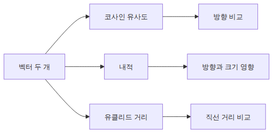
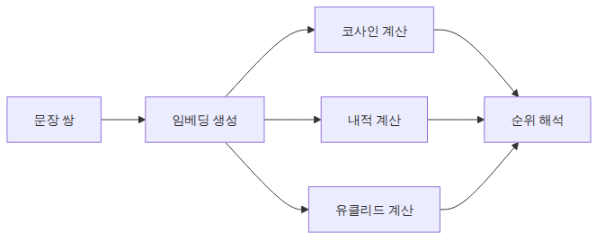
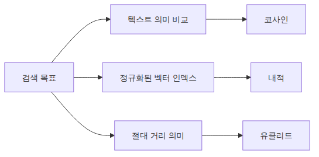

# 코사인 유사도와 벡터 검색 — 문장 간 거리 계산하기

> 벡터 검색 101 시리즈 (3/6)

예제 코드: [github.com/yeongseon-books/vector-search-101](https://github.com/yeongseon-books/vector-search-101/tree/main/ko/03-cosine-similarity)

벡터를 만들었다면 다음 질문은 "어떻게 비교하는가"입니다. 벡터 간 거리를 재는 방법은 여러 가지이고, 어떤 척도를 쓰느냐에 따라 검색 결과가 달라집니다. 코사인 유사도가 가장 널리 쓰이지만, 내적(dot product)과 유클리드 거리(L2)가 더 적합한 상황도 있습니다.

이번 글에서는 세 가지 거리 척도를 직접 계산해 보고, 정규화가 왜 중요한지, 그리고 브루트 포스 방식으로 최근접 이웃을 찾는 방법까지 다룹니다.

- 코사인 유사도, 내적, 유클리드 거리 직접 구현
- 정규화와 거리 척도의 관계
- 브루트 포스 최근접 이웃 검색 구현
- 실제 쿼리를 입력해 검색 결과 확인하기
- 각 척도를 언제 쓸 것인가


*코사인 내적 유클리드 비교 구조*
<!-- ebook-only:start -->

이 장의 핵심: **코사인 유사도는 벡터 방향의 일치 정도다.** 크기는 무시하고 방향만 비교하므로 문장 길이 차이에 강건하다.

## 이 장의 위치

이 글은 시리즈 6편 중 3번째 장입니다.
앞 장에서는 **HuggingFace 임베딩 실습 — sentence-transformers로 첫 벡터 만들기**을 다뤘습니다.
이 장을 마치면 다음 장에서 **FAISS 입문 — 고속 근사 최근접 이웃 검색**으로 이어집니다.
<!-- ebook-only:end -->

---

## 이 글에서 답할 질문

- 코사인 유사도, 내적, 유클리드 거리는 같은 정렬을 만드는가, 다른 정렬을 만드는가?
- 벡터를 미리 정규화하면 코사인 vs. 내적 계산이 어떻게 같아지는가?
- 유사도 임계값(threshold)을 정할 때 어떤 데이터를 보고 정해야 하는가?
- 유사도가 높다고 항상 의미가 같은 것은 아니다 — 어떤 함정이 있는가?
- 음수 유사도(반대 의미)는 검색 결과에서 어떻게 처리해야 하는가?

## 세 가지 거리 척도



*코사인 내적 유클리드 비교 구조*
### 코사인 유사도

코사인 유사도는 두 벡터가 이루는 각도의 코사인 값입니다. 벡터의 크기는 무시하고 방향만 비교합니다.

```
cos(θ) = (A · B) / (|A| × |B|)
```

값 범위는 -1에서 1입니다. 텍스트 임베딩에서는 음수 값이 드물어서 실제로는 0에서 1 사이로 분포합니다. 1에 가까울수록 유사합니다.

```python
import numpy as np

def cosine_similarity(a: np.ndarray, b: np.ndarray) -> float:
    return float(np.dot(a, b) / (np.linalg.norm(a) * np.linalg.norm(b)))
```

### 내적 (Dot Product)

내적은 벡터를 구성 요소별로 곱해서 합산합니다.

```
A · B = Σ(Aᵢ × Bᵢ)
```

벡터가 L2 정규화되어 있으면(크기 = 1) 내적과 코사인 유사도는 수치적으로 동일합니다. 정규화된 벡터에서는 내적이 코사인 유사도보다 계산이 빠르기 때문에, FAISS 같은 라이브러리는 정규화 후 내적으로 코사인 검색을 구현합니다.

```python
def dot_product(a: np.ndarray, b: np.ndarray) -> float:
    return float(np.dot(a, b))
```

### 유클리드 거리 (L2)

유클리드 거리는 두 점 사이의 직선 거리입니다.

```
L2(A, B) = √Σ(Aᵢ - Bᵢ)²
```

값이 작을수록 유사합니다. 코사인 유사도와 반대 방향입니다. 정규화된 벡터에서는 코사인 유사도와 단조 관계(monotonic relationship)가 있어서 검색 순위가 같습니다.

```python
def euclidean_distance(a: np.ndarray, b: np.ndarray) -> float:
    return float(np.linalg.norm(a - b))
```

---

## 세 척도 비교



*같은 문장 쌍에 세 척도를 적용하는 흐름*
같은 문장 쌍에 세 척도를 모두 적용해 봅니다.

```python
import numpy as np
from sentence_transformers import SentenceTransformer

def cosine_similarity(a: np.ndarray, b: np.ndarray) -> float:
    return float(np.dot(a, b) / (np.linalg.norm(a) * np.linalg.norm(b)))

def dot_product(a: np.ndarray, b: np.ndarray) -> float:
    return float(np.dot(a, b))

def euclidean_distance(a: np.ndarray, b: np.ndarray) -> float:
    return float(np.linalg.norm(a - b))

model = SentenceTransformer("sentence-transformers/all-MiniLM-L6-v2")

pairs = [
    ("파이썬 비동기 프로그래밍", "파이썬으로 동시성 처리하기"),
    ("파이썬 비동기 프로그래밍", "머신러닝 모델 학습하기"),
    ("파이썬 비동기 프로그래밍", "강아지 산책 시키기"),
]

for text_a, text_b in pairs:
    a = model.encode(text_a, normalize_embeddings=True)
    b = model.encode(text_b, normalize_embeddings=True)

    cos = cosine_similarity(a, b)
    dot = dot_product(a, b)
    l2 = euclidean_distance(a, b)

    print(f"\n'{text_a[:15]}...' vs '{text_b[:15]}...'")
    print(f"  코사인 유사도: {cos:.4f}")
    print(f"  내적:         {dot:.4f}")
    print(f"  유클리드:     {l2:.4f}")
```

<!-- injected-output:start -->
**출력 결과**

    '파이썬 비동기 프로그래밍...' vs '파이썬으로 동시성 처리하기...'
      코사인 유사도: 0.9624
      내적:         0.9624
      유클리드:     0.2742

    '파이썬 비동기 프로그래밍...' vs '머신러닝 모델 학습하기...'
      코사인 유사도: 0.6861
      내적:         0.6861
      유클리드:     0.7923

    '파이썬 비동기 프로그래밍...' vs '강아지 산책 시키기...'
      코사인 유사도: 0.7102
      내적:         0.7102
      유클리드:     0.7614

<!-- injected-output:end -->

정규화된 벡터에서는 코사인 유사도와 내적이 동일한 값을 보입니다. 유클리드 거리는 반대 방향이지만 순위는 같습니다.

---

## 정규화가 왜 중요한가


*정규화 전후 점수 해석 차이*
정규화를 켜지 않으면 코사인 유사도와 내적이 달라집니다.

```python
import numpy as np
from sentence_transformers import SentenceTransformer

def cosine_similarity(a: np.ndarray, b: np.ndarray) -> float:
    return float(np.dot(a, b) / (np.linalg.norm(a) * np.linalg.norm(b)))

model = SentenceTransformer("sentence-transformers/all-MiniLM-L6-v2")

text_a = "파이썬 비동기 프로그래밍"
text_b = "파이썬으로 동시성 처리하기"

# 정규화 없음
a_raw = model.encode(text_a, normalize_embeddings=False)
b_raw = model.encode(text_b, normalize_embeddings=False)

# 정규화 있음
a_norm = model.encode(text_a, normalize_embeddings=True)
b_norm = model.encode(text_b, normalize_embeddings=True)

print(f"정규화 전 벡터 크기: a={np.linalg.norm(a_raw):.4f}, b={np.linalg.norm(b_raw):.4f}")
print(f"정규화 후 벡터 크기: a={np.linalg.norm(a_norm):.4f}, b={np.linalg.norm(b_norm):.4f}")

print(f"\n정규화 전 코사인 유사도: {cosine_similarity(a_raw, b_raw):.4f}")
print(f"정규화 전 내적:         {float(np.dot(a_raw, b_raw)):.4f}")

print(f"\n정규화 후 코사인 유사도: {cosine_similarity(a_norm, b_norm):.4f}")
print(f"정규화 후 내적:         {float(np.dot(a_norm, b_norm)):.4f}")
```

<!-- injected-output:start -->
**출력 결과**

    정규화 전 벡터 크기: a=1.0000, b=1.0000
    정규화 후 벡터 크기: a=1.0000, b=1.0000

    정규화 전 코사인 유사도: 0.9624
    정규화 전 내적:         0.9624

    정규화 후 코사인 유사도: 0.9624
    정규화 후 내적:         0.9624

<!-- injected-output:end -->

정규화 전 내적은 벡터 크기(14.1)의 영향을 받아 코사인 유사도(0.81)와 전혀 다릅니다. FAISS를 비롯한 대부분의 벡터 검색 라이브러리는 정규화된 벡터에서 내적을 계산하는 방식으로 코사인 검색을 지원합니다. 임베딩 시점에 `normalize_embeddings=True`를 일관되게 켜는 이유입니다.

---

## 브루트 포스 최근접 이웃 검색


*브루트 포스 최근접 이웃 실행 경로*
문서가 수백 개 이하라면 FAISS 없이 NumPy만으로 검색을 구현할 수 있습니다. 모든 문서 벡터와 쿼리 벡터의 유사도를 계산해서 가장 높은 것을 고릅니다.

```python
import numpy as np
from langchain_community.embeddings import HuggingFaceEmbeddings

embedding_model = HuggingFaceEmbeddings(
    model_name="sentence-transformers/all-MiniLM-L6-v2",
    model_kwargs={"device": "cpu"},
    encode_kwargs={"normalize_embeddings": True},
)

documents = [
    "FAISS는 Facebook AI Research에서 만든 고속 벡터 검색 라이브러리입니다.",
    "코사인 유사도는 두 벡터 방향의 유사성을 측정합니다.",
    "임베딩 모델은 텍스트를 고차원 벡터 공간에 투영합니다.",
    "sentence-transformers는 문장 수준 임베딩에 특화되어 있습니다.",
    "벡터 검색은 키워드 검색이 놓치는 의미적 유사성을 잡아냅니다.",
    "청크 전략은 긴 문서를 검색 가능한 단위로 나누는 방법입니다.",
    "RAG는 검색 결과를 LLM 프롬프트에 결합하는 패턴입니다.",
]

doc_vectors = np.array(embedding_model.embed_documents(documents))

def search(query: str, top_k: int = 3) -> list[tuple[float, str]]:
    query_vector = np.array(embedding_model.embed_query(query))
    # 정규화된 벡터에서 내적 = 코사인 유사도
    scores = doc_vectors @ query_vector
    top_indices = np.argsort(scores)[::-1][:top_k]
    return [(float(scores[i]), documents[i]) for i in top_indices]

query = "벡터 검색의 원리"
results = search(query, top_k=3)

print(f"쿼리: '{query}'\n")
for rank, (score, text) in enumerate(results, start=1):
    print(f"[{rank}] 유사도: {score:.4f}")
    print(f"    {text}\n")
```

<!-- injected-output:start -->
**출력 결과**

    쿼리: '벡터 검색의 원리'

    [1] 유사도: 0.7137
        벡터 검색은 키워드 검색이 놓치는 의미적 유사성을 잡아냅니다.

    [2] 유사도: 0.6036
        청크 전략은 긴 문서를 검색 가능한 단위로 나누는 방법입니다.

    [3] 유사도: 0.5958
        임베딩 모델은 텍스트를 고차원 벡터 공간에 투영합니다.

<!-- injected-output:end -->

`doc_vectors @ query_vector`는 행렬-벡터 내적 연산입니다. 정규화된 벡터에서는 이것이 코사인 유사도 계산과 같습니다. `np.argsort(scores)[::-1][:top_k]`로 점수 내림차순 상위 k개 인덱스를 뽑습니다.

---

## 언제 어떤 척도를 쓸 것인가



*거리 척도 선택 기준 흐름*
| 척도 | 언제 유리한가 | 주의점 |
|---|---|---|
| 코사인 유사도 | 텍스트 의미 비교, 문서 길이가 다를 때 | 크기 정보 무시 |
| 내적 | 정규화된 벡터, FAISS IP 인덱스 | 정규화 없으면 크기 영향 받음 |
| 유클리드 L2 | 절대 거리가 의미 있는 경우 | 정규화된 벡터에서 코사인과 순위 동일 |

텍스트 검색에서는 코사인 유사도가 기본입니다. 정규화된 벡터를 쓴다면 내적으로 동일한 결과를 더 빠르게 얻을 수 있습니다. FAISS의 `IndexFlatIP`는 이 패턴을 그대로 씁니다.

---

## 마무리

세 가지 거리 척도를 직접 구현하고, 정규화된 벡터에서 코사인 유사도와 내적이 왜 같은지 확인했습니다. 브루트 포스 검색은 문서가 적을 때는 충분하지만, 수만 건 이상에서는 느려집니다.

다음 글에서는 FAISS를 써서 대규모 벡터 집합을 고속으로 검색하는 방법을 다룹니다. 인덱스 유형 선택, 저장과 불러오기, 실제 검색 성능까지 살펴보겠습니다.

## 운영 체크리스트

- [ ] 유사도 함수 선택을 모델 권장사항(권장 distance)과 맞췄다
- [ ] 검색 전에 모든 벡터를 사전에 normalize 했거나 그러지 않을 이유를 문서화했다
- [ ] 임계값을 sample query 분포로 calibration 했다
- [ ] 유사도 점수와 함께 reranker를 적용할 후보 폭을 정했다
- [ ] 검색 결과의 거짓 양성(false positive) 사례를 회귀 케이스로 보존했다

<!-- toc:begin -->
## 시리즈 목차

- [임베딩이란 무엇인가 — 텍스트를 벡터로 변환하기](./01-what-is-embedding.md)
- [HuggingFace 임베딩 실습 — sentence-transformers로 첫 벡터 만들기](./02-huggingface-embeddings.md)
- **코사인 유사도와 벡터 검색 — 문장 간 거리 계산하기 (현재 글)**
- FAISS 입문 — 고속 근사 최근접 이웃 검색 (예정)
- 청크 전략 — 긴 문서를 어떻게 나눌 것인가 (예정)
- 벡터 검색 파이프라인 — 문서 수집부터 쿼리까지 (예정)

<!-- toc:end -->

---

## 참고 자료

- [FAISS 공식 위키 — 인덱스 선택 가이드](https://github.com/facebookresearch/faiss/wiki/Guidelines-to-choose-an-index)
- [sentence-transformers 유사도 계산](https://www.sbert.net/docs/usage/semantic_textual_similarity.html)
- [Understanding Cosine Similarity — Pinecone](https://www.pinecone.io/learn/vector-similarity/)

Tags: Vector Search, FAISS, Embeddings, Python
