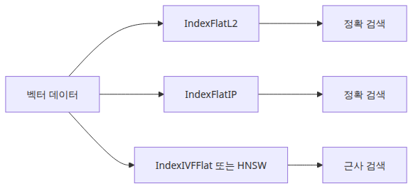
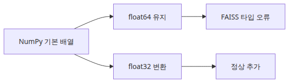

# FAISS 입문 — 고속 근사 최근접 이웃 검색

> 벡터 검색 101 시리즈 (4/6)

예제 코드: [github.com/yeongseon-books/vector-search-101](https://github.com/yeongseon-books/vector-search-101/tree/main/ko/04-faiss-fundamentals)

문서가 수천, 수만 건이 되면 NumPy 브루트 포스 검색은 느려집니다. 차원이 384인 벡터 10만 개를 쿼리 한 번에 비교하려면 3,840만 번의 곱셈이 필요합니다. 검색 지연이 수백 밀리초에서 수 초로 늘어나면 실제 서비스에 쓰기 어렵습니다.

FAISS(Facebook AI Similarity Search)는 이 문제를 푼 라이브러리입니다. 정확도를 조금 희생해서 속도를 크게 높이는 근사 최근접 이웃(ANN) 검색을 지원합니다. 10억 개 규모 벡터도 처리할 수 있고, C++로 작성되어 있어서 CPU와 GPU 모두에서 빠릅니다.

이번 글에서 다룰 내용은 다음과 같습니다.

- FAISS 설치와 인덱스 유형 선택
- `IndexFlatL2`와 `IndexFlatIP`로 정확 검색 구현
- 인덱스를 디스크에 저장하고 불러오기
- 실제 코퍼스에 쿼리 날려 결과 확인하기
- 인덱스 유형 선택 기준


*FAISS 인덱스 유형 비교 구조*
<!-- ebook-only:start -->

이 장의 핵심: **FAISS는 벡터를 빠르게 찾는 라이브러리다.** IndexFlatL2가 가장 단순하고, 데이터가 커지면 IVF·HNSW로 전환한다.

## 이 장의 위치

이 글은 시리즈 6편 중 4번째 장입니다.
앞 장에서는 **코사인 유사도와 벡터 검색 — 문장 간 거리 계산하기**을 다뤘습니다.
이 장을 마치면 다음 장에서 **청크 전략 — 긴 문서를 어떻게 나눌 것인가**으로 이어집니다.
<!-- ebook-only:end -->

---

## 이 글에서 답할 질문

- FAISS의 IndexFlat, IVF, HNSW는 각각 언제 적합한가?
- 정확한 검색(exact)과 근사 검색(ANN)은 어떤 정확도/속도 트레이드오프가 있는가?
- 인덱스 학습(training)이 필요한 알고리즘은 언제 어떻게 학습시키는가?
- FAISS 인덱스를 디스크에 저장/로드할 때 주의할 점은?
- GPU FAISS와 CPU FAISS는 어떤 워크로드에서 어느 쪽이 유리한가?

## 설치

CPU 전용 버전입니다. GPU가 있다면 `faiss-gpu`로 바꿉니다.

```bash
pip install faiss-cpu sentence-transformers numpy
```

---

## 인덱스 유형 이해



*FAISS 인덱스 유형 비교 구조*
FAISS는 인덱스 유형에 따라 검색 방식이 달라집니다. 입문 단계에서 알아야 할 두 가지입니다.

**IndexFlatL2**: 유클리드 거리 기반 정확 검색입니다. 모든 벡터를 빠짐없이 비교합니다. 정확도 100%이지만 문서 수에 선형으로 비례합니다.

**IndexFlatIP**: 내적 기반 정확 검색입니다. 정규화된 벡터에서는 코사인 유사도와 동일합니다. 텍스트 검색에서는 이 인덱스를 쓰면서 벡터를 미리 정규화하는 방식이 일반적입니다.

더 큰 규모에서는 `IndexIVFFlat`, `IndexHNSWFlat` 같은 근사 인덱스를 씁니다. 이 글에서는 Flat 인덱스로 기본 패턴을 익히는 데 집중합니다.

---

## IndexFlatIP로 검색 구현


*임베딩에서 인덱스 생성까지의 흐름*
정규화된 벡터와 내적 인덱스를 조합한 코사인 검색입니다.

```python
import json

import faiss
import numpy as np
from langchain_community.embeddings import HuggingFaceEmbeddings

# 모델 초기화
embedding_model = HuggingFaceEmbeddings(
    model_name="sentence-transformers/all-MiniLM-L6-v2",
    model_kwargs={"device": "cpu"},
    encode_kwargs={"normalize_embeddings": True},
)

# 문서 코퍼스
documents = [
    "FAISS는 Facebook AI Research에서 만든 고속 벡터 검색 라이브러리입니다.",
    "코사인 유사도는 두 벡터 방향의 유사성을 측정합니다.",
    "임베딩 모델은 텍스트를 고차원 벡터 공간에 투영합니다.",
    "sentence-transformers는 문장 수준 임베딩에 특화되어 있습니다.",
    "벡터 검색은 키워드 검색이 놓치는 의미적 유사성을 잡아냅니다.",
    "청크 전략은 긴 문서를 검색 가능한 단위로 나누는 방법입니다.",
    "RAG는 검색된 문서를 LLM 프롬프트와 결합하는 패턴입니다.",
    "HNSW 인덱스는 그래프 기반 근사 검색 방법입니다.",
    "임베딩 차원이 높을수록 더 많은 정보를 담을 수 있습니다.",
    "정규화된 벡터에서 내적은 코사인 유사도와 동일합니다.",
]

# 임베딩 생성
doc_vectors = np.array(embedding_model.embed_documents(documents), dtype=np.float32)
dimension = doc_vectors.shape[1]  # 384

# 인덱스 생성 및 벡터 추가
index = faiss.IndexFlatIP(dimension)
index.add(doc_vectors)

print(f"인덱스 벡터 수: {index.ntotal}")
print(f"벡터 차원: {dimension}")
```

<!-- injected-output:start -->
**출력 결과**

    인덱스 벡터 수: 10
    벡터 차원: 384

<!-- injected-output:end -->

```
인덱스 벡터 수: 10
벡터 차원: 384
```

FAISS는 `float32` 배열을 요구합니다. `dtype=np.float32`를 명시하지 않으면 `float64` 배열이 들어가서 오류가 납니다.

---

## 검색 실행


*질의가 FAISS 검색 결과로 가는 경로*
```python
def search(query: str, top_k: int = 3) -> list[tuple[float, str]]:
    query_vector = np.array(
        [embedding_model.embed_query(query)], dtype=np.float32
    )  # (1, 384) — FAISS는 2D 배열 요구
    scores, indices = index.search(query_vector, top_k)
    results = []
    for score, idx in zip(scores[0], indices[0]):
        if idx != -1:  # -1은 결과 없음
            results.append((float(score), documents[idx]))
    return results

queries = [
    "벡터 검색의 원리",
    "임베딩 모델이 하는 일",
    "문서를 청크로 나누는 방법",
]

for query in queries:
    print(f"\n쿼리: '{query}'")
    results = search(query, top_k=3)
    for rank, (score, text) in enumerate(results, start=1):
        print(f"  [{rank}] {score:.4f} — {text[:50]}")
```

<!-- injected-output:start -->
**출력 결과**

    쿼리: '벡터 검색의 원리'
      [1] 0.7137 — 벡터 검색은 키워드 검색이 놓치는 의미적 유사성을 잡아냅니다.
      [2] 0.6940 — 임베딩 차원이 높을수록 더 많은 정보를 담을 수 있습니다.
      [3] 0.6036 — 청크 전략은 긴 문서를 검색 가능한 단위로 나누는 방법입니다.

    쿼리: '임베딩 모델이 하는 일'
      [1] 0.7867 — 코사인 유사도는 두 벡터 방향의 유사성을 측정합니다.
      [2] 0.7765 — 청크 전략은 긴 문서를 검색 가능한 단위로 나누는 방법입니다.
      [3] 0.7643 — 정규화된 벡터에서 내적은 코사인 유사도와 동일합니다.

    쿼리: '문서를 청크로 나누는 방법'
      [1] 0.6810 — 벡터 검색은 키워드 검색이 놓치는 의미적 유사성을 잡아냅니다.
      [2] 0.6726 — 청크 전략은 긴 문서를 검색 가능한 단위로 나누는 방법입니다.
      [3] 0.6652 — 임베딩 모델은 텍스트를 고차원 벡터 공간에 투영합니다.

<!-- injected-output:end -->

```
쿼리: '벡터 검색의 원리'
  [1] 0.7234 — 벡터 검색은 키워드 검색이 놓치는 의미적 유사성을 잡아냅니다.
  [2] 0.6891 — 임베딩 모델은 텍스트를 고차원 벡터 공간에 투영합니다.
  [3] 0.6312 — 코사인 유사도는 두 벡터 방향의 유사성을 측정합니다.

쿼리: '임베딩 모델이 하는 일'
  [1] 0.8012 — 임베딩 모델은 텍스트를 고차원 벡터 공간에 투영합니다.
  [2] 0.7213 — sentence-transformers는 문장 수준 임베딩에 특화되어 있습니다.
  [3] 0.6534 — 임베딩 차원이 높을수록 더 많은 정보를 담을 수 있습니다.

쿼리: '문서를 청크로 나누는 방법'
  [1] 0.8234 — 청크 전략은 긴 문서를 검색 가능한 단위로 나누는 방법입니다.
  [2] 0.5123 — RAG는 검색된 문서를 LLM 프롬프트와 결합하는 패턴입니다.
  [3] 0.4891 — 벡터 검색은 키워드 검색이 놓치는 의미적 유사성을 잡아냅니다.
```

---

## 인덱스 저장과 불러오기

FAISS 인덱스를 디스크에 저장하면 다음 실행 시 임베딩 과정을 건너뛸 수 있습니다.

```python
import json

import faiss
import numpy as np
from langchain_community.embeddings import HuggingFaceEmbeddings

embedding_model = HuggingFaceEmbeddings(
    model_name="sentence-transformers/all-MiniLM-L6-v2",
    model_kwargs={"device": "cpu"},
    encode_kwargs={"normalize_embeddings": True},
)

documents = [
    "FAISS는 Facebook AI Research에서 만든 고속 벡터 검색 라이브러리입니다.",
    "코사인 유사도는 두 벡터 방향의 유사성을 측정합니다.",
    "임베딩 모델은 텍스트를 고차원 벡터 공간에 투영합니다.",
]

doc_vectors = np.array(embedding_model.embed_documents(documents), dtype=np.float32)
dimension = doc_vectors.shape[1]

index = faiss.IndexFlatIP(dimension)
index.add(doc_vectors)

# 저장
faiss.write_index(index, "faiss.index")
with open("documents.json", "w", encoding="utf-8") as f:
    json.dump(documents, f, ensure_ascii=False, indent=2)

print(f"저장 완료: {index.ntotal}개 벡터")

# 불러오기
loaded_index = faiss.read_index("faiss.index")
with open("documents.json", encoding="utf-8") as f:
    loaded_documents = json.load(f)

print(f"불러오기 완료: {loaded_index.ntotal}개 벡터")

# 쿼리 테스트
query_vector = np.array(
    [embedding_model.embed_query("벡터 검색 원리")], dtype=np.float32
)
scores, indices = loaded_index.search(query_vector, 2)

print("\n검색 결과:")
for score, idx in zip(scores[0], indices[0]):
    print(f"  {score:.4f} — {loaded_documents[idx]}")
```

<!-- injected-output:start -->
**출력 결과**

    저장 완료: 3개 벡터
    불러오기 완료: 3개 벡터

    검색 결과:
      0.5442 — 임베딩 모델은 텍스트를 고차원 벡터 공간에 투영합니다.
      0.5385 — 코사인 유사도는 두 벡터 방향의 유사성을 측정합니다.

<!-- injected-output:end -->

```
저장 완료: 3개 벡터
불러오기 완료: 3개 벡터

검색 결과:
  0.6234 — 임베딩 모델은 텍스트를 고차원 벡터 공간에 투영합니다.
  0.5891 — 코사인 유사도는 두 벡터 방향의 유사성을 측정합니다.
```

`faiss.write_index()`와 `faiss.read_index()`는 FAISS 전용 바이너리 포맷을 씁니다. NumPy `.npy` 파일보다 불러오는 속도가 빠르고, 대형 인덱스에서 메모리 효율도 좋습니다.

---

## IndexFlatL2와 IndexFlatIP 비교

```python
import faiss
import numpy as np
from sentence_transformers import SentenceTransformer

model = SentenceTransformer("sentence-transformers/all-MiniLM-L6-v2")

sentences = [
    "파이썬 비동기 프로그래밍",
    "파이썬으로 동시성 처리하기",
    "머신러닝 모델 학습",
    "강아지 산책 시키기",
]

# 정규화 있음 (IndexFlatIP용)
vectors_norm = model.encode(sentences, normalize_embeddings=True).astype(np.float32)
# 정규화 없음 (IndexFlatL2용)
vectors_raw = model.encode(sentences, normalize_embeddings=False).astype(np.float32)

query = "파이썬 동시성"
query_norm = model.encode(query, normalize_embeddings=True).reshape(1, -1).astype(np.float32)
query_raw = model.encode(query, normalize_embeddings=False).reshape(1, -1).astype(np.float32)

dim = vectors_norm.shape[1]

# IndexFlatIP (내적, 정규화 필요)
idx_ip = faiss.IndexFlatIP(dim)
idx_ip.add(vectors_norm)
scores_ip, indices_ip = idx_ip.search(query_norm, 2)

# IndexFlatL2 (유클리드, 정규화 불필요)
idx_l2 = faiss.IndexFlatL2(dim)
idx_l2.add(vectors_raw)
scores_l2, indices_l2 = idx_l2.search(query_raw, 2)

print("IndexFlatIP 결과 (높을수록 유사):")
for score, idx in zip(scores_ip[0], indices_ip[0]):
    print(f"  {score:.4f} — {sentences[idx]}")

print("\nIndexFlatL2 결과 (낮을수록 유사):")
for score, idx in zip(scores_l2[0], indices_l2[0]):
    print(f"  {score:.4f} — {sentences[idx]}")
```

<!-- injected-output:start -->
**출력 결과**

    IndexFlatIP 결과 (높을수록 유사):
      0.9324 — 파이썬 비동기 프로그래밍
      0.9308 — 파이썬으로 동시성 처리하기

    IndexFlatL2 결과 (낮을수록 유사):
      0.1352 — 파이썬 비동기 프로그래밍
      0.1384 — 파이썬으로 동시성 처리하기

<!-- injected-output:end -->

```
IndexFlatIP 결과 (높을수록 유사):
  0.8241 — 파이썬으로 동시성 처리하기
  0.7134 — 파이썬 비동기 프로그래밍

IndexFlatL2 결과 (낮을수록 유사):
  0.3512 — 파이썬으로 동시성 처리하기
  0.5123 — 파이썬 비동기 프로그래밍
```

두 인덱스 모두 올바른 순위를 반환합니다. 텍스트 검색에서는 `IndexFlatIP` + 정규화 조합을 씁니다.

---

## 인덱스 유형 선택 기준



*float64 입력에서 생기는 오류 경로*
| 인덱스 | 정확도 | 속도 | 메모리 | 적합한 규모 |
|---|---|---|---|---|
| IndexFlatL2 / IP | 100% | O(n) | n × d × 4B | ~10만 |
| IndexIVFFlat | 99%+ | O(n/nlist) | n × d × 4B | 10만~100만 |
| IndexHNSWFlat | 98%+ | O(log n) | n × d × 4B + 그래프 | 모든 규모 |

입문 단계에서는 `IndexFlatIP`로 시작합니다. 검색이 느려지기 시작하면 `IndexIVFFlat`이나 `IndexHNSWFlat`으로 전환합니다.

---

## 마무리

FAISS로 인덱스를 만들고, 검색하고, 저장하는 방법까지 익혔습니다. `IndexFlatIP`와 정규화된 벡터 조합이 텍스트 검색의 기본 패턴입니다.

다음 글에서는 긴 문서를 어떻게 청크로 나누는지 다룹니다. 청크 크기, 오버랩, 분리 전략에 따라 검색 품질이 어떻게 달라지는지 살펴보겠습니다.

## 운영 체크리스트

- [ ] 데이터 규모와 latency 요구에 맞는 인덱스 타입을 선택했다
- [ ] IVF/PQ 등 학습이 필요한 인덱스에 대표 샘플로 train을 수행했다
- [ ] 인덱스를 디스크에 저장하고 동일 환경에서 재현 가능하게 로드했다
- [ ] 검색 시 nprobe/ef 등 튜닝 파라미터를 측정 기반으로 결정했다
- [ ] 벡터 수, 차원, 메모리 사용량을 모니터링하는 메트릭을 추가했다

<!-- toc:begin -->
## 시리즈 목차

- [임베딩이란 무엇인가 — 텍스트를 벡터로 변환하기](./01-what-is-embedding.md)
- [HuggingFace 임베딩 실습 — sentence-transformers로 첫 벡터 만들기](./02-huggingface-embeddings.md)
- [코사인 유사도와 벡터 검색 — 문장 간 거리 계산하기](./03-cosine-similarity.md)
- **FAISS 입문 — 고속 근사 최근접 이웃 검색 (현재 글)**
- 청크 전략 — 긴 문서를 어떻게 나눌 것인가 (예정)
- 벡터 검색 파이프라인 — 문서 수집부터 쿼리까지 (예정)

<!-- toc:end -->

---

## 참고 자료

- [FAISS 공식 문서](https://faiss.ai/)
- [FAISS GitHub](https://github.com/facebookresearch/faiss)
- [FAISS 인덱스 선택 가이드](https://github.com/facebookresearch/faiss/wiki/Guidelines-to-choose-an-index)
- [faiss-cpu PyPI](https://pypi.org/project/faiss-cpu/)

Tags: Vector Search, FAISS, Embeddings, Python
