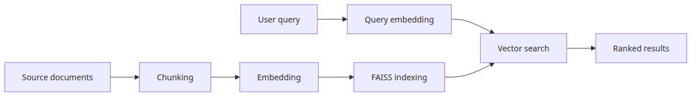
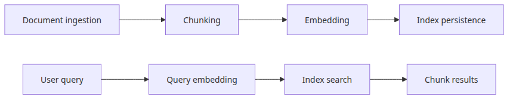
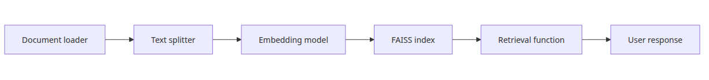
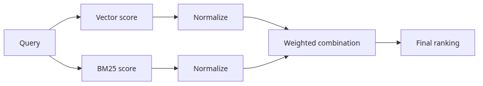
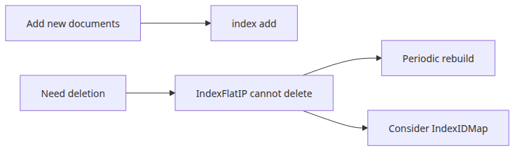

# 벡터 검색 파이프라인 — 문서 수집부터 쿼리까지

이 글은 Vector Search 101 시리즈의 마지막 글입니다. 앞선 다섯 편에서는 임베딩, 유사도 척도, FAISS, 청킹을 각각 따로 봤습니다. 이번 글에서는 그 부품들을 하나의 실행 가능한 파이프라인으로 조립합니다. 문서를 불러오고, 청크로 나누고, 임베딩하고, FAISS 인덱스에 저장한 뒤, 자연어 쿼리로 결과를 검색하는 전체 흐름입니다.

마지막에는 벡터 검색과 키워드 검색을 결합하는 하이브리드 검색의 기초도 정리합니다.

이 글에서 다루는 주제는 다음과 같습니다.

- 텍스트에서 문서 불러오기
- 청킹 → 임베딩 → FAISS로 이어지는 전체 인덱싱 흐름
- 인덱스 저장과 다시 불러오기
- 쿼리 실행과 결과 출력
- 하이브리드 검색 개념과 최소 구현

예제 코드: [github.com/yeongseon-books/vector-search-101](https://github.com/yeongseon-books/vector-search-101/tree/main/en/06-vector-search-pipeline)



*엔드 투 엔드 인덱싱 및 검색 흐름*
<!-- ebook-only:start -->

**핵심 아이디어**: 벡터 검색 파이프라인은 embed, index, query, retrieve의 네 단계입니다. 각 단계는 독립적으로 교체 가능해야 합니다.

## 이 장의 위치

이 글은 시리즈 6편 중 6편입니다.
이전 글에서는 **청크 전략 — 긴 문서를 어떻게 나눌 것인가**를 다뤘습니다.
<!-- ebook-only:end -->

---

> 벡터 검색 파이프라인은 거대한 한 덩어리 기능이 아니라, 인덱싱 단계와 검색 단계를 분리해 각각 교체 가능하게 만드는 구조입니다.

## 이 글에서 다룰 문제

- 문서 수집, 임베딩, 인덱싱, 검색 단계를 어떻게 깔끔하게 분리할 수 있을까요?
- 어떤 이벤트를 자동 재인덱싱의 트리거로 삼아야 할까요?
- 벡터만으로 부족할 때 BM25 같은 어휘 기반 검색과 벡터 검색을 어떻게 결합할까요?
- 검색 결과를 LLM에 넘기기 전에 리랭커를 붙여야 하는 시점은 언제일까요?
- 운영 환경에서 recall@k, MRR, nDCG 같은 검색 품질 지표를 어떻게 계산하고 추적할까요?

## 파이프라인 구조



*엔드 투 엔드 인덱싱 및 검색 흐름*


*파이프라인 구성 요소 연결 구조*
벡터 검색 파이프라인은 크게 두 단계로 나뉩니다.

인덱싱은 오프라인 단계입니다. 문서를 한 번 처리해서 검색 가능한 인덱스를 만듭니다.

```text
load documents → chunk → embed → save FAISS index
```

검색은 온라인 단계입니다. 쿼리를 받아 임베딩하고 인덱스를 조회해 결과를 반환합니다.

```text
embed query → FAISS search → return ranked chunks
```

이 두 단계를 분리하면 인덱스는 한 번 만들고, 쿼리는 여러 번 처리할 수 있습니다.

---

## 완전한 파이프라인


*구축, 저장, 로드, 검색 실행 경로*
하나의 파일로 바로 실행 가능한 예제를 보겠습니다.

```python
import json
from pathlib import Path

import faiss
import numpy as np
from langchain_community.embeddings import HuggingFaceEmbeddings
from langchain_text_splitters import RecursiveCharacterTextSplitter

# ── config ────────────────────────────────────────────────────────────────
EMBED_MODEL = "sentence-transformers/all-MiniLM-L6-v2"
CHUNK_SIZE = 300
CHUNK_OVERLAP = 30
INDEX_PATH = "faiss.index"
DOCS_PATH = "chunks.json"

# ── embedding model ────────────────────────────────────────────────────────
embedding_model = HuggingFaceEmbeddings(
    model_name=EMBED_MODEL,
    model_kwargs={"device": "cpu"},
    encode_kwargs={"normalize_embeddings": True},
)

# ── text splitter ──────────────────────────────────────────────────────────
splitter = RecursiveCharacterTextSplitter(
    chunk_size=CHUNK_SIZE,
    chunk_overlap=CHUNK_OVERLAP,
    separators=["\n\n", "\n", ". ", " ", ""],
)

# ── indexing ───────────────────────────────────────────────────────────────
def build_index(documents: list[str]) -> tuple[faiss.Index, list[str]]:
    """Chunk, embed, and index a list of document strings."""
    all_chunks: list[str] = []
    for doc in documents:
        all_chunks.extend(splitter.split_text(doc))
    print(f"total chunks: {len(all_chunks)}")

    vectors = np.array(
        embedding_model.embed_documents(all_chunks), dtype=np.float32
    )
    dimension = vectors.shape[1]
    print(f"vector shape: {vectors.shape}")

    index = faiss.IndexFlatIP(dimension)
    index.add(vectors)

    return index, all_chunks

def save_index(index: faiss.Index, chunks: list[str]) -> None:
    faiss.write_index(index, INDEX_PATH)
    with open(DOCS_PATH, "w") as f:
        json.dump(chunks, f, indent=2)
    print(f"saved: {INDEX_PATH}, {DOCS_PATH}")

def load_index() -> tuple[faiss.Index, list[str]]:
    index = faiss.read_index(INDEX_PATH)
    with open(DOCS_PATH) as f:
        chunks = json.load(f)
    print(f"loaded: {index.ntotal} vectors")
    return index, chunks

# ── retrieval ──────────────────────────────────────────────────────────────
def search(
    query: str,
    index: faiss.Index,
    chunks: list[str],
    top_k: int = 3,
) -> list[tuple[float, str]]:
    q_vec = np.array([embedding_model.embed_query(query)], dtype=np.float32)
    scores, indices = index.search(q_vec, top_k)
    return [
        (float(scores[0][i]), chunks[indices[0][i]])
        for i in range(top_k)
        if indices[0][i] != -1
    ]

# ── run ────────────────────────────────────────────────────────────────────
documents = [
    """
Vector search converts text into numeric vectors for meaning-based retrieval.
Unlike keyword search, it matches content even when phrasing differs.
Embedding models place semantically similar text close together in vector space.
""",
    """
FAISS is a high-speed vector search library developed at Facebook AI Research.
It supports both exact and approximate search and can handle billions of vectors.
IndexFlatIP is an exact inner-product index equivalent to cosine search on normalized vectors.
""",
    """
Chunking strategies split long documents into units the embedding model can process.
chunk_size and chunk_overlap must be tuned to achieve good retrieval quality.
RecursiveCharacterTextSplitter tries paragraph, sentence, and word boundaries in order.
""",
    """
RAG (Retrieval-Augmented Generation) combines retrieved documents with an LLM prompt.
The system retrieves relevant chunks for the user's question and provides them as context.
Vector search is the retrieval component in most RAG pipelines.
""",
]

index, chunks = build_index(documents)
save_index(index, chunks)

index, chunks = load_index()

queries = [
    "how vector search differs from keyword search",
    "FAISS index types",
    "choosing chunk size",
    "role of retrieval in RAG",
]

for query in queries:
    print(f"\nquery: '{query}'")
    results = search(query, index, chunks, top_k=2)
    for rank, (score, text) in enumerate(results, start=1):
        print(f"  [{rank}] {score:.4f} — {text.strip()[:70]}...")
```

<!-- injected-output:start -->
**출력 결과**

    total chunks: 4
    vector shape: (4, 384)
    saved: faiss.index, chunks.json
    loaded: 4 vectors

    query: 'how vector search differs from keyword search'
      [1] 0.7285 — Vector search converts text into numeric vectors for meaning-based ret...
      [2] 0.4562 — RAG (Retrieval-Augmented Generation) combines retrieved documents with...

    query: 'FAISS index types'
      [1] 0.5547 — FAISS is a high-speed vector search library developed at Facebook AI R...
      [2] 0.1110 — Vector search converts text into numeric vectors for meaning-based ret...

    query: 'choosing chunk size'
      [1] 0.4771 — Chunking strategies split long documents into units the embedding mode...
      [2] 0.1839 — RAG (Retrieval-Augmented Generation) combines retrieved documents with...

    query: 'role of retrieval in RAG'
      [1] 0.5931 — RAG (Retrieval-Augmented Generation) combines retrieved documents with...
      [2] 0.1908 — Chunking strategies split long documents into units the embedding mode...

<!-- injected-output:end -->

Expected output:

```
total chunks: 8
vector shape: (8, 384)
saved: faiss.index, chunks.json
loaded: 8 vectors

query: 'how vector search differs from keyword search'
  [1] 0.8123 — Vector search converts text into numeric vectors for meaning-based...
  [2] 0.7234 — Unlike keyword search, it matches content even when phrasing differs.

query: 'FAISS index types'
  [1] 0.8412 — IndexFlatIP is an exact inner-product index equivalent to cosine...
  [2] 0.7891 — FAISS is a high-speed vector search library developed at Facebook...
```

---

## 하이브리드 검색



*벡터 점수와 BM25 점수 결합 구조*
벡터 검색만으로는 정확한 용어가 중요한 상황에 약합니다. 오류 코드, 제품 ID, 고유명사처럼 정확 일치가 중요한 경우에는 키워드 검색이 더 강합니다. 하이브리드 검색은 두 방식을 결합합니다.

가장 표준적인 접근은 각 점수를 [0, 1] 범위로 정규화한 뒤 가중합을 계산하는 방식입니다.

```python
from rank_bm25 import BM25Okapi

def hybrid_search(
    query: str,
    index: faiss.Index,
    chunks: list[str],
    top_k: int = 3,
    alpha: float = 0.5,
) -> list[tuple[float, str]]:
    """Combine vector search and BM25 keyword search.
    alpha: weight of vector score (0 = keyword only, 1 = vector only)
    """
    # vector scores (already 0–1 with normalized vectors)
    q_vec = np.array([embedding_model.embed_query(query)], dtype=np.float32)
    vec_scores, vec_indices = index.search(q_vec, len(chunks))
    vec_score_map = {
        int(idx): float(score)
        for idx, score in zip(vec_indices[0], vec_scores[0])
        if idx != -1
    }

    # BM25 scores normalized to 0–1
    tokenized = [chunk.split() for chunk in chunks]
    bm25 = BM25Okapi(tokenized)
    bm25_scores = bm25.get_scores(query.split())
    max_bm25 = max(bm25_scores) if max(bm25_scores) > 0 else 1.0
    bm25_norm = bm25_scores / max_bm25

    # weighted combination
    combined = {
        i: alpha * vec_score_map.get(i, 0.0) + (1 - alpha) * float(bm25_norm[i])
        for i in range(len(chunks))
    }

    top_indices = sorted(combined, key=combined.__getitem__, reverse=True)[:top_k]
    return [(combined[i], chunks[i]) for i in top_indices]
```

`alpha=0.5`는 두 방식에 같은 가중치를 둡니다. 의미 기반 가중치를 더 높이고 싶다면 1.0 쪽으로 올리고, 키워드 일치를 더 중시하고 싶다면 0.0 쪽으로 낮추면 됩니다.

---

## 운영 관점에서 볼 점



*인덱스 갱신과 삭제 제약 경로*
**인덱스 업데이트.** 새 문서를 추가하는 일 자체는 단순합니다. 임베딩한 뒤 `index.add()`를 호출하면 됩니다. 다만 `IndexFlatIP`는 삭제를 지원하지 않습니다. 벡터를 제거해야 한다면 주기적으로 인덱스를 재구축하거나, `IndexIDMap`으로 식별자를 관리하면서 삭제된 항목을 건너뛰는 방식을 사용해야 합니다.

**메모리.** `IndexFlatIP`는 모든 벡터를 메모리에 유지합니다. 차원 384, 4바이트 float 기준으로 10만 벡터는 약 147MB이고, 100만 벡터면 약 1.5GB입니다. 그 이상에서는 `IndexIVFFlat`이나 `IndexPQ` 같은 압축형 인덱스가 필요합니다.

**지연 시간.** CPU에서 10만 벡터를 검색하면 수십 밀리초 수준이 걸립니다. 서비스 지연 시간이 민감하다면 GPU 빌드나 근사 인덱스를 고려해야 합니다.

---

## 마무리

이 글에서는 전체 벡터 검색 파이프라인을 조립했습니다. 문서를 불러오고, `RecursiveCharacterTextSplitter`로 청크를 만들고, `HuggingFaceEmbeddings`로 임베딩하고, FAISS로 인덱싱하고, 디스크에 저장한 뒤, 자연어 쿼리로 검색했습니다.

다음으로 자연스러운 확장은 이 파이프라인을 LLM과 연결해 RAG 시스템으로 만드는 일입니다. `langchain-101` 시리즈에서는 LCEL, Retriever, Chain 조합을 다룹니다.

## 운영 체크리스트

- [ ] ingest, embed, index, search를 각각 독립 배포 가능한 단계로 분리했다
- [ ] 임베딩 모델 버전과 인덱스 버전에 맞춰 재인덱싱 트리거를 자동화했다
- [ ] lexical 점수와 vector 점수를 어떻게 결합할지 정의했다
- [ ] 운영에서 평가 셋과 자동 품질 검증 스크립트를 유지했다
- [ ] 지연 시간, recall, 비용을 같은 대시보드에서 보이게 했다

<!-- toc:begin -->
## 시리즈 목차

- [임베딩이란 무엇인가 — 텍스트를 벡터로 변환하기](./01-what-is-embedding.md)
- [HuggingFace 임베딩 실습 — sentence-transformers로 첫 벡터 만들기](./02-huggingface-embeddings.md)
- [코사인 유사도와 벡터 검색 — 문장 간 거리 계산하기](./03-cosine-similarity.md)
- [FAISS 입문 — 고속 근사 최근접 이웃 검색](./04-faiss-fundamentals.md)
- [청크 전략 — 긴 문서를 어떻게 나눌 것인가](./05-chunking-strategies.md)
- **벡터 검색 파이프라인 — 문서 수집부터 쿼리까지 (현재 글)**

<!-- toc:end -->

---

## 참고 자료

- [FAISS documentation](https://faiss.ai/)
- [LangChain FAISS integration](https://python.langchain.com/docs/integrations/vectorstores/faiss/)
- [rank-bm25 library](https://github.com/dorianbrown/rank_bm25)
- [Hybrid search introduction — Pinecone](https://www.pinecone.io/learn/hybrid-search-intro/)

Tags: Vector Search, FAISS, Embeddings, Python
