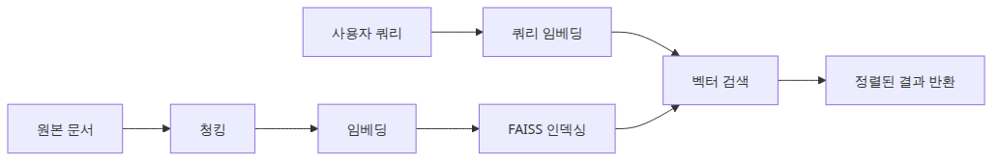
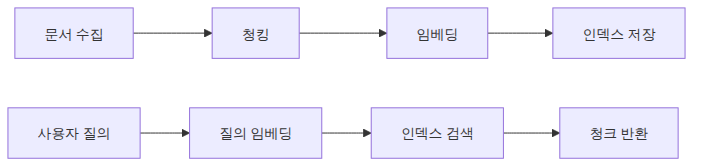
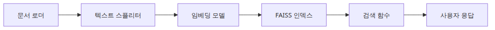
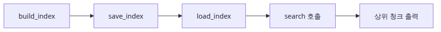
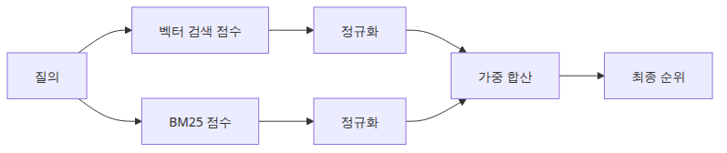
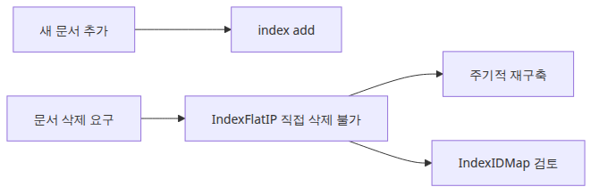

# 벡터 검색 파이프라인 — 문서 수집부터 쿼리까지

> 벡터 검색 101 시리즈 (6/6)

예제 코드: [github.com/yeongseon-books/vector-search-101](https://github.com/yeongseon-books/vector-search-101/tree/main/ko/06-vector-search-pipeline)

지금까지 임베딩, 유사도 계산, FAISS, 청킹을 각각 따로 다뤘습니다. 이번 글에서는 이 부품들을 하나의 실행 가능한 파이프라인으로 조립합니다. 문서 파일을 불러오고, 청크로 나누고, 임베딩하고, FAISS 인덱스에 저장하고, 자연어 쿼리로 검색하는 전체 흐름입니다.

마지막에는 키워드 검색과 벡터 검색을 결합한 하이브리드 검색의 기본 개념도 살펴봅니다.

다룰 내용은 다음과 같습니다.

- 텍스트 파일에서 문서 불러오기
- 청킹 → 임베딩 → FAISS 인덱스 구축 전체 흐름
- 인덱스 저장과 불러오기
- 자연어 쿼리로 검색하고 결과 출력하기
- 하이브리드 검색 개념과 기본 구현


<!-- ebook-only:start -->

이 장의 핵심: **벡터 검색 파이프라인은 embed → index → query → retrieve 네 단계다.** 각 단계를 독립적으로 교체할 수 있어야 한다.

## 이 장의 위치

이 글은 시리즈 6편 중 6번째 장입니다.
앞 장에서는 **청크 전략 — 긴 문서를 어떻게 나눌 것인가**을 다뤘습니다.
<!-- ebook-only:end -->

---

## 파이프라인 구조



벡터 검색 파이프라인은 크게 두 단계입니다.

**인덱싱 단계**: 문서를 처리해서 검색 가능한 인덱스를 만드는 오프라인 작업입니다.

```
문서 로드 → 청킹 → 임베딩 → FAISS 인덱스 저장
```

**검색 단계**: 사용자 쿼리를 받아 관련 청크를 반환하는 온라인 작업입니다.

```
쿼리 임베딩 → FAISS 검색 → 결과 반환
```

두 단계를 분리하면 인덱스를 한 번 만들어 두고 여러 번 쿼리할 수 있습니다.

---

## 완전한 파이프라인 구현


이 예제는 독립 실행 가능한 하나의 파일로 구성됩니다.

```python
import json
from pathlib import Path

import faiss
import numpy as np
from langchain_community.embeddings import HuggingFaceEmbeddings
from langchain_text_splitters import RecursiveCharacterTextSplitter

# ── 설정 ──────────────────────────────────────────────────────────────────
EMBED_MODEL = "sentence-transformers/all-MiniLM-L6-v2"
CHUNK_SIZE = 300
CHUNK_OVERLAP = 30
INDEX_PATH = "faiss.index"
DOCS_PATH = "chunks.json"

# ── 임베딩 모델 ────────────────────────────────────────────────────────────
embedding_model = HuggingFaceEmbeddings(
    model_name=EMBED_MODEL,
    model_kwargs={"device": "cpu"},
    encode_kwargs={"normalize_embeddings": True},
)

# ── 텍스트 분할기 ──────────────────────────────────────────────────────────
splitter = RecursiveCharacterTextSplitter(
    chunk_size=CHUNK_SIZE,
    chunk_overlap=CHUNK_OVERLAP,
    separators=["\n\n", "\n", ". ", " ", ""],
)

# ── 인덱싱 ────────────────────────────────────────────────────────────────
def build_index(documents: list[str]) -> tuple[faiss.Index, list[str]]:
    """문서 목록을 받아 FAISS 인덱스와 청크 목록을 반환합니다."""
    # 청킹
    all_chunks: list[str] = []
    for doc in documents:
        all_chunks.extend(splitter.split_text(doc))
    print(f"총 청크 수: {len(all_chunks)}")

    # 임베딩
    vectors = np.array(
        embedding_model.embed_documents(all_chunks), dtype=np.float32
    )
    dimension = vectors.shape[1]
    print(f"벡터 크기: {vectors.shape}")

    # FAISS 인덱스
    index = faiss.IndexFlatIP(dimension)
    index.add(vectors)

    return index, all_chunks

def save_index(index: faiss.Index, chunks: list[str]) -> None:
    """인덱스와 청크를 디스크에 저장합니다."""
    faiss.write_index(index, INDEX_PATH)
    with open(DOCS_PATH, "w", encoding="utf-8") as f:
        json.dump(chunks, f, ensure_ascii=False, indent=2)
    print(f"저장 완료: {INDEX_PATH}, {DOCS_PATH}")

def load_index() -> tuple[faiss.Index, list[str]]:
    """저장된 인덱스와 청크를 불러옵니다."""
    index = faiss.read_index(INDEX_PATH)
    with open(DOCS_PATH, encoding="utf-8") as f:
        chunks = json.load(f)
    print(f"불러오기 완료: {index.ntotal}개 벡터")
    return index, chunks

# ── 검색 ─────────────────────────────────────────────────────────────────
def search(
    query: str,
    index: faiss.Index,
    chunks: list[str],
    top_k: int = 3,
) -> list[tuple[float, str]]:
    """쿼리를 임베딩해서 FAISS에서 가장 유사한 청크를 반환합니다."""
    q_vec = np.array([embedding_model.embed_query(query)], dtype=np.float32)
    scores, indices = index.search(q_vec, top_k)
    return [
        (float(scores[0][i]), chunks[indices[0][i]])
        for i in range(top_k)
        if indices[0][i] != -1
    ]

# ── 실행 ─────────────────────────────────────────────────────────────────
documents = [
    """
벡터 검색은 텍스트를 수치 벡터로 변환해 의미 기반으로 검색하는 방법입니다.
키워드 검색과 달리 표현이 달라도 의미가 같으면 검색 결과에 포함됩니다.
임베딩 모델은 유사한 의미의 텍스트를 벡터 공간에서 가깝게 배치합니다.
""",
    """
FAISS는 Facebook AI Research에서 개발한 고속 벡터 검색 라이브러리입니다.
정확 검색과 근사 검색 모두 지원하며, 수십억 개의 벡터도 처리할 수 있습니다.
IndexFlatIP는 내적 기반 정확 검색 인덱스로, 정규화된 벡터에서 코사인 검색과 동일합니다.
""",
    """
청크 전략은 긴 문서를 임베딩 모델이 처리할 수 있는 단위로 나누는 방법입니다.
chunk_size와 chunk_overlap을 적절히 설정해야 검색 품질이 좋아집니다.
RecursiveCharacterTextSplitter는 문단, 문장, 단어 순서로 자연스러운 경계에서 나눕니다.
""",
    """
RAG(Retrieval-Augmented Generation)는 검색된 문서를 LLM 프롬프트와 결합하는 패턴입니다.
사용자 질문에 관련 문서를 먼저 검색하고, 그 내용을 컨텍스트로 제공해 LLM이 더 정확한 답을 생성합니다.
벡터 검색은 RAG 파이프라인의 핵심 검색 컴포넌트로 자주 사용됩니다.
""",
]

# 인덱스 구축
index, chunks = build_index(documents)
save_index(index, chunks)

# 불러와서 쿼리
index, chunks = load_index()

test_queries = [
    "벡터 검색이 키워드 검색과 다른 점",
    "FAISS 인덱스 종류",
    "청크 크기를 어떻게 정해야 하나",
    "RAG에서 검색의 역할",
]

for query in test_queries:
    print(f"\n쿼리: '{query}'")
    results = search(query, index, chunks, top_k=2)
    for rank, (score, text) in enumerate(results, start=1):
        print(f"  [{rank}] {score:.4f} — {text.strip()[:70]}...")
```

<!-- injected-output:start -->
**출력 결과**

    총 청크 수: 4
    벡터 크기: (4, 384)
    저장 완료: faiss.index, chunks.json
    불러오기 완료: 4개 벡터

    쿼리: '벡터 검색이 키워드 검색과 다른 점'
      [1] 0.6463 — 벡터 검색은 텍스트를 수치 벡터로 변환해 의미 기반으로 검색하는 방법입니다.
    키워드 검색과 달리 표현이 달라도 의미가 같으면 ...
      [2] 0.4941 — FAISS는 Facebook AI Research에서 개발한 고속 벡터 검색 라이브러리입니다.
    정확 검색과 근사 검색 모두 지...

    쿼리: 'FAISS 인덱스 종류'
      [1] 0.2851 — RAG(Retrieval-Augmented Generation)는 검색된 문서를 LLM 프롬프트와 결합하는 패턴입니다.
    사용자...
      [2] 0.2830 — 벡터 검색은 텍스트를 수치 벡터로 변환해 의미 기반으로 검색하는 방법입니다.
    키워드 검색과 달리 표현이 달라도 의미가 같으면 ...

    쿼리: '청크 크기를 어떻게 정해야 하나'
      [1] 0.4475 — 청크 전략은 긴 문서를 임베딩 모델이 처리할 수 있는 단위로 나누는 방법입니다.
    chunk_size와 chunk_overlap...
      [2] 0.3571 — 벡터 검색은 텍스트를 수치 벡터로 변환해 의미 기반으로 검색하는 방법입니다.
    키워드 검색과 달리 표현이 달라도 의미가 같으면 ...

    쿼리: 'RAG에서 검색의 역할'
      [1] 0.6477 — RAG(Retrieval-Augmented Generation)는 검색된 문서를 LLM 프롬프트와 결합하는 패턴입니다.
    사용자...
      [2] 0.4154 — 벡터 검색은 텍스트를 수치 벡터로 변환해 의미 기반으로 검색하는 방법입니다.
    키워드 검색과 달리 표현이 달라도 의미가 같으면 ...

<!-- injected-output:end -->

실행하면 아래와 비슷한 결과가 나옵니다.

```
총 청크 수: 8
벡터 크기: (8, 384)
저장 완료: faiss.index, chunks.json
불러오기 완료: 8개 벡터

쿼리: '벡터 검색이 키워드 검색과 다른 점'
  [1] 0.8123 — 벡터 검색은 텍스트를 수치 벡터로 변환해 의미 기반으로 검색하는...
  [2] 0.7234 — 키워드 검색과 달리 표현이 달라도 의미가 같으면 검색 결과에 포함...

쿼리: 'FAISS 인덱스 종류'
  [1] 0.8412 — IndexFlatIP는 내적 기반 정확 검색 인덱스로, 정규화된 벡터에서...
  [2] 0.7891 — FAISS는 Facebook AI Research에서 개발한 고속 벡터 검색 라이브러...
```

---

## 하이브리드 검색 개념


벡터 검색만으로는 정확한 키워드가 중요한 경우에 약합니다. 특정 오류 코드, 제품 ID, 고유명사처럼 정확히 일치해야 하는 검색은 키워드 검색이 더 정확합니다.

하이브리드 검색은 두 방식을 결합합니다. 각 방식의 점수를 정규화한 뒤 가중치를 줘서 합산합니다.

```python
from rank_bm25 import BM25Okapi

def hybrid_search(
    query: str,
    index: faiss.Index,
    chunks: list[str],
    top_k: int = 3,
    alpha: float = 0.5,
) -> list[tuple[float, str]]:
    """벡터 검색 + BM25 키워드 검색을 결합한 하이브리드 검색.
    alpha: 벡터 검색 가중치 (0 = 키워드만, 1 = 벡터만)
    """
    # 벡터 검색 점수 (0~1)
    q_vec = np.array([embedding_model.embed_query(query)], dtype=np.float32)
    vec_scores, vec_indices = index.search(q_vec, len(chunks))
    vec_score_map = {int(idx): float(score) for idx, score in zip(vec_indices[0], vec_scores[0]) if idx != -1}

    # BM25 키워드 검색 점수 (정규화 필요)
    tokenized = [chunk.split() for chunk in chunks]
    bm25 = BM25Okapi(tokenized)
    bm25_scores = bm25.get_scores(query.split())
    max_bm25 = max(bm25_scores) if max(bm25_scores) > 0 else 1.0
    bm25_norm = bm25_scores / max_bm25  # 0~1로 정규화

    # 가중 합산
    combined = {}
    for i in range(len(chunks)):
        vec_s = vec_score_map.get(i, 0.0)
        bm25_s = float(bm25_norm[i])
        combined[i] = alpha * vec_s + (1 - alpha) * bm25_s

    sorted_indices = sorted(combined, key=combined.get, reverse=True)[:top_k]
    return [(combined[i], chunks[i]) for i in sorted_indices]
```

`alpha=0.5`는 두 방식에 동일한 가중치를 줍니다. 의미 검색이 더 중요하면 `alpha=0.7`, 키워드가 더 중요하면 `alpha=0.3`으로 조정합니다.

---

## 파이프라인 운영 시 고려사항


**인덱스 업데이트.** 문서가 추가되면 기존 인덱스에 새 벡터를 추가(`index.add()`)하면 됩니다. 단, `IndexFlatIP`는 삭제가 불가능합니다. 삭제가 필요하면 주기적으로 전체 인덱스를 재구축하거나 `IndexIDMap`을 사용합니다.

**메모리.** `IndexFlatIP`는 모든 벡터를 메모리에 올립니다. 10만 개 × 384차원 × 4바이트 = 약 147MB입니다. 100만 개면 1.5GB입니다. 이 이상이면 `IndexIVFFlat`이나 양자화 인덱스(`IndexPQ`)가 필요합니다.

**속도.** CPU 환경에서 10만 개 문서 검색은 수십 밀리초 수준입니다. 서비스 레이턴시가 중요하다면 GPU 버전이나 Approximate 인덱스를 고려합니다.

---

## 마무리

벡터 검색 101 시리즈를 마칩니다. 임베딩의 원리에서 시작해, 유사도 계산, FAISS 인덱스, 청크 전략을 거쳐 완전한 파이프라인까지 조립해 봤습니다.

다음으로 자연스러운 진행은 이 파이프라인을 LangChain 컴포넌트와 연결해 RAG 시스템을 구축하는 것입니다. langchain-101 시리즈에서 LCEL, Retriever, Chain 연결을 다룹니다.

<!-- toc:begin -->
## 시리즈 목차

- [임베딩이란 무엇인가 — 텍스트를 벡터로 변환하기](./01-what-is-embedding.md)
- [HuggingFace 임베딩 실습 — sentence-transformers로 첫 벡터 만들기](./02-huggingface-embeddings.md)
- [코사인 유사도와 벡터 검색 — 문장 간 거리 계산하기](./03-cosine-similarity.md)
- [FAISS 입문 — 고속 근사 최근접 이웃 검색](./04-faiss-fundamentals.md)
- [청크 전략 — 긴 문서를 어떻게 나눌 것인가](./05-chunking-strategies.md)
- **벡터 검색 파이프라인 — 문서 수집부터 쿼리까지 (현재 글)**

<!-- toc:end -->

---

## 참고 자료

- [FAISS 공식 문서](https://faiss.ai/)
- [LangChain FAISS 통합](https://python.langchain.com/docs/integrations/vectorstores/faiss/)
- [rank-bm25 라이브러리](https://github.com/dorianbrown/rank_bm25)
- [Hybrid Search — Pinecone](https://www.pinecone.io/learn/hybrid-search-intro/)

Tags: Vector Search, FAISS, Embeddings, Python
