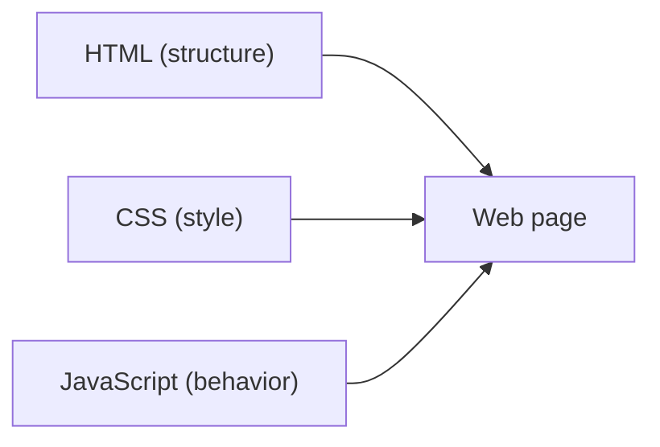

# HTML, CSS, and JavaScript

This is post 2 in the Web Development 101 series.

> Web Development 101 series (2/10)

<!-- a-grade-intro:begin -->

**Core question**: Why is one web page split into *three* different languages?

> Because separating structure, style, and behavior lets each one change without breaking the others.

<!-- a-grade-intro:end -->

## What You Will Learn

- The *structure* HTML draws
- The *style* CSS applies
- The *behavior* JavaScript adds
- How the three work together
- The flexibility separation creates

## Why It Matters

When all three live in one file, fixing one line breaks another. *Separation* is the starting point of teamwork and maintenance — designers touch CSS, frontend engineers touch JS, content owners touch HTML.

> Good web code keeps roles separate.

## Concept at a Glance



Three pillars build one page.

## Key Terms

- **HTML**: meaningful *structure* (headings, paragraphs, links, forms).
- **CSS**: visible *style* (colors, fonts, layout).
- **JavaScript**: dynamic *behavior* (clicks, input, async calls).
- **Selector**: rule that picks where CSS applies.
- **Event**: signal that lets JS react to user input.

## Before/After

**Before (everything mixed)**

```html
<h1 style="color:red" onclick="alert('hi')">Title</h1>
```

**After (roles separated)**

```html
<h1 class="title">Title</h1>
```

```css
.title { color: red; }
```

```js
document.querySelector(".title").addEventListener("click", () => alert("hi"));
```

Same result, *much easier to change*.

## Hands-on: Build a Separated Page in 5 Steps

### Step 1 — Basic HTML structure

```html
<!-- index.html -->
<!doctype html>
<html lang="en">
  <head>
    <meta charset="utf-8">
    <title>Hello</title>
    <link rel="stylesheet" href="style.css">
  </head>
  <body>
    <h1 class="title">Hello there</h1>
    <button id="say">Greet</button>
    <script src="app.js" defer></script>
  </body>
</html>
```

### Step 2 — Add style with CSS

```css
/* style.css */
body { font-family: system-ui; }
.title { color: steelblue; }
button { padding: 8px 16px; }
```

### Step 3 — Add behavior with JS

```js
// app.js
document.getElementById("say").addEventListener("click", () => {
  alert("Nice to meet you");
});
```

### Step 4 — Open in a browser

```bash
python3 -m http.server 8000
# Open http://localhost:8000
```

### Step 5 — Inspect the tree

```text
F12 → Elements tab → see DOM tree and applied styles
```

## What to Notice in This Code

- HTML `class` and `id` are the *hooks* CSS and JS use.
- `defer` makes JS run after HTML parsing finishes.
- CSS *cascades* — multiple rules merge by priority.

## Five Common Mistakes

1. **Overusing `style="..."` inline.** The CSS file becomes pointless.
2. **Big `<script>` blocks inside HTML.** Hurts readability and caching.
3. **Reusing the same `id` on many elements.** An `id` must be unique on a page.
4. **Ignoring CSS specificity.** Reaching for `!important` to win the fight.
5. **Manipulating styles only with JS.** Toggling a CSS class is simpler.

## How This Shows Up in Production

Even huge sites reduce to these three languages. React and Vue are tools that ultimately produce *HTML, CSS, and JS* for the browser. Understanding the separation principle keeps you grounded in any framework.

## How a Senior Engineer Thinks

- Write *meaningful* HTML first (semantic tags).
- Style with *reusable* classes.
- Keep JS responsible for *behavior only*.
- Consider accessibility from the start.
- Design so a single change happens in one place.

## Checklist

- [ ] You can name each language's responsibility in one sentence.
- [ ] You know the difference between inline and external CSS.
- [ ] You can read the DOM tree and CSS rules in DevTools.
- [ ] You know the difference between `defer` and `async`.
- [ ] You can refactor mixed code into separated files.

## Practice Problems

1. Take an HTML file full of inline styles and move them into a CSS file.
2. Build five buttons that toggle background color via a CSS class.
3. Pick a favorite site and find five *semantic tags* in its HTML.

## Wrap-up and Next Steps

Three languages model the principle of *separation of concerns*. Next, we look at how the browser turns HTML into a tree (the DOM).

<!-- toc:begin -->
- [How the Web Works](./01-how-the-web-works.md)
- **HTML, CSS, and JavaScript (current)**
- The Browser and the DOM (upcoming)
- HTTP and APIs (upcoming)
- Frontend and Backend (upcoming)
- Authentication and Sessions (upcoming)
- Connecting to a Database (upcoming)
- Deployment (upcoming)
- Performance and Caching (upcoming)
- Building a Small Web App (upcoming)
<!-- toc:end -->

## References

- [HTML basics (MDN)](https://developer.mozilla.org/en-US/docs/Learn/Getting_started_with_the_web/HTML_basics)
- [CSS basics (MDN)](https://developer.mozilla.org/en-US/docs/Learn/Getting_started_with_the_web/CSS_basics)
- [JavaScript basics (MDN)](https://developer.mozilla.org/en-US/docs/Learn/Getting_started_with_the_web/JavaScript_basics)
- [Semantic HTML (MDN)](https://developer.mozilla.org/en-US/docs/Glossary/Semantics)

Tags: Computer Science, WebDevelopment, HTML, CSS, JavaScript, Frontend
