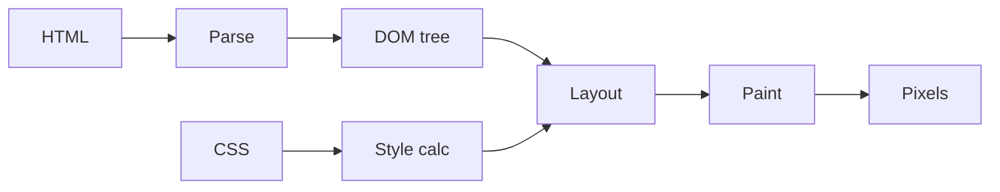

# The Browser and the DOM

> Web Development 101 series (3/10)

<!-- a-grade-intro:begin -->

**Core question**: How does the browser turn HTML text into a *living screen* you can click?

> It builds a *tree (the DOM)*, computes styles, runs layout and paint, and then handles *behavior* through the event loop.

<!-- a-grade-intro:end -->

## What You Will Learn

- What the DOM is and how it gets built
- The stages of the rendering pipeline
- How JavaScript manipulates the DOM
- The basics of events and the event loop
- Patterns that ruin performance

## Why It Matters

Without a mental model of the DOM, you will never understand *why your page is slow*. Once the rendering pipeline is in your head, even React and Vue stop feeling like magic.

> The browser is *a machine for drawing the DOM*.

## Concept at a Glance



Five stages: Parse, Style, Layout, Paint, Composite.

## Key Terms

- **DOM (Document Object Model)**: HTML represented as an object tree.
- **Render tree**: DOM plus computed styles.
- **Layout**: computing the position and size of every element.
- **Paint**: drawing pixels.
- **Event loop**: queue system that handles asynchronous work.

## Before/After

**Before (string-style HTML)**

```js
document.body.innerHTML += "<p>new item</p>";
```

**After (DOM API)**

```js
const p = document.createElement("p");
p.textContent = "new item";
document.body.appendChild(p);
```

The DOM API is *safer and faster* — and it blocks XSS by default.

## Hands-on: Working With the DOM in 5 Steps

### Step 1 — Look at the tree

```html
<!-- index.html -->
<ul id="list">
  <li>apple</li>
  <li>pear</li>
</ul>
<script src="app.js"></script>
```

### Step 2 — Select elements

```js
// app.js
const list = document.getElementById("list");
const items = list.querySelectorAll("li");
console.log(items.length);  // 2
```

### Step 3 — Add a new element

```js
const li = document.createElement("li");
li.textContent = "grape";
list.appendChild(li);
```

### Step 4 — Register an event

```js
list.addEventListener("click", (e) => {
  if (e.target.tagName === "LI") {
    console.log("clicked:", e.target.textContent);
  }
});
```

This is *event delegation* — one listener on the parent.

### Step 5 — Compare with async

```js
console.log("1");
setTimeout(() => console.log("2"), 0);
console.log("3");
// Output: 1, 3, 2 — the event loop runs the callback later.
```

## What to Notice in This Code

- DOM mutations are *expensive* (they trigger layout and paint).
- Event delegation saves both memory and time.
- Even `setTimeout(fn, 0)` does not run *immediately*.

## Five Common Mistakes

1. **Using `innerHTML` with user input.** XSS opens up.
2. **Adding DOM nodes one by one in a loop.** Layout fires every time.
3. **Attaching one listener per `<li>`.** No event delegation.
4. **Not knowing *when* JS runs.** `defer` vs `async` vs inline matters.
5. **Assuming the DOM is *synchronous*.** Async callback order surprises you.

## How This Shows Up in Production

React and Vue use a *Virtual DOM* to batch real DOM calls into one update. Infinite scroll, chat apps, browser games — all of them ride on the DOM and the event loop. When something is slow, open Chrome DevTools' *Performance* tab to see layout and paint as flame charts.

## How a Senior Engineer Thinks

- *Batch* DOM calls into one update.
- Delegate events to parents.
- Measure first, then optimize (DevTools Performance).
- Use virtualization for long lists.
- Hunt down code that triggers repaints.

## Checklist

- [ ] You can list the five rendering stages.
- [ ] You can create and attach an element with the DOM API.
- [ ] You use event delegation.
- [ ] You can predict sync vs async order.
- [ ] You know the risks of `innerHTML`.

## Practice Problems

1. Compare adding 100 `<li>` items one by one vs adding them with a `DocumentFragment`. Time both.
2. Attach a single click listener to a parent `<ul>` and log the text of the clicked `<li>`.
3. Predict the output of `console.log("a"); Promise.resolve().then(() => console.log("b")); console.log("c");`.

## Wrap-up and Next Steps

The browser is *a machine for drawing the DOM*. Next, we look at the bridge between client and server: HTTP and APIs.

<!-- toc:begin -->
- [How the Web Works](./01-how-the-web-works.md)
- [HTML, CSS, and JavaScript](./02-html-css-javascript.md)
- **The Browser and the DOM (current)**
- HTTP and APIs (upcoming)
- Frontend and Backend (upcoming)
- Authentication and Sessions (upcoming)
- Connecting to a Database (upcoming)
- Deployment (upcoming)
- Performance and Caching (upcoming)
- Building a Small Web App (upcoming)
<!-- toc:end -->

## References

- [DOM (MDN)](https://developer.mozilla.org/en-US/docs/Web/API/Document_Object_Model)
- [Critical rendering path (MDN)](https://developer.mozilla.org/en-US/docs/Web/Performance/Critical_rendering_path)
- [Event delegation (MDN)](https://developer.mozilla.org/en-US/docs/Learn/JavaScript/Building_blocks/Events#event_delegation)
- [Event loop (MDN)](https://developer.mozilla.org/en-US/docs/Web/JavaScript/Event_loop)

Tags: Computer Science, WebDevelopment, Browser, DOM, JavaScript, Frontend
