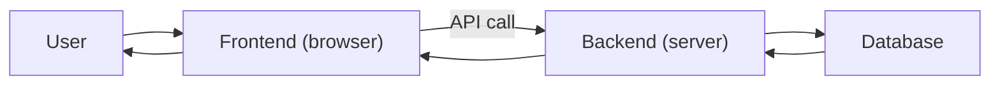

# Frontend and Backend

This is post 5 in the Web Development 101 series.

> Web Development 101 series (5/10)

<!-- a-grade-intro:begin -->

**Core question**: *Where* does the frontend's job end and the backend's begin?

> Whoever owns the *source of truth* is the backend; whoever *shows* it to the user is the frontend.

<!-- a-grade-intro:end -->

## What You Will Learn

- How responsibility splits between frontend and backend
- SPA (Single Page App) vs SSR (Server-Side Rendering)
- How the API contract bridges the two worlds
- Tradeoffs when the same logic could live on either side
- The picture a full-stack engineer holds in mind

## Why It Matters

Even when one person writes both sides, blurring the *boundary of responsibility* rots the code fast. The boundary is not a *physical line* — it is a *promise about who owns what*.

> Good systems have *clear boundaries*.

## Concept at a Glance



Data flows *DB → BE → FE → User*.

## Key Terms

- **Frontend**: the part that *shows* things to the user (runs in the browser).
- **Backend**: the part that *processes and stores* data (runs on a server).
- **SPA**: load once, then JS swaps screens.
- **SSR**: server builds HTML for every request.
- **Contract**: the agreed shape of the API between the two sides.

## Before/After

**Before (password check on the frontend)**

```js
if (password === "admin1234") { login(); }  // anyone can read this
```

**After (check on the backend)**

```python
# only the server can compare
if check_password(user, password):
    return token
```

The truth lives on the *server*.

## Hands-on: Connect the Two Sides in 5 Steps

### Step 1 — A tiny backend

```python
# server.py
from flask import Flask, jsonify
app = Flask(__name__)

@app.get("/api/items")
def items():
    return jsonify([{"id": 1, "name": "apple"}, {"id": 2, "name": "pear"}])

if __name__ == "__main__":
    app.run(port=8000)
```

### Step 2 — Call from the frontend

```html
<!-- index.html -->
<ul id="list"></ul>
<script>
fetch("http://localhost:8000/api/items")
  .then(r => r.json())
  .then(items => {
    const ul = document.getElementById("list");
    for (const it of items) {
      const li = document.createElement("li");
      li.textContent = it.name;
      ul.appendChild(li);
    }
  });
</script>
```

### Step 3 — Allow CORS

```python
# add to server.py
from flask_cors import CORS
CORS(app)
```

Browsers *block* cross-origin requests by default.

### Step 4 — Compare with server-side rendering

```python
# ssr.py
from flask import Flask, render_template_string
app = Flask(__name__)

@app.get("/")
def home():
    items = [{"name": "apple"}, {"name": "pear"}]
    return render_template_string("<ul><li>{{ i.name }}</li></ul>", items=items)
```

### Step 5 — Same feature, two styles

```text
SPA: 1 line of HTML + JS that fetches and builds the DOM
SSR: server returns fully built HTML on every request
```

## What to Notice in This Code

- The API contract (shape of `/api/items`) is *agreed by both sides*.
- CORS is a *browser* security policy, not a server one.
- SSR makes the *first paint* fast; SPA makes *later interactions* fast.

## Five Common Mistakes

1. **Doing authorization on the frontend.** Tools bypass it.
2. **Coding without an API contract.** Both sides assume different shapes.
3. **Pushing all business logic to the backend.** Even simple display logic hits the server.
4. **Pushing all logic to the frontend.** Secrets leak.
5. **Opening CORS to *every* origin.** A security hole.

## How This Shows Up in Production

Startups often start with SPA + REST API. Content sites prefer SSR (Next.js, Remix). A *full-stack* engineer who writes both still keeps the *contract* clean.

## How a Senior Engineer Thinks

- *Truth* on the backend, *experience* on the frontend.
- Draw the API contract *first*.
- Keep data flow one-directional.
- Always check security and authorization on the *backend*.
- Pick SPA or SSR per situation, not by fashion.

## Checklist

- [ ] You can describe each side's job in one sentence.
- [ ] You can sketch an API contract.
- [ ] You can read a CORS error message.
- [ ] You know the SPA vs SSR tradeoffs.
- [ ] You know where authorization must live.

## Practice Problems

1. Build the same screen as both SPA and SSR; compare *first-paint* time.
2. Trigger a CORS error on purpose and read the message.
3. Pick one endpoint and list the differences (auth, etc.) between calling it from FE vs BE.

## Wrap-up and Next Steps

Boundaries are *promises about responsibility*. Next, we layer *authentication and sessions* on top of that boundary.

<!-- toc:begin -->
- [How the Web Works](./01-how-the-web-works.md)
- [HTML, CSS, and JavaScript](./02-html-css-javascript.md)
- [The Browser and the DOM](./03-browser-and-dom.md)
- [HTTP and APIs](./04-http-and-api.md)
- **Frontend and Backend (current)**
- Authentication and Sessions (upcoming)
- Connecting to a Database (upcoming)
- Deployment (upcoming)
- Performance and Caching (upcoming)
- Building a Small Web App (upcoming)
<!-- toc:end -->

## References

- [Client-side vs server-side (MDN)](https://developer.mozilla.org/en-US/docs/Learn/Server-side/First_steps/Client-Server_overview)
- [SPA (MDN)](https://developer.mozilla.org/en-US/docs/Glossary/SPA)
- [Server-side rendering (MDN)](https://developer.mozilla.org/en-US/docs/Glossary/SSR)
- [CORS (MDN)](https://developer.mozilla.org/en-US/docs/Web/HTTP/CORS)

Tags: Computer Science, WebDevelopment, Frontend, Backend, Architecture, FullStack
