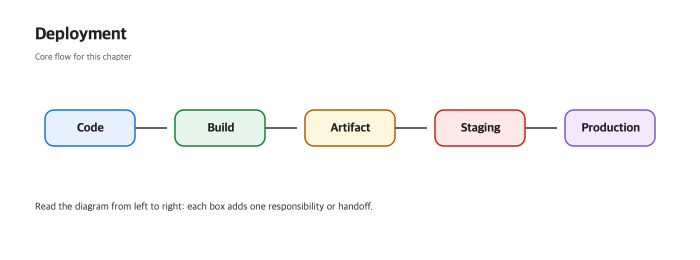

# Deployment

“Works on my laptop” usually means the application is still missing part of its operating model. Once code leaves a personal machine, configuration, secrets, repeatable builds, health checks, and rollback paths all become part of the feature.

This is post 8 in the Web Development 101 series. Here we treat deployment as a reproducible release process rather than a copy-and-paste ritual so the same build can move safely across environments.

## What you will learn

- Splitting dev / staging / production environments
- Managing environment variables and secrets
- The meaning of build and artifact
- The difference between PaaS and IaaS
- A basic CI/CD pipeline

## Why It Matters

Manual deploys cause weekly accidents. Automated deploys change *team velocity* itself. Once you internalize the flow, every platform feels familiar.

> Deployment is *habit*, not *feature*.

## Concept at a Glance



*A release flow where source code becomes one artifact that moves across environments.*

The point of this picture is repeatability. If the artifact changes per environment, you are no longer promoting the same release through a pipeline—you are rebuilding the product under different conditions and hoping the results match.

### What to verify yourself

- Start the app without the expected environment variables and confirm which values are truly required.
- Build one Docker image and run it with different environment values instead of rebuilding for each stage.
- After deployment, call `/health` directly and confirm that the platform sees a 200 response.

**Expected output:** Configuration changes through environment variables only, the same image can run in multiple stages, and the health endpoint gives a fast Pass/Fail signal.

**Failure mode to watch for:** Different builds per environment destroy reproducibility. No rollback path turns a small deploy failure into a long outage.

## Key Terms

- **Environment**: same code, *different config* (dev/staging/prod).
- **Build artifact**: the output of a build (file, image).
- **PaaS**: a platform that *abstracts* hosting (Heroku, Vercel).
- **IaaS**: VMs you operate yourself (AWS EC2).
- **CI/CD**: push → build → test → deploy, automated.

## Before/After

**Before (SSH and copy)**

```bash
scp -r ./app user@server:/var/www/  # different result every time
```

**After (CI builds and deploys)**

```yaml
# .github/workflows/deploy.yml (gist)
on: { push: { branches: [main] } }
jobs:
  deploy:
    runs-on: ubuntu-latest
    steps:
      - uses: actions/checkout@v4
      - run: pip install -r requirements.txt
      - run: pytest
      - run: ./deploy.sh
```

The artifact becomes *reproducible*.

## Hands-on: Ship a Small App in 5 Steps

### Step 1 — Move config into env vars

```python
# app.py
import os
DB_URL = os.environ["DATABASE_URL"]
DEBUG = os.environ.get("DEBUG", "0") == "1"
```

Never hardcode *secrets*.

### Step 2 — Pin dependencies

```text
# requirements.txt
flask==3.0.3
gunicorn==22.0.0
```

Same versions, same build.

### Step 3 — Build an artifact with a Dockerfile

```dockerfile
FROM python:3.12-slim
WORKDIR /app
COPY requirements.txt .
RUN pip install -r requirements.txt
COPY . .
CMD ["gunicorn", "-b", "0.0.0.0:8000", "app:app"]
```

One image equals one *immutable artifact*.

### Step 4 — Deploy to a PaaS (Fly.io / Render)

```bash
# Fly.io
fly launch     # once
fly deploy     # every release
```

Or with Render, you only *connect* the repo and it deploys on push.

### Step 5 — Health check + rollback

```python
@app.get("/health")
def health(): return {"status": "ok"}, 200
```

Most PaaSes auto-rollback if `/health` does not return 200.

## What to Notice in This Code

- Env vars live *outside* the code.
- *Promote* the same image from staging to prod.
- Health checks must be *cheap* to be useful.

## Five Common Mistakes

1. **Committing secrets.** Once leaked, leaked forever.
2. **Different builds per environment.** Not reproducible.
3. **Auto-deploys with no tests.** CI/CD becomes *accident automation*.
4. **No rollback plan.** Thirty minutes becomes three hours.
5. **Heavy health checks.** False signals block traffic.

## How This Shows Up in Production

Startups usually start on a *PaaS* (Render, Fly.io, Vercel). At scale they migrate to tools like *Kubernetes*. Either way, the skeleton — *env vars + immutable artifact + automated deploy* — stays the same.

## How a Senior Engineer Thinks

- Build *reproducibly*.
- Secrets only in a *secret store*.
- Spread risk with *blue/green* or *canary* releases.
- One-click *rollback* on every deploy.
- Pair every deploy with *monitoring*.

## Checklist

- [ ] Config lives in env vars.
- [ ] CI runs tests on every merge.
- [ ] One Docker image is reused across environments.
- [ ] Health check runs after each deploy.
- [ ] You can roll back with one command.

## Practice Problems

1. Build a small Flask app with Docker and run it locally as a container.
2. Wire up a GitHub Actions workflow for *push → test → build*.
3. Pick one PaaS and deploy a hello-world; confirm the health-check URL.

## Wrap-up and Next Steps

Deployment is *a habit*. Next, when the deployed app is *slow*, what do we look at? Performance and caching.

<!-- toc:begin -->
- [How the Web Works](./01-how-the-web-works.md)
- [HTML, CSS, and JavaScript](./02-html-css-javascript.md)
- [The Browser and the DOM](./03-browser-and-dom.md)
- [HTTP and APIs](./04-http-and-api.md)
- [Frontend and Backend](./05-frontend-and-backend.md)
- [Authentication and Sessions](./06-auth-and-sessions.md)
- [Connecting to a Database](./07-connecting-to-database.md)
- **Deployment (current)**
- Performance and Caching (upcoming)
- Building a Small Web App (upcoming)
<!-- toc:end -->

## References

### Official Docs
- [The Twelve-Factor App](https://12factor.net/)
- [Docker Get Started](https://docs.docker.com/get-started/)
- [GitHub Actions Quickstart](https://docs.github.com/en/actions/writing-workflows/quickstart)

### Practical Checks
- [Deploying Flask with Gunicorn](https://flask.palletsprojects.com/en/stable/deploying/gunicorn/)
- [HEALTHCHECK in Dockerfiles](https://docs.docker.com/reference/dockerfile/#healthcheck)

Tags: Computer Science, WebDevelopment, Deployment, DevOps, CICD, Hosting
