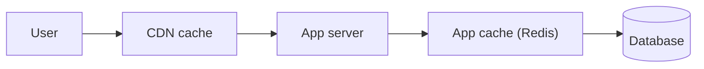

# Performance and Caching

> Web Development 101 series (9/10)

<!-- a-grade-intro:begin -->

**Core question**: When a page is slow, *where* should you start fixing it?

> Measure, cache, reduce, defer. Make the same work happen *less often* and *closer* to the user.

<!-- a-grade-intro:end -->

## What You Will Learn

- Basic performance measurement (browser and server)
- HTTP cache headers (Cache-Control, ETag)
- The role of a CDN
- Lazy loading and code splitting
- DB indexes and the N+1 problem

## Why It Matters

A fast site is *money* — conversion, search rank, and user satisfaction all scale with speed. And making it fast is a job of *measurement*, not guessing.

> Performance starts with *measuring*.

## Concept at a Glance



The closest cache that has the answer is the *fastest*.

## Key Terms

- **TTFB**: time to first byte (server response speed).
- **HTTP cache**: the rules that let the browser *reuse* a response.
- **CDN**: *proxy servers* spread around the world.
- **Lazy load**: do not fetch until needed.
- **Index**: a *shortcut* the DB uses to find rows fast.

## Before/After

**Before (DB on every request)**

```python
@app.get("/popular")
def popular():
    return db.fetch("SELECT * FROM posts ORDER BY views DESC LIMIT 10")
```

**After (cache for 1 minute)**

```python
import time
_cache = {"at": 0, "data": None}
@app.get("/popular")
def popular():
    if time.time() - _cache["at"] > 60:
        _cache["data"] = db.fetch("SELECT * FROM posts ORDER BY views DESC LIMIT 10")
        _cache["at"] = time.time()
    return _cache["data"]
```

Same answer, *dozens fewer* DB calls.

## Hands-on: Make It Faster in 5 Steps

### Step 1 — Measure

```text
Browser: F12 → Lighthouse or Performance tab
Server: time.perf_counter() or APM (Datadog, New Relic)
```

### Step 2 — Cache headers on static files

```python
# Flask
@app.after_request
def add_cache(resp):
    if resp.mimetype.startswith(("image/", "text/css")):
        resp.headers["Cache-Control"] = "public, max-age=31536000, immutable"
    return resp
```

### Step 3 — Add a CDN

```text
Put Cloudflare/Fastly/CloudFront in front and
static assets become close to users on every continent.
```

### Step 4 — Lazy loading

```html

```

```js
// JS code splitting (dynamic import)
button.onclick = async () => {
  const mod = await import("./editor.js");
  mod.open();
};
```

### Step 5 — DB indexes and the N+1 trap

```sql
CREATE INDEX idx_posts_views ON posts(views DESC);
```

```python
# N+1 (bad)
for p in posts: print(p.author.name)  # SELECT every loop

# join (good)
posts = db.fetch("SELECT p.*, u.name FROM posts p JOIN users u ON u.id = p.user_id")
```

## What to Notice in This Code

- A cache must come with both *lifetime* and *invalidation*.
- CDNs help most for *static* assets.
- Indexes follow *query patterns*, not random columns.

## Five Common Mistakes

1. **Optimizing on a hunch.** The slow part is usually elsewhere.
2. **`no-cache` on every response.** You waste cacheable wins.
3. **CDN-caching *dynamic* responses.** Risk of leaking per-user data.
4. **Indexing *every* column.** Writes get slow.
5. **No monitoring for N+1.** The service quietly degrades.

## How This Shows Up in Production

Browser → CDN → app cache (Redis) → DB — this *four-layer cache* underpins almost every large site. The habit of designing the *cache strategy* alongside the feature is one thing that separates seniors from juniors.

## How a Senior Engineer Thinks

- Loop *measure → hypothesis → experiment*.
- Design caches with both *TTL* and *invalidation key*.
- Cache *closest* to the user first.
- Verify indexes with *EXPLAIN*.
- Watch *p95/p99* (averages lie).

## Checklist

- [ ] You ran Lighthouse at least once.
- [ ] Static assets have `Cache-Control`.
- [ ] A CDN sits in front of static assets.
- [ ] You know how to find N+1 queries.
- [ ] You have created at least one DB index.

## Practice Problems

1. Pick one endpoint and *measure* response time before and after caching.
2. Compare page load time with and without ``.
3. Reproduce an N+1 and refactor it into a single SQL join.

## Wrap-up and Next Steps

Performance starts with *measurement*. In the final post we tie everything together and build a small web app.

<!-- toc:begin -->
- [How the Web Works](./01-how-the-web-works.md)
- [HTML, CSS, and JavaScript](./02-html-css-javascript.md)
- [The Browser and the DOM](./03-browser-and-dom.md)
- [HTTP and APIs](./04-http-and-api.md)
- [Frontend and Backend](./05-frontend-and-backend.md)
- [Authentication and Sessions](./06-auth-and-sessions.md)
- [Connecting to a Database](./07-connecting-to-database.md)
- [Deployment](./08-deployment.md)
- **Performance and Caching (current)**
- Building a Small Web App (upcoming)
<!-- toc:end -->

## References

- [HTTP caching (MDN)](https://developer.mozilla.org/en-US/docs/Web/HTTP/Caching)
- [Lazy loading (MDN)](https://developer.mozilla.org/en-US/docs/Web/Performance/Lazy_loading)
- [Lighthouse overview](https://developer.chrome.com/docs/lighthouse/overview/)
- [Database indexes (Use The Index, Luke!)](https://use-the-index-luke.com/)

Tags: Computer Science, WebDevelopment, Performance, Caching, CDN, Optimization
