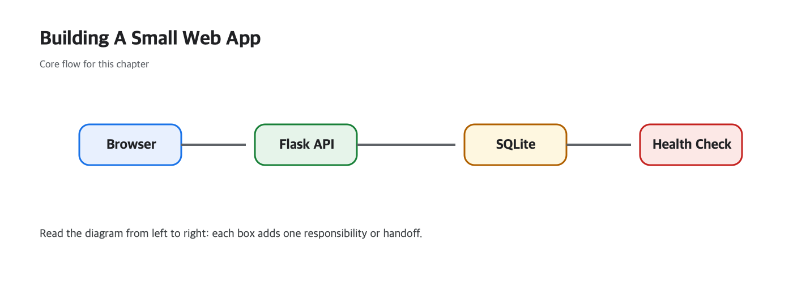

# Building a Small Web App

Concepts feel separate until you force them to cooperate inside one real project. A tiny app is where routing, templates, APIs, persistence, configuration, health checks, and deployment suddenly become one continuous engineering story instead of ten isolated lessons.

This is the final post in the Web Development 101 series. Here we turn the series into a working Todo app so the core layers of web development can be practiced end to end in one small but complete system.

## What you will learn

- See every concept from the series live *in one app*
- A folder layout for a small full-stack project
- The full build-and-deploy flow end to end
- A map of what to learn next
- A retrospective on the whole series

## Why It Matters

Knowledge sets only when you *make something small*. One small full-stack app teaches more than five books. The Todo app you build here becomes the skeleton of *every project that follows*.

> Build *small* and go *all the way through*.

## Concept at a Glance



*The end-to-end shape of the Todo app built in this capstone chapter.*

This final figure is the whole series compressed into one vertical slice. The browser submits input, Flask accepts and stores it, SQLite persists it, and the same data comes back through JSON for rendering.

### What to verify yourself

- Add a Todo through `curl` and confirm that the browser-rendered list updates from the same data source.
- Run the app inside a container and confirm that `/health` still answers correctly.
- Change `DB_PATH` and verify that the app switches storage locations without changing application code.

**Expected output:** The HTML view and API share one source of truth, environment variables redirect storage cleanly, and container execution reproduces local behavior.

**Failure mode to watch for:** If error cases still return 200, the frontend cannot tell success from failure. Hardcoded storage paths make local and deployed environments drift apart quickly.

## Key Terms

- **Capstone**: the *integration project* that closes a series.
- **Full-stack**: FE + BE + DB + deployment.
- **MVP**: the smallest *working* slice.
- **Folder layout**: a layout you could share with a teammate.
- **Smoke test**: a minimal check that the core flow *works*.

## Before/After

**Before (one-line script)**

```python
print("hello")
```

**After (one app)**

```text
todo-app/
├── app.py
├── templates/index.html
├── static/style.css
├── requirements.txt
└── Dockerfile
```

From `hello` to a *shippable app*.

## Hands-on: The Todo App in 5 Steps

### Step 1 — Project setup

```bash
mkdir todo-app && cd todo-app
python3 -m venv .venv && source .venv/bin/activate
pip install flask gunicorn
```

### Step 2 — Backend (`app.py`)

```python
from flask import Flask, request, jsonify, render_template
import sqlite3, os

DB = os.environ.get("DB_PATH", "todo.db")
app = Flask(__name__)

def conn():
    c = sqlite3.connect(DB)
    c.row_factory = sqlite3.Row
    return c

with conn() as c:
    c.execute("CREATE TABLE IF NOT EXISTS todos(id INTEGER PRIMARY KEY, text TEXT, done INTEGER DEFAULT 0)")

@app.get("/")
def home(): return render_template("index.html")

@app.get("/api/todos")
def list_todos():
    rows = conn().execute("SELECT * FROM todos ORDER BY id DESC").fetchall()
    return jsonify([dict(r) for r in rows])

@app.post("/api/todos")
def add_todo():
    text = request.get_json()["text"]
    with conn() as c:
        c.execute("INSERT INTO todos(text) VALUES (?)", (text,))
    return jsonify(ok=True), 201

@app.get("/health")
def health(): return {"status": "ok"}
```

### Step 3 — Frontend (`templates/index.html`)

```html
<!doctype html>
<html lang="en">
<head><meta charset="utf-8"><title>Todo</title>
  <link rel="stylesheet" href="/static/style.css"></head>
<body>
  <h1>Todo</h1>
  <form id="f"><input id="t" placeholder="what to do"><button>add</button></form>
  <ul id="list"></ul>
<script>
async function load() {
  const items = await (await fetch("/api/todos")).json();
  document.getElementById("list").innerHTML = items.map(i => `<li>${i.text}</li>`).join("");
}
document.getElementById("f").addEventListener("submit", async e => {
  e.preventDefault();
  await fetch("/api/todos", {method: "POST", headers: {"Content-Type": "application/json"},
    body: JSON.stringify({text: document.getElementById("t").value})});
  document.getElementById("t").value = "";
  load();
});
load();
</script>
</body></html>
```

### Step 4 — Smoke test

```bash
flask --app app run
# in another terminal
curl -X POST -H "Content-Type: application/json" -d '{"text":"first todo"}' http://localhost:5000/api/todos
curl http://localhost:5000/api/todos
```

### Step 5 — Docker + deploy

```dockerfile
FROM python:3.12-slim
WORKDIR /app
COPY . .
RUN pip install -r requirements.txt
ENV DB_PATH=/data/todo.db
CMD ["gunicorn", "-b", "0.0.0.0:8000", "app:app"]
```

```bash
docker build -t todo-app . && docker run -p 8000:8000 -v $PWD/data:/data todo-app
```

## What to Notice in This Code

- The same *env var* (DB_PATH) drives both local and container runs.
- `/health` is the *signal* a deployment system uses.
- All nine concepts of the series fit in roughly 100 lines.

## Five Common Mistakes

1. **Hardcoding the DB path.** Push it to env vars.
2. **Inlining all JS in the first page.** Even small apps benefit from separation.
3. **Returning 200 on errors.** Honor status codes.
4. **Deploying with no test.** At least a health check + curl.
5. **Reaching for a *huge framework* too early.** Start small.

## How This Shows Up in Production

This little app can grow into a *blog, a budget tracker, a notebook, a chatbot*. Big SaaS products are *extensions of this very structure* — auth, cache, queue, batch, layered on top.

## How a Senior Engineer Thinks

- Ship a *vertical slice* end to end.
- Use env vars only for *what differs* between environments.
- Health check + logging + monitoring from day one.
- Redraw boundaries as features grow.
- As the product scales, *team agreements* (reviews, CI) matter more.

## Checklist

- [ ] FE, BE, and DB all live in one app.
- [ ] You have a health check endpoint.
- [ ] Configuration is moved to env vars.
- [ ] You have curled an endpoint.
- [ ] You have run it as a container.

## Practice Problems

1. Add *toggle done* and *delete* to the Todo app (PUT/DELETE).
2. Add session login so each user has their own todos.
3. Add cache headers to static assets and run Lighthouse.

## Wrap-up and Next Steps

That is *Web Development 101*. Next steps are depth — Frontend Development 101, Backend Development 101, and Database 101 take you one layer deeper. The best next book is the *next app you build*.

<!-- toc:begin -->
- [How the Web Works](./01-how-the-web-works.md)
- [HTML, CSS, and JavaScript](./02-html-css-javascript.md)
- [The Browser and the DOM](./03-browser-and-dom.md)
- [HTTP and APIs](./04-http-and-api.md)
- [Frontend and Backend](./05-frontend-and-backend.md)
- [Authentication and Sessions](./06-auth-and-sessions.md)
- [Connecting to a Database](./07-connecting-to-database.md)
- [Deployment](./08-deployment.md)
- [Performance and Caching](./09-performance-and-caching.md)
- **Building a Small Web App (current)**
<!-- toc:end -->

## References

### Official Docs
- [Flask quickstart](https://flask.palletsprojects.com/en/stable/quickstart/)
- [sqlite3 — DB-API 2.0 interface for SQLite databases](https://docs.python.org/3/library/sqlite3.html)
- [Docker Get Started](https://docs.docker.com/get-started/)

### Practical Checks
- [The Twelve-Factor App](https://12factor.net/)
- [Using the Fetch API (MDN)](https://developer.mozilla.org/en-US/docs/Web/API/Fetch_API/Using_Fetch)

Tags: Computer Science, WebDevelopment, Capstone, Flask, FullStack, Project
