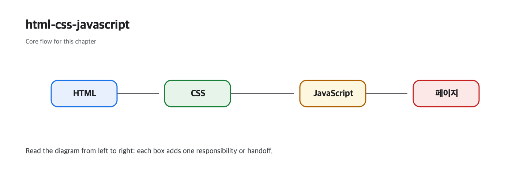

# HTML, CSS, JavaScript

웹 페이지를 처음 만들 때는 세 언어가 왜 따로 존재하는지 잘 와닿지 않습니다. 화면 하나를 만들 뿐인데 구조용 언어, 스타일용 언어, 동작용 언어가 따로 있다는 사실이 오히려 번거롭게 보이기도 합니다. 하지만 규모가 조금만 커져도 이 분리가 왜 중요한지 금방 드러납니다.

이 글은 Web Development 101 시리즈의 두 번째 글입니다. 여기서는 HTML, CSS, JavaScript가 각각 무엇을 맡고, 왜 세 층을 분리하는 편이 유지보수와 협업에 유리한지 정리하겠습니다.

---

## 이 글에서 다룰 문제

- 웹 페이지는 왜 세 가지 언어로 나뉠까요?
- HTML, CSS, JavaScript는 각각 무엇을 책임질까요?
- 세 언어가 함께 동작할 때 어떤 연결 지점이 생길까요?
- 코드가 한 파일에 뒤섞이면 어떤 문제가 커질까요?
- 브라우저 DevTools에서 이 세 층을 어떻게 읽을 수 있을까요?

> 좋은 웹 코드는 구조, 스타일, 동작을 분리해 각 층의 변경 비용을 낮춥니다.

## 왜 이 구분이 중요한가

세 언어가 한 파일 안에서 뒤엉키면 한 줄을 고칠 때마다 다른 영역이 흔들립니다. 디자인 수정이 동작 버그를 부르고, 스크립트 변경이 마크업 구조를 깨뜨리는 식입니다. 작은 예제에서는 버틸 수 있어도 팀 작업으로 넘어가면 금방 읽기 어려워집니다.

이 분리는 단지 미적인 취향이 아닙니다. 디자이너는 CSS를, 프론트엔드 엔지니어는 JavaScript를, 콘텐츠 담당자는 HTML을 주로 다룹니다. 역할이 나뉘어야 변경 범위가 좁아지고, 캐시 전략도 단순해지고, 코드 리뷰도 훨씬 쉬워집니다.

## 한눈에 보는 개념 지도



*구조, 스타일, 동작이 한 페이지를 함께 만드는 책임 분리를 보여 주는 그림입니다.*

이 그림에서 중요한 점은 세 언어가 같은 페이지를 만들더라도 같은 문제를 해결하지는 않는다는 사실입니다. HTML은 구조를, CSS는 시각 규칙을, JavaScript는 사용자 반응을 맡으므로 수정 범위를 분리할 수 있습니다.

### 직접 검증해 볼 포인트

- HTML만 있는 파일을 열어 제목과 버튼 구조가 먼저 보이는지 확인합니다.
- 같은 파일에 CSS를 연결한 뒤 색상과 여백만 바뀌는지 관찰합니다.
- JavaScript를 붙여 클릭 시 경고창이 뜨는지 확인해 구조·스타일·동작이 따로 바뀌는 경험을 만듭니다.

**기대 결과:** HTML 없이 CSS나 JavaScript만으로는 페이지 골격이 생기지 않고, 각 파일을 따로 수정할 때 영향 범위도 분리됩니다.

**실패 모드:** 모든 스타일과 동작을 HTML 안에 섞어 넣으면 작은 변경에도 파일 전체를 다시 읽어야 하고, 캐시 이점도 크게 줄어듭니다.

## 먼저 알아둘 용어

- **HTML**: 제목, 문단, 링크, 폼 같은 구조를 표현합니다.
- **CSS**: 색상, 폰트, 레이아웃처럼 보이는 스타일을 정의합니다.
- **JavaScript**: 클릭, 입력, 비동기 호출 같은 동작을 추가합니다.
- **Selector**: CSS가 어느 요소에 적용될지 고르는 규칙입니다.
- **Event**: 사용자 입력이나 브라우저 상태 변화를 JavaScript가 받을 수 있게 하는 신호입니다.

## Before / After로 보는 분리의 가치

**Before (everything mixed)**

```html
<h1 style="color:red" onclick="alert('hi')">Title</h1>
```

**After (roles separated)**

```html
<h1 class="title">Title</h1>
```

```css
.title { color: red; }
```

```js
document.querySelector(".title").addEventListener("click", () => alert("hi"));
```

결과는 같아도 바꾸는 방법은 훨씬 단순해집니다. 제목 스타일을 바꿀 때 HTML을 뜯지 않아도 되고, 클릭 동작을 지울 때 CSS를 건드릴 이유도 없습니다.

## 분리된 페이지를 다섯 단계로 만들기

### 1단계 — HTML 기본 구조 만들기

```html
<!-- index.html -->
<!doctype html>
<html lang="en">
  <head>
    <meta charset="utf-8">
    <title>Hello</title>
    <link rel="stylesheet" href="style.css">
  </head>
  <body>
    <h1 class="title">Hello there</h1>
    <button id="say">Greet</button>
    <script src="app.js" defer></script>
  </body>
</html>
```

HTML은 이 페이지에 어떤 요소가 있는지 선언합니다. 제목과 버튼이 있다는 사실이 먼저 정해져야 그다음 스타일과 동작을 붙일 수 있습니다.

### 2단계 — CSS로 스타일 추가하기

```css
/* style.css */
body { font-family: system-ui; }
.title { color: steelblue; }
button { padding: 8px 16px; }
```

CSS는 구조를 바꾸지 않고 모양만 조절합니다. 이 분리 덕분에 시각 디자인을 수정할 때 HTML 구조를 흔들지 않아도 됩니다.

### 3단계 — JavaScript로 동작 추가하기

```js
// app.js
document.getElementById("say").addEventListener("click", () => {
  alert("Nice to meet you");
});
```

JavaScript는 버튼 클릭 같은 사용자 입력에 반응합니다. 이때 `id`와 `class`는 HTML이 JavaScript와 CSS에 제공하는 연결 고리 역할을 합니다.

### 4단계 — 브라우저에서 열기

```bash
python3 -m http.server 8000
# http://localhost:8000 열기
```

간단한 정적 서버를 띄우면 파일 연결 상태를 실제 브라우저에서 확인할 수 있습니다.

### 5단계 — DOM 트리와 스타일 확인하기

```text
F12 → Elements 탭 → DOM 트리와 적용된 스타일 확인
```

Elements 탭에서는 HTML 구조와 CSS 규칙이 어떻게 맞물리는지 한 번에 볼 수 있습니다. 브라우저가 실제로 어떤 DOM을 만들었는지 확인하는 습관이 중요합니다.

## 이 코드에서 먼저 봐야 할 점

- HTML의 `class`와 `id`는 CSS와 JavaScript가 연결되는 지점입니다.
- `defer`는 HTML 파싱이 끝난 뒤 JavaScript를 실행하게 만듭니다.
- CSS는 여러 규칙이 우선순위에 따라 합쳐지는 cascade 구조를 가집니다.

## 여기서 자주 헷갈립니다

1. **`style="..."`를 과하게 쓰는 경우**: CSS 파일의 장점이 사라집니다.
2. **큰 `<script>` 블록을 HTML 안에 넣는 경우**: 가독성과 캐시 효율이 모두 떨어집니다.
3. **같은 `id`를 여러 요소에 재사용하는 경우**: `id`는 문서 안에서 유일해야 합니다.
4. **CSS specificity를 이해하지 못한 채 `!important`에 의존하는 경우**: 규칙 충돌이 더 복잡해집니다.
5. **스타일 변경을 모두 JavaScript로만 처리하는 경우**: CSS 클래스를 토글하는 편이 더 단순합니다.

## 운영에서는 이렇게 보입니다

React나 Vue 같은 프레임워크를 써도 브라우저가 받는 것은 HTML, CSS, JavaScript입니다. 프레임워크는 이 세 언어를 더 잘 관리하게 도와주는 도구일 뿐입니다. 이 원칙을 알고 있으면 새로운 도구를 배울 때도 중심을 잃지 않습니다.

## 시니어 엔지니어는 이렇게 생각합니다

- 먼저 의미 있는 HTML을 씁니다. 가능하면 semantic tag를 사용합니다.
- CSS는 재사용 가능한 클래스 중심으로 설계합니다.
- JavaScript는 동작에만 집중하게 둡니다.
- 접근성은 나중이 아니라 처음부터 함께 봅니다.
- 변경이 한 곳에서 끝나도록 구조를 짭니다.

## 체크리스트

- [ ] 세 언어의 책임을 각각 한 문장으로 설명할 수 있습니다.
- [ ] inline CSS와 external CSS의 차이를 알고 있습니다.
- [ ] DevTools에서 DOM 트리와 CSS 규칙을 읽을 수 있습니다.
- [ ] `defer`와 `async`의 차이를 알고 있습니다.
- [ ] 뒤섞인 코드를 분리된 파일 구조로 옮길 수 있습니다.

## 연습 문제

1. inline style이 많은 HTML 파일 하나를 골라 CSS 파일로 분리해 보세요.
2. 버튼 다섯 개를 만들고 CSS 클래스를 토글해 배경색이 바뀌게 해 보세요.
3. 자주 가는 사이트의 HTML에서 semantic tag 다섯 개를 찾아보세요.

## 정리와 다음 글

HTML, CSS, JavaScript는 관심사를 분리하는 가장 기본적인 훈련입니다. 구조, 스타일, 동작을 나눠 생각할 수 있어야 브라우저가 화면을 어떻게 그리는지도 자연스럽게 이해됩니다. 다음 글에서는 브라우저가 HTML을 DOM 트리로 바꾸는 과정을 보겠습니다.

<!-- toc:begin -->
- [웹은 어떻게 동작하는가?](./01-how-the-web-works.md)
- **HTML, CSS, JavaScript (현재 글)**
- 브라우저와 DOM (예정)
- HTTP와 API (예정)
- Frontend와 Backend (예정)
- 인증과 세션 (예정)
- 데이터베이스 연결 (예정)
- 배포 (예정)
- 성능과 캐싱 (예정)
- 작은 웹앱 만들기 (예정)
<!-- toc:end -->

## 참고 자료

### 공식 문서
- [HTML basics (MDN)](https://developer.mozilla.org/en-US/docs/Learn_web_development/Getting_started/Your_first_website/Creating_the_content)
- [CSS basics (MDN)](https://developer.mozilla.org/en-US/docs/Learn_web_development/Getting_started/Your_first_website/Styling_the_content)
- [JavaScript basics (MDN)](https://developer.mozilla.org/en-US/docs/Learn_web_development/Getting_started/Your_first_website/Adding_interactivity)

### 개념 보강
- [Semantic HTML (MDN)](https://developer.mozilla.org/en-US/docs/Glossary/Semantics)
- [script 요소와 defer/async (MDN)](https://developer.mozilla.org/en-US/docs/Web/HTML/Reference/Elements/script)

Tags: Computer Science, WebDevelopment, HTML, CSS, JavaScript, Frontend
