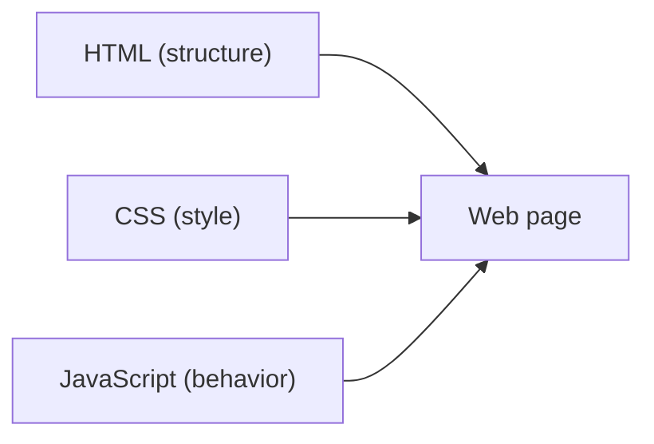

# HTML, CSS, JavaScript

> Web Development 101 시리즈 (2/10)


## 이 글에서 다룰 문제

세 언어가 한 파일에 섞이면 한 줄을 고쳐도 다른 곳이 깨집니다. *분리* 는 협업과 유지보수의 출발선입니다 — 디자이너는 CSS, 프론트엔드 엔지니어는 JS, 콘텐츠 담당자는 HTML을 다룹니다.

> 좋은 웹 코드는 *역할이 분리* 되어 있습니다.

## 전체 흐름


세 기둥이 모여 한 페이지를 만듭니다.

## Before/After

**Before (한 파일에 다 섞음)**

```html
<h1 style="color:red" onclick="alert('hi')">Title</h1>
```

**After (역할 분리)**

```html
<h1 class="title">Title</h1>
```

```css
.title { color: red; }
```

```js
document.querySelector(".title").addEventListener("click", () => alert("hi"));
```

같은 결과지만 *바꾸기 쉬워졌습니다*.

## 분리된 페이지 만들기 5단계

### 1단계 — HTML 기본 구조

```html
<!-- index.html -->
<!doctype html>
<html lang="ko">
  <head>
    <meta charset="utf-8">
    <title>Hello</title>
    <link rel="stylesheet" href="style.css">
  </head>
  <body>
    <h1 class="title">안녕하세요</h1>
    <button id="say">인사하기</button>
    <script src="app.js" defer></script>
  </body>
</html>
```

### 2단계 — CSS로 스타일 입히기

```css
/* style.css */
body { font-family: system-ui; }
.title { color: steelblue; }
button { padding: 8px 16px; }
```

### 3단계 — JS로 동작 더하기

```js
// app.js
document.getElementById("say").addEventListener("click", () => {
  alert("반갑습니다");
});
```

### 4단계 — 브라우저에서 확인

```bash
python3 -m http.server 8000
# http://localhost:8000 접속
```

### 5단계 — DevTools로 트리 보기

```text
F12 → Elements 탭 → DOM 트리와 적용된 스타일 관찰
```

## 이 코드에서 주목할 점

- HTML의 `class` 와 `id` 가 CSS/JS의 *연결고리* 입니다.
- `defer` 는 HTML 파싱 후 JS가 실행되도록 합니다.
- CSS는 *cascading* — 여러 규칙이 우선순위로 합쳐집니다.

## 자주 하는 실수 5가지

1. **`style="..."` 인라인 스타일 남용.** CSS 파일이 무력해집니다.
2. **HTML 안에 큰 `<script>` 블록.** 가독성과 캐싱이 모두 손해입니다.
3. **`id` 를 여러 요소에 쓴다.** id는 페이지에 *하나* 뿐입니다.
4. **CSS 우선순위를 무시한다.** `!important` 로 덮으려 한다.
5. **JS로 모든 스타일을 조작한다.** CSS class 토글이 더 단순합니다.

## 실무에서는 이렇게 쓰입니다

대규모 사이트도 결국 이 세 언어로 환원됩니다. React/Vue 같은 프레임워크도 마지막에는 *HTML/CSS/JS* 를 만들어 브라우저에 보냅니다. 분리의 원칙을 알면 어떤 프레임워크를 만나도 길을 잃지 않습니다.

## 체크리스트

- [ ] 세 언어의 책임을 한 문장으로 말할 수 있다.
- [ ] 인라인 스타일과 외부 CSS의 차이를 안다.
- [ ] DOM 트리와 CSS 규칙을 DevTools에서 본다.
- [ ] `defer` 와 `async` 의 차이를 안다.
- [ ] 같은 결과를 더 *분리된* 방식으로 다시 쓸 수 있다.

## 정리 및 다음 단계

세 언어는 *역할의 분리* 라는 원칙을 보여줍니다. 다음 글에서는 브라우저가 HTML을 받아 어떻게 트리(DOM)로 만드는지 봅니다.

<!-- toc:begin -->
- [웹은 어떻게 동작하는가?](./01-how-the-web-works.md)
- **HTML, CSS, JavaScript (현재 글)**
- 브라우저와 DOM (예정)
- HTTP와 API (예정)
- Frontend와 Backend (예정)
- 인증과 세션 (예정)
- 데이터베이스 연결 (예정)
- 배포 (예정)
- 성능과 캐싱 (예정)
- 작은 웹앱 만들기 (예정)
<!-- toc:end -->

## 참고 자료

- [HTML basics (MDN)](https://developer.mozilla.org/en-US/docs/Learn/Getting_started_with_the_web/HTML_basics)
- [CSS basics (MDN)](https://developer.mozilla.org/en-US/docs/Learn/Getting_started_with_the_web/CSS_basics)
- [JavaScript basics (MDN)](https://developer.mozilla.org/en-US/docs/Learn/Getting_started_with_the_web/JavaScript_basics)
- [Semantic HTML (MDN)](https://developer.mozilla.org/en-US/docs/Glossary/Semantics)

Tags: Computer Science, WebDevelopment, HTML, CSS, JavaScript, Frontend
