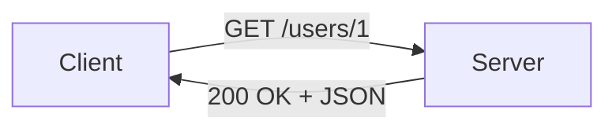

# HTTP와 API

웹 개발을 하다 보면 결국 가장 많이 읽고 쓰는 것은 HTTP 메시지입니다. 브라우저가 페이지를 요청할 때도, JavaScript가 JSON 데이터를 가져올 때도, 모바일 앱이 서버와 통신할 때도 바닥에는 HTTP가 놓여 있습니다. 요청과 응답의 모양을 정확히 모르면 디버깅은 금방 추측 게임으로 바뀝니다.

이 글은 Web Development 101 시리즈의 네 번째 글입니다. 여기서는 HTTP 요청과 응답이 어떤 형태를 가지는지, method와 status code와 header가 각각 어떤 의미를 가지는지, API 호출이 페이지 요청과 무엇이 다른지 정리하겠습니다.

---

## 이 글에서 다룰 문제

- 클라이언트와 서버는 실제로 무엇을 주고받을까요?
- HTTP 요청과 응답은 어떤 요소로 구성될까요?
- GET, POST, PUT, DELETE는 각각 어떤 의미일까요?
- `Content-Type`은 왜 중요할까요?
- API 호출과 HTML 페이지 요청은 무엇이 같고 무엇이 다를까요?

> HTTP는 method, URL, header, body를 주고받는 단순한 계약입니다.

## 왜 이 구조를 알아야 하는가

웹 개발의 절반은 HTTP 메시지를 만들고 읽는 일입니다. 요청이 어떤 method로 갔는지, 응답이 왜 404인지, 서버가 JSON을 줬는지 HTML을 줬는지를 읽지 못하면 오류 원인을 좁히기 어렵습니다. 프레임워크는 이 메시지를 다루기 쉽게 감싸 줄 뿐, 메시지 자체를 없애 주지는 않습니다.

한 번 HTTP의 모양을 익혀 두면 Flask, FastAPI, React, 모바일 앱, GraphQL, gRPC를 볼 때도 공통된 감각이 생깁니다. 이름은 달라도 많은 시스템이 결국 HTTP 위에서 움직이기 때문입니다.

## 한눈에 보는 개념 지도



클라이언트는 요청 한 줄과 메타데이터와 본문을 보내고, 서버는 상태 코드와 메타데이터와 본문으로 답합니다. 이것이 HTTP의 기본 골격입니다.

## 먼저 알아둘 용어

- **Method**: 무엇을 하려는지 나타냅니다. GET은 조회, POST는 생성에 자주 씁니다.
- **Status code**: 요청 결과를 나타냅니다. 2xx는 성공, 4xx는 클라이언트 오류, 5xx는 서버 오류입니다.
- **Header**: `Content-Type`, `Authorization` 같은 메타데이터입니다.
- **Body**: JSON, HTML, 이미지 바이트처럼 실제 payload가 들어가는 영역입니다.
- **API**: 브라우저 사람이 아니라 프로그램이 호출하도록 설계된 엔드포인트입니다.

## Before / After로 보는 요청 대상의 차이

**Before (HTML page request)**

```python
import requests
r = requests.get("https://example.com")
print(r.text[:80])  # <!doctype html>...
```

**After (JSON API call)**

```python
import requests
r = requests.get("https://api.github.com/repos/python/cpython")
data = r.json()
print(data["full_name"], data["stargazers_count"])
```

둘 다 HTTP이지만 응답의 `Content-Type`이 다릅니다. 전자는 HTML 문서, 후자는 JSON 데이터입니다.

## HTTP 메시지를 다섯 단계로 읽어 보기

### 1단계 — GET 요청 보내기

```python
# 1_get.py
import requests
r = requests.get("https://httpbin.org/get?lang=en")
print(r.status_code)
print(r.json()["args"])  # {'lang': 'en'}
```

GET은 읽기 요청에 가장 많이 쓰입니다. 쿼리스트링이 서버에 그대로 전달되는 것도 함께 볼 수 있습니다.

### 2단계 — POST로 본문 보내기

```python
# 2_post.py
import requests
r = requests.post("https://httpbin.org/post", json={"name": "yeongseon"})
print(r.json()["json"])
```

POST는 서버 상태가 바뀔 수 있는 작업에 주로 사용합니다. JSON 본문을 보내면 서버가 그 내용을 읽어 처리합니다.

### 3단계 — 헤더 확인하기

```python
# 3_headers.py
import requests
r = requests.get("https://httpbin.org/headers", headers={"X-Custom": "hi"})
print(r.json()["headers"]["X-Custom"])
```

헤더는 인증, 캐시, 콘텐츠 타입 같은 부가 정보를 실어 나릅니다. 같은 URL이라도 헤더에 따라 처리 방식이 달라질 수 있습니다.

### 4단계 — 상태 코드로 분기하기

```python
# 4_status.py
import requests
for url in ["https://httpbin.org/status/200", "https://httpbin.org/status/404"]:
    r = requests.get(url)
    if r.ok:
        print("OK", r.status_code)
    else:
        print("FAIL", r.status_code)
```

클라이언트는 응답 본문만 보지 않고 상태 코드도 함께 읽어야 합니다. 같은 JSON 구조라도 200과 404는 전혀 다른 의미입니다.

### 5단계 — raw 요청과 응답 보기

```bash
curl -v https://httpbin.org/get
# > GET /get HTTP/1.1
# > Host: httpbin.org
# < HTTP/1.1 200 OK
# < Content-Type: application/json
```

`curl -v`는 HTTP가 실제로 어떤 텍스트를 주고받는지 감각을 잡는 데 좋습니다. 프레임워크 뒤에 숨은 메시지를 직접 볼 수 있습니다.

## 이 코드에서 먼저 봐야 할 점

- `Content-Type`이 `text/html`인지 `application/json`인지에 따라 클라이언트 처리 방식이 달라집니다.
- POST는 서버 상태가 바뀔 수 있다는 계약을 담고 있습니다.
- 같은 URL이라도 method가 다르면 완전히 다른 동작을 할 수 있습니다.

## 여기서 자주 헷갈립니다

1. **GET으로 데이터를 생성하는 경우**: GET은 읽기 전용 계약으로 보는 편이 맞습니다.
2. **모든 응답을 200으로 돌려주는 경우**: 클라이언트가 실패를 구분할 수 없습니다.
3. **`Content-Type`을 무시하는 경우**: HTML을 JSON처럼 파싱하다가 오류가 납니다.
4. **에러 본문 형식을 제멋대로 만드는 경우**: 클라이언트가 메시지를 안정적으로 읽기 어렵습니다.
5. **인증 정보를 URL에 넣는 경우**: 로그와 히스토리에 오래 남습니다.

## 운영에서는 이렇게 보입니다

대부분의 웹과 모바일 앱은 JSON over HTTP 형태로 서버와 통신합니다. GraphQL과 gRPC도 결국 HTTP 위에 서 있습니다. 새 서비스를 처음 볼 때 API 문서를 먼저 읽는 이유도 여기에 있습니다. 요청과 응답의 형식이 시스템 계약의 중심이기 때문입니다.

## 시니어 엔지니어는 이렇게 생각합니다

- method와 status code를 본래 의미에 맞게 씁니다.
- 에러 응답의 형식을 표준화합니다.
- 인증 정보는 header로 보내고, 토큰 수명은 짧게 둡니다.
- timeout과 retry 예산을 항상 같이 봅니다.
- API와 문서는 함께 자라야 한다고 생각합니다.

## 체크리스트

- [ ] 네 가지 기본 method의 의미를 알고 있습니다.
- [ ] 2xx, 4xx, 5xx 범위의 뜻을 알고 있습니다.
- [ ] `Content-Type`을 읽고 처리 분기를 할 수 있습니다.
- [ ] timeout과 retry를 설정할 수 있습니다.
- [ ] `curl`로 raw 요청을 날릴 수 있습니다.

## 연습 문제

1. `httpbin.org/anything`에 GET, POST, PUT, DELETE를 보내고 응답 차이를 비교해 보세요.
2. 3xx redirect를 따라가지 않는 코드를 작성해 보세요.
3. 공개 API 하나를 골라 세 개 이상의 엔드포인트를 호출해 보세요.

## 정리와 다음 글

HTTP는 문자 기반 계약이지만, 웹 개발에서는 가장 중요한 바닥 구조입니다. 요청과 응답의 모양을 알면 API를 읽고 서버를 디버깅하는 속도가 달라집니다. 다음 글에서는 이 계약의 양쪽 끝, Frontend와 Backend의 책임 경계를 정리하겠습니다.

<!-- toc:begin -->
- [웹은 어떻게 동작하는가?](./01-how-the-web-works.md)
- [HTML, CSS, JavaScript](./02-html-css-javascript.md)
- [브라우저와 DOM](./03-browser-and-dom.md)
- **HTTP와 API (현재 글)**
- Frontend와 Backend (예정)
- 인증과 세션 (예정)
- 데이터베이스 연결 (예정)
- 배포 (예정)
- 성능과 캐싱 (예정)
- 작은 웹앱 만들기 (예정)
<!-- toc:end -->

## 참고 자료

- [HTTP overview (MDN)](https://developer.mozilla.org/en-US/docs/Web/HTTP/Overview)
- [HTTP methods (MDN)](https://developer.mozilla.org/en-US/docs/Web/HTTP/Methods)
- [HTTP status codes (MDN)](https://developer.mozilla.org/en-US/docs/Web/HTTP/Status)
- [httpbin (request/response service)](https://httpbin.org/)

Tags: Computer Science, WebDevelopment, HTTP, API, REST, Networking
