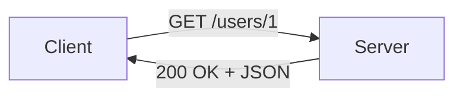

# HTTP와 API

> Web Development 101 시리즈 (4/10)


## 이 글에서 다룰 문제

웹 개발의 절반은 *HTTP 메시지를 만들고 읽는 일* 입니다. 메시지의 모양을 모르면 디버깅이 추측 게임이 됩니다. 한 번만 정확히 익혀두면 어떤 프레임워크에서도 통합니다.

> HTTP는 *문자로 된 약속* 입니다.

## 개념 한눈에 보기



요청 한 줄, 응답 한 줄.

## Before/After

**Before (HTML 페이지 요청)**

```python
import requests
r = requests.get("https://example.com")
print(r.text[:80])  # <!doctype html>...
```

**After (JSON API 호출)**

```python
import requests
r = requests.get("https://api.github.com/repos/python/cpython")
data = r.json()
print(data["full_name"], data["stargazers_count"])
```

같은 HTTP, 다른 *Content-Type*.

## 실습: HTTP 메시지 5단계

### 1단계 — GET 요청

```python
# 1_get.py
import requests
r = requests.get("https://httpbin.org/get?lang=ko")
print(r.status_code)
print(r.json()["args"])  # {'lang': 'ko'}
```

### 2단계 — POST로 데이터 보내기

```python
# 2_post.py
import requests
r = requests.post("https://httpbin.org/post", json={"name": "yeongseon"})
print(r.json()["json"])
```

### 3단계 — 헤더 살펴보기

```python
# 3_headers.py
import requests
r = requests.get("https://httpbin.org/headers", headers={"X-Custom": "hi"})
print(r.json()["headers"]["X-Custom"])
```

### 4단계 — Status code 분기

```python
# 4_status.py
import requests
for url in ["https://httpbin.org/status/200", "https://httpbin.org/status/404"]:
    r = requests.get(url)
    if r.ok:
        print("OK", r.status_code)
    else:
        print("FAIL", r.status_code)
```

### 5단계 — 직접 raw로 보기

```bash
curl -v https://httpbin.org/get
# > GET /get HTTP/1.1
# > Host: httpbin.org
# < HTTP/1.1 200 OK
# < Content-Type: application/json
```

## 이 코드에서 주목할 점

- `Content-Type` 이 `text/html` 인지 `application/json` 인지가 *전부* 를 가른다.
- POST는 *서버 상태를 바꿀 수 있다* 는 약속이다.
- 같은 URL이 method에 따라 다르게 동작한다.

## 자주 하는 실수 5가지

1. **GET으로 데이터를 만든다.** GET은 *읽기 전용* 약속.
2. **모든 응답을 200으로 보낸다.** 클라이언트가 오류를 못 걸러낸다.
3. **`Content-Type` 을 안 본다.** JSON인 척 HTML을 파싱한다.
4. **에러 본문이 자유 형식.** 클라이언트가 메시지를 못 꺼낸다.
5. **인증 헤더를 URL에 넣는다.** 로그에 그대로 남는다.

## 실무에서는 이렇게 쓰입니다

대부분의 모바일/웹 앱은 *JSON over HTTP* 로 서버와 통신합니다. GraphQL, gRPC도 결국 HTTP 위에서 동작합니다. 새 서비스를 다룰 때 가장 먼저 보는 것이 *API 문서* 인 이유입니다.

## 체크리스트

- [ ] 4가지 method의 의미를 안다.
- [ ] 2xx/4xx/5xx의 범위를 안다.
- [ ] `Content-Type` 헤더를 읽고 분기할 수 있다.
- [ ] timeout과 retry를 설정할 수 있다.
- [ ] curl로 raw 요청을 던질 수 있다.

## 정리 및 다음 단계

HTTP는 *문자로 된 약속* 입니다. 다음 글에서는 그 약속의 양쪽 — Frontend와 Backend — 의 분리를 봅니다.

<!-- toc:begin -->
- [웹은 어떻게 동작하는가?](./01-how-the-web-works.md)
- [HTML, CSS, JavaScript](./02-html-css-javascript.md)
- [브라우저와 DOM](./03-browser-and-dom.md)
- **HTTP와 API (현재 글)**
- Frontend와 Backend (예정)
- 인증과 세션 (예정)
- 데이터베이스 연결 (예정)
- 배포 (예정)
- 성능과 캐싱 (예정)
- 작은 웹앱 만들기 (예정)
<!-- toc:end -->

## 참고 자료

- [HTTP overview (MDN)](https://developer.mozilla.org/en-US/docs/Web/HTTP/Overview)
- [HTTP methods (MDN)](https://developer.mozilla.org/en-US/docs/Web/HTTP/Methods)
- [HTTP status codes (MDN)](https://developer.mozilla.org/en-US/docs/Web/HTTP/Status)
- [httpbin (request/response service)](https://httpbin.org/)

Tags: Computer Science, WebDevelopment, HTTP, API, REST, Networking
