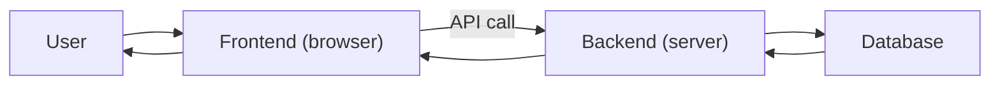

# Frontend와 Backend

웹 개발을 배우다 보면 Frontend와 Backend를 서로 다른 기술 묶음처럼만 보기 쉽습니다. 하지만 실무에서 더 중요한 것은 도구 이름이 아니라 책임 경계입니다. 누가 데이터를 보여 주고, 누가 저장하고, 누가 권한을 검증하는지 구분되지 않으면 작은 서비스도 금방 지저분해집니다.

이 글은 Web Development 101 시리즈의 다섯 번째 글입니다. 여기서는 Frontend와 Backend의 역할을 나눠 보고, SPA와 SSR이 어떤 차이를 가지는지, 두 세계를 잇는 API 계약이 왜 중요한지 정리하겠습니다.

---

## 이 글에서 다룰 문제

- Frontend와 Backend의 일은 어디서 갈릴까요?
- 데이터의 진실은 어느 쪽이 가져야 할까요?
- SPA와 SSR은 무엇이 다를까요?
- API 계약은 두 영역 사이에서 어떤 역할을 할까요?
- 같은 로직을 어느 쪽에 둘지 판단하는 기준은 무엇일까요?

> 사용자 경험은 Frontend가 만들고, 데이터의 진실은 Backend가 지킵니다.

## 왜 이 경계가 중요한가

한 사람이 양쪽 코드를 모두 짜더라도 책임 경계가 흐려지면 코드가 빠르게 무너집니다. Frontend에서 권한 검사를 하고, Backend에서 화면용 문자열을 과하게 조립하고, API 형식이 문서 없이 바뀌기 시작하면 변경 영향 범위를 읽기 어려워집니다.

이 경계는 물리적인 선이 아니라 소유권에 대한 약속입니다. 무엇을 저장할지, 무엇을 노출할지, 어느 쪽이 최종 판단권을 가질지 먼저 정해야 시스템이 커져도 버틸 수 있습니다.

## 한눈에 보는 개념 지도



기본 데이터 흐름은 `DB → Backend → Frontend → User`입니다. 화면에 보이는 값은 Frontend가 다루더라도, 원본 데이터의 진실은 보통 Backend와 Database 쪽에 있습니다.

## 먼저 알아둘 용어

- **Frontend**: 브라우저에서 실행되며 사용자에게 정보를 보여 주는 영역입니다.
- **Backend**: 서버에서 실행되며 데이터를 처리하고 저장하는 영역입니다.
- **SPA**: 첫 페이지를 한 번 로드한 뒤 JavaScript로 화면을 바꾸는 방식입니다.
- **SSR**: 요청마다 서버가 HTML을 만들어 돌려주는 방식입니다.
- **Contract**: 두 영역이 합의한 API 요청과 응답의 형태입니다.

## Before / After로 보는 책임 배치

**Before (password check on the frontend)**

```js
if (password === "admin1234") { login(); }  // anyone can read this
```

**After (check on the backend)**

```python
# 서버에서만 비교
if check_password(user, password):
    return token
```

비밀번호 검증처럼 민감한 판단은 서버에서 해야 합니다. Frontend 코드는 누구나 열어 볼 수 있기 때문입니다.

## 두 세계를 다섯 단계로 연결해 보기

### 1단계 — 아주 작은 Backend 만들기

```python
# server.py
from flask import Flask, jsonify
app = Flask(__name__)

@app.get("/api/items")
def items():
    return jsonify([{"id": 1, "name": "apple"}, {"id": 2, "name": "pear"}])

if __name__ == "__main__":
    app.run(port=8000)
```

이 서버는 `/api/items` 요청에 JSON 배열을 돌려줍니다. 이 응답 형식이 곧 Frontend와 Backend 사이의 첫 번째 계약이 됩니다.

### 2단계 — Frontend에서 호출하기

```html
<!-- index.html -->
<ul id="list"></ul>
<script>
fetch("http://localhost:8000/api/items")
  .then(r => r.json())
  .then(items => {
    const ul = document.getElementById("list");
    for (const it of items) {
      const li = document.createElement("li");
      li.textContent = it.name;
      ul.appendChild(li);
    }
  });
</script>
```

Frontend는 이 JSON 구조를 믿고 DOM을 만듭니다. `id`와 `name` 필드가 어떻게 생겼는지 양쪽이 함께 알고 있어야 합니다.

### 3단계 — CORS 허용하기

```python
# server.py에 추가
from flask_cors import CORS
CORS(app)
```

브라우저는 다른 origin으로 가는 요청을 기본적으로 제한합니다. 이 정책이 CORS이며, 서버가 허용 범위를 명시해야 브라우저가 요청을 통과시킵니다.

### 4단계 — 서버 사이드 렌더링과 비교하기

```python
# ssr.py
from flask import Flask, render_template_string
app = Flask(__name__)

@app.get("/")
def home():
    items = [{"name": "apple"}, {"name": "pear"}]
    return render_template_string("<ul><li>{{ i.name }}</li></ul>", items=items)
```

SSR에서는 서버가 HTML까지 만들어 돌려줍니다. 첫 화면이 빠르게 보일 수 있지만, 이후 상호작용 방식은 SPA와 다르게 설계됩니다.

### 5단계 — 같은 기능, 다른 스타일

```text
SPA: HTML 한 줄과 JS가 데이터를 가져와 DOM을 만듭니다.
SSR: 서버가 매 요청마다 완성된 HTML을 돌려줍니다.
```

둘은 경쟁 관계라기보다 상황에 따라 선택하는 렌더링 방식입니다. 첫 화면 속도, 상호작용 패턴, SEO 요구사항에 따라 달라집니다.

## 이 코드에서 먼저 봐야 할 점

- `/api/items`의 응답 형태는 양쪽이 함께 지켜야 하는 계약입니다.
- CORS는 서버 보안 정책이라기보다 브라우저 보안 정책에 가깝습니다.
- SSR은 첫 paint를 빠르게 만들고, SPA는 이후 상호작용을 빠르게 만드는 데 유리합니다.

## 여기서 자주 헷갈립니다

1. **권한 검사를 Frontend에서만 하는 경우**: 개발자 도구로 쉽게 우회됩니다.
2. **API 계약 없이 양쪽을 동시에 개발하는 경우**: 필드 이름과 형태가 서로 달라집니다.
3. **모든 비즈니스 로직을 Backend로 몰아넣는 경우**: 단순한 화면 로직도 서버 의존이 커집니다.
4. **모든 로직을 Frontend로 밀어 넣는 경우**: 비밀 정보와 검증 규칙이 노출됩니다.
5. **CORS를 모든 origin에 무조건 열어 두는 경우**: 불필요한 보안 구멍이 생깁니다.

## 운영에서는 이렇게 보입니다

스타트업은 SPA + REST API 조합으로 시작하는 경우가 많고, 콘텐츠 사이트는 SSR 계열 프레임워크를 선호하는 경우가 많습니다. 어떤 조합을 택하더라도 강한 팀은 API 계약을 먼저 그리고, 진실은 Backend에, 사용자 경험은 Frontend에 두려는 원칙을 유지합니다.

## 시니어 엔지니어는 이렇게 생각합니다

- 데이터의 진실은 Backend에 둡니다.
- 사용자 경험은 Frontend에서 세심하게 다룹니다.
- API 계약을 먼저 그려 두고 양쪽 구현을 시작합니다.
- 보안과 권한 검사는 반드시 Backend에서 다시 확인합니다.
- SPA와 SSR은 유행이 아니라 상황에 맞춰 선택합니다.

## 체크리스트

- [ ] Frontend와 Backend의 책임을 각각 한 문장으로 설명할 수 있습니다.
- [ ] API 계약의 예를 간단히 그릴 수 있습니다.
- [ ] CORS 오류 메시지를 읽을 수 있습니다.
- [ ] SPA와 SSR의 장단점을 알고 있습니다.
- [ ] 권한 검사는 Backend가 맡는다는 점을 알고 있습니다.

## 연습 문제

1. 같은 화면을 SPA와 SSR 두 방식으로 각각 만들어 보고 첫 화면 속도를 비교해 보세요.
2. 일부러 CORS 오류를 만든 뒤 브라우저 콘솔 메시지를 읽어 보세요.
3. 하나의 엔드포인트를 골라 Frontend에서 호출할 때와 Backend에서 호출할 때 차이를 정리해 보세요.

## 정리와 다음 글

Frontend와 Backend의 경계는 기술 분류표가 아니라 책임 약속입니다. 이 약속이 선명해야 데이터, 보안, 사용자 경험이 제자리를 찾습니다. 다음 글에서는 이 경계 위에 로그인과 사용자 기억을 얹는 인증과 세션을 다루겠습니다.

<!-- toc:begin -->
- [웹은 어떻게 동작하는가?](./01-how-the-web-works.md)
- [HTML, CSS, JavaScript](./02-html-css-javascript.md)
- [브라우저와 DOM](./03-browser-and-dom.md)
- [HTTP와 API](./04-http-and-api.md)
- **Frontend와 Backend (현재 글)**
- 인증과 세션 (예정)
- 데이터베이스 연결 (예정)
- 배포 (예정)
- 성능과 캐싱 (예정)
- 작은 웹앱 만들기 (예정)
<!-- toc:end -->

## 참고 자료

- [Client-side vs server-side (MDN)](https://developer.mozilla.org/en-US/docs/Learn/Server-side/First_steps/Client-Server_overview)
- [SPA (MDN)](https://developer.mozilla.org/en-US/docs/Glossary/SPA)
- [Server-side rendering (MDN)](https://developer.mozilla.org/en-US/docs/Glossary/SSR)
- [CORS (MDN)](https://developer.mozilla.org/en-US/docs/Web/HTTP/CORS)

Tags: Computer Science, WebDevelopment, Frontend, Backend, Architecture, FullStack
