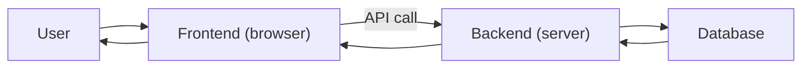

# Frontend과 Backend

> Web Development 101 시리즈 (5/10)


## 이 글에서 다룰 문제

작은 회사의 한 사람이 둘 다 짜더라도, *역할의 경계* 를 흐리면 코드가 빠르게 부패합니다. 경계는 *물리적인 줄* 이 아니라 *책임의 약속* 입니다.

> 좋은 시스템은 *경계가 분명* 합니다.

## 개념 한눈에 보기



데이터는 *DB → BE → FE → User* 로 흐릅니다.

## Before/After

**Before (FE에 비밀번호 검증)**

```js
if (password === "admin1234") { login(); }  // 클라이언트 코드는 *모두 보입니다*
```

**After (BE에 검증)**

```python
# 서버에서만 비교
if check_password(user, password):
    return token
```

진실은 *서버* 가 가집니다.

## 실습: 두 세계 잇기 5단계

### 1단계 — 작은 백엔드

```python
# server.py
from flask import Flask, jsonify
app = Flask(__name__)

@app.get("/api/items")
def items():
    return jsonify([{"id": 1, "name": "사과"}, {"id": 2, "name": "배"}])

if __name__ == "__main__":
    app.run(port=8000)
```

### 2단계 — Frontend에서 호출

```html
<!-- index.html -->
<ul id="list"></ul>
<script>
fetch("http://localhost:8000/api/items")
  .then(r => r.json())
  .then(items => {
    const ul = document.getElementById("list");
    for (const it of items) {
      const li = document.createElement("li");
      li.textContent = it.name;
      ul.appendChild(li);
    }
  });
</script>
```

### 3단계 — CORS 허용

```python
# server.py 에 추가
from flask_cors import CORS
CORS(app)
```

브라우저는 다른 출처(origin)에서 온 호출을 *기본으로 막습니다*.

### 4단계 — 서버 렌더링과 비교

```python
# ssr.py
from flask import Flask, render_template_string
app = Flask(__name__)

@app.get("/")
def home():
    items = [{"name": "사과"}, {"name": "배"}]
    return render_template_string("<ul><li>{{ i.name }}</li></ul>", items=items)
```

### 5단계 — 같은 기능, 두 방식

```text
SPA: HTML 1줄 + JS가 fetch + DOM 조립
SSR: 서버가 완성된 HTML을 매번 보냄
```

## 이 코드에서 주목할 점

- API 계약(`/api/items` 의 응답 모양)은 *양쪽이 합의* 한 것.
- CORS는 *브라우저* 의 보안 정책이지 서버의 것이 아니다.
- SSR은 *첫 페인트* 가 빠르고, SPA는 *이후 인터랙션* 이 빠르다.

## 자주 하는 실수 5가지

1. **FE에서 권한 검사를 끝낸다.** 도구로 우회된다.
2. **API 계약 없이 짠다.** 양쪽이 다른 모양을 가정한다.
3. **모든 비즈니스 로직을 BE에 둔다.** 단순 표시 로직까지 서버 호출.
4. **모든 로직을 FE에 둔다.** 비밀이 노출된다.
5. **CORS를 *모든* 출처로 연다.** 보안 구멍.

## 실무에서는 이렇게 쓰입니다

스타트업은 SPA + REST API로 시작하는 경우가 많습니다. 콘텐츠 사이트는 SSR(Next.js, Remix)을 선호합니다. *Full-stack* 엔지니어는 양쪽을 짜더라도 *경계의 약속* 을 분명히 둡니다.

## 체크리스트

- [ ] FE/BE의 책임을 한 줄로 말할 수 있다.
- [ ] API 계약을 그림으로 그릴 수 있다.
- [ ] CORS 오류 메시지를 읽을 수 있다.
- [ ] SPA와 SSR의 트레이드오프를 안다.
- [ ] 권한 검사가 어디에 있어야 하는지 안다.

## 정리 및 다음 단계

경계는 *책임의 약속* 입니다. 다음 글에서는 그 경계 위에 *인증과 세션* 을 어떻게 얹는지 봅니다.

<!-- toc:begin -->
- [웹은 어떻게 동작하는가?](./01-how-the-web-works.md)
- [HTML, CSS, JavaScript](./02-html-css-javascript.md)
- [브라우저와 DOM](./03-browser-and-dom.md)
- [HTTP와 API](./04-http-and-api.md)
- **Frontend과 Backend (현재 글)**
- 인증과 세션 (예정)
- 데이터베이스 연결 (예정)
- 배포 (예정)
- 성능과 캐싱 (예정)
- 작은 웹앱 만들기 (예정)
<!-- toc:end -->

## 참고 자료

- [Client-side vs server-side (MDN)](https://developer.mozilla.org/en-US/docs/Learn/Server-side/First_steps/Client-Server_overview)
- [SPA (MDN)](https://developer.mozilla.org/en-US/docs/Glossary/SPA)
- [Server-side rendering (MDN)](https://developer.mozilla.org/en-US/docs/Glossary/SSR)
- [CORS (MDN)](https://developer.mozilla.org/en-US/docs/Web/HTTP/CORS)

Tags: Computer Science, WebDevelopment, Frontend, Backend, Architecture, FullStack
