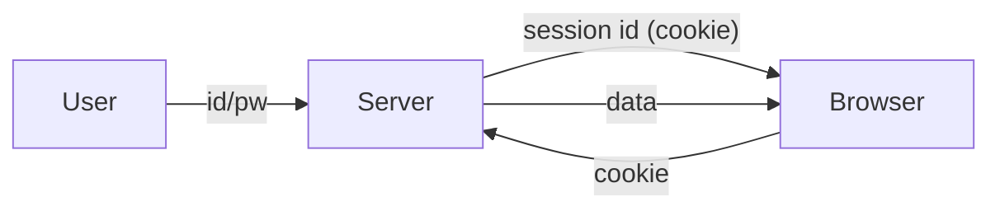

# 인증과 세션

HTTP는 상태를 기억하지 않는 프로토콜입니다. 요청 하나가 끝나면 서버는 다음 요청이 같은 사용자인지 자동으로 알지 못합니다. 그런데 실제 서비스는 로그인 상태, 권한, 장바구니, 내 정보 같은 사용자 맥락을 계속 이어 가야 합니다. 이 간극을 메우는 도구가 인증과 세션입니다.

이 글은 Web Development 101 시리즈의 여섯 번째 글입니다. 여기서는 인증과 인가의 차이, 쿠키와 세션의 동작 방식, JWT와 OAuth의 역할, 그리고 자주 놓치는 보안 기본기를 함께 정리하겠습니다.

---

## 이 글에서 다룰 문제

- 인증과 인가는 무엇이 다를까요?
- 상태가 없는 HTTP 위에서 서버는 사용자를 어떻게 기억할까요?
- 쿠키와 세션은 어떤 식으로 맞물릴까요?
- JWT는 세션과 무엇이 다를까요?
- OAuth는 왜 사용자 비밀번호를 직접 받지 않고도 로그인을 가능하게 할까요?

> 인증은 사용자를 확인하는 절차이고, 세션과 토큰은 그 결과를 요청 사이에 이어 주는 장치입니다.

## 왜 이 주제가 중요한가

거의 모든 앱에는 로그인 기능이 들어갑니다. 여기가 약하면 계정 탈취, 세션 하이재킹, 권한 우회가 한 번에 이어집니다. 인증은 부가 기능이 아니라 서비스 전체를 떠받치는 기반입니다.

이 도구들의 이름과 역할을 분명히 알아 두면 많은 실수를 초기에 막을 수 있습니다. 비밀번호는 어디에 저장하면 안 되는지, JWT에 무엇을 넣으면 안 되는지, 쿠키 옵션을 왜 꼼꼼히 봐야 하는지 같은 판단이 전부 이 기반 위에서 나옵니다.

## 한눈에 보는 개념 지도



서버는 로그인에 성공하면 세션 ID를 발급하고, 브라우저는 그 값을 쿠키로 저장한 뒤 이후 요청마다 자동으로 보냅니다.

## 먼저 알아둘 용어

- **Authentication**: 내가 누구인지 확인하는 과정입니다.
- **Authorization**: 내가 무엇을 할 수 있는지 결정하는 과정입니다.
- **Session**: 서버가 보관하는 사용자 상태입니다.
- **Cookie**: 브라우저가 도메인 단위로 저장하는 key/value 데이터입니다.
- **JWT**: 서버가 서명한 self-describing token입니다.

## Before / After로 보는 인증 흐름

**Before (password on every call)**

```python
requests.get("/api/me", auth=("alice", "secret"))  # 비밀번호가 반복해서 흐릅니다
```

**After (session cookie)**

```python
s = requests.Session()
s.post("/login", json={"id": "alice", "pw": "secret"})
s.get("/api/me")  # 쿠키가 자동으로 함께 전송됩니다
```

비밀번호는 로그인 시점에만 확인하고, 이후에는 세션 식별자로 사용자를 이어 가는 편이 안전합니다.

## 로그인 흐름을 다섯 단계로 만들어 보기

### 1단계 — Flask 세션 로그인 만들기

```python
# app.py
from flask import Flask, session, request, jsonify
app = Flask(__name__)
app.secret_key = "dev-only-change-me"

USERS = {"alice": "secret"}

@app.post("/login")
def login():
    data = request.get_json()
    if USERS.get(data["id"]) == data["pw"]:
        session["user"] = data["id"]
        return jsonify(ok=True)
    return jsonify(ok=False), 401

@app.get("/me")
def me():
    user = session.get("user")
    if not user: return jsonify(error="unauth"), 401
    return jsonify(user=user)
```

이 예제에서 서버는 로그인 성공 시 `session["user"]`에 사용자 ID를 저장합니다. 이후 `/me` 요청은 세션에 값이 있는지 보고 로그인 여부를 판단합니다.

### 2단계 — 쿠키가 실제로 생기는지 확인하기

```bash
curl -c c.txt -X POST -H "Content-Type: application/json" -d '{"id":"alice","pw":"secret"}' http://localhost:5000/login
curl -b c.txt http://localhost:5000/me  # → {"user":"alice"}
```

첫 번째 명령은 서버가 내려준 쿠키를 파일에 저장하고, 두 번째 명령은 그 쿠키를 다시 보내서 로그인 상태를 재사용합니다.

### 3단계 — 로그아웃 추가하기

```python
@app.post("/logout")
def logout():
    session.clear()
    return jsonify(ok=True)
```

로그아웃은 세션 정보를 지우는 작업입니다. 서버 기준 기억을 지우면 브라우저가 같은 세션 ID를 보내도 더는 유효하지 않습니다.

### 4단계 — JWT 발급하기

```python
# jwt_demo.py
import jwt, time
SECRET = "dev"
token = jwt.encode({"sub": "alice", "exp": time.time() + 3600}, SECRET, algorithm="HS256")
print(jwt.decode(token, SECRET, algorithms=["HS256"]))
```

JWT는 서버가 상태를 직접 저장하지 않고도 사용자를 식별하게 도와줍니다. 대신 서명 검증과 만료 시간 관리가 중요합니다.

### 5단계 — Authorization 헤더로 호출하기

```python
import requests
requests.get("/api/me", headers={"Authorization": f"Bearer {token}"})
```

세션 쿠키 대신 `Authorization` 헤더에 토큰을 넣어 요청하는 방식입니다. 모바일 앱과 분산 시스템에서 자주 보게 됩니다.

## 이 코드에서 먼저 봐야 할 점

- 세션은 서버 메모리나 데이터베이스 같은 저장소를 필요로 합니다.
- JWT는 서버가 매 요청마다 서명만 검증해도 되므로 분산 환경에 잘 맞습니다.
- 쿠키에는 `HttpOnly`, `Secure`, `SameSite` 같은 보안 옵션이 꼭 필요합니다.

## 여기서 자주 헷갈립니다

1. **비밀번호를 평문으로 저장하는 경우**: 반드시 hash 함수로 저장해야 합니다.
2. **JWT 안에 민감한 비밀을 넣는 경우**: JWT는 서명되었을 뿐 암호화된 것이 아닙니다.
3. **쿠키 보안 옵션을 비워 두는 경우**: XSS와 CSRF 위험이 커집니다.
4. **만료 시간이 없는 토큰을 쓰는 경우**: 한 번 유출되면 오래 남습니다.
5. **권한 검사를 로그인 한 번으로 끝내는 경우**: 보호된 모든 엔드포인트에서 다시 확인해야 합니다.

## 운영에서는 이렇게 보입니다

전통적인 웹앱은 세션 쿠키와 CSRF 토큰 조합을 많이 씁니다. SPA, 모바일 앱, 마이크로서비스 환경은 JWT를 더 자주 선택합니다. Google, GitHub 로그인은 OAuth 2.0 흐름 위에서 돌아가며, 서비스는 사용자 비밀번호 대신 외부 제공자의 인증 결과를 받습니다.

## 시니어 엔지니어는 이렇게 생각합니다

- 비밀번호는 hash로 저장하고 토큰 수명은 짧게 둡니다.
- 쿠키 기본값은 `HttpOnly + Secure + SameSite=Lax` 쪽으로 생각합니다.
- 권한 검사는 middleware처럼 공통 경로에 둡니다.
- refresh token으로 수명을 분리합니다.
- 유출을 전제로 설계하고, 모든 credential이 폐기 가능해야 한다고 봅니다.

## 체크리스트

- [ ] 인증과 인가의 차이를 설명할 수 있습니다.
- [ ] 세션과 JWT의 장단점을 알고 있습니다.
- [ ] 비밀번호를 저장할 때 hash 함수를 써야 함을 알고 있습니다.
- [ ] 쿠키 보안 플래그 세 가지를 말할 수 있습니다.
- [ ] OAuth 흐름을 한 줄로 설명할 수 있습니다.

## 연습 문제

1. Flask 세션으로 login/logout을 만들고 DevTools에서 쿠키를 직접 확인해 보세요.
2. JWT를 발급한 뒤 만료 시간이 지나면 거부되는지 확인해 보세요.
3. 엔드포인트 하나에 인증 middleware를 적용하고 비로그인 요청이 401을 받는지 검증해 보세요.

## 정리와 다음 글

HTTP는 상태를 기억하지 않지만, 웹앱은 쿠키, 세션, 토큰, OAuth를 이용해 사용자 맥락을 이어 갑니다. 인증 구조를 제대로 잡아야 나머지 기능도 안전하게 쌓을 수 있습니다. 다음 글에서는 이렇게 확인한 사용자 데이터를 영속적으로 저장하는 데이터베이스 연결을 보겠습니다.

<!-- toc:begin -->
- [웹은 어떻게 동작하는가?](./01-how-the-web-works.md)
- [HTML, CSS, JavaScript](./02-html-css-javascript.md)
- [브라우저와 DOM](./03-browser-and-dom.md)
- [HTTP와 API](./04-http-and-api.md)
- [Frontend와 Backend](./05-frontend-and-backend.md)
- **인증과 세션 (현재 글)**
- 데이터베이스 연결 (예정)
- 배포 (예정)
- 성능과 캐싱 (예정)
- 작은 웹앱 만들기 (예정)
<!-- toc:end -->

## 참고 자료

- [HTTP cookies (MDN)](https://developer.mozilla.org/en-US/docs/Web/HTTP/Cookies)
- [Flask sessions](https://flask.palletsprojects.com/en/latest/quickstart/#sessions)
- [JWT introduction](https://jwt.io/introduction)
- [OAuth 2.0 simplified](https://www.oauth.com/)

Tags: Computer Science, WebDevelopment, Authentication, Sessions, Security, Backend
