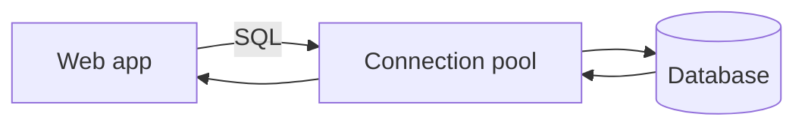

# 데이터베이스 연결

웹앱은 화면만으로 끝나지 않습니다. 사용자 정보, 게시글, 주문, 결제 기록처럼 남아야 하는 데이터는 결국 데이터베이스에 들어갑니다. 서버가 메모리만 믿고 있으면 프로세스가 재시작되는 순간 상태가 사라집니다. 그래서 웹앱에서 데이터베이스 연결은 거의 항상 핵심 경로입니다.

이 글은 Web Development 101 시리즈의 일곱 번째 글입니다. 여기서는 SQL의 기본 작업, ORM의 역할, 연결과 연결 풀, 트랜잭션이 왜 필요한지 정리하면서 웹앱이 데이터를 오래 보관하는 방식을 살펴보겠습니다.

---

## 이 글에서 다룰 문제

- 웹앱은 왜 파일이 아니라 데이터베이스를 쓸까요?
- SQL의 네 가지 기본 작업은 무엇일까요?
- ORM은 어디서 편하고 어디서 한계가 생길까요?
- 연결 풀은 왜 필요할까요?
- 트랜잭션은 어떤 상황에서 꼭 필요할까요?

> 데이터베이스는 진실의 저장소이고, 연결 풀과 트랜잭션은 그 저장소를 안전하게 다루는 기본 장치입니다.

## 왜 이 주제가 중요한가

웹앱의 거의 모든 상태는 데이터베이스에 있습니다. 사용자 수가 조금만 늘어나도 연결을 잘못 다루는 서버는 금방 느려지거나 멈춥니다. 반대로 데이터 모델과 연결 관리 감각이 있으면 기능을 추가할 때 구조가 훨씬 안정적입니다.

이 지식은 오래 갑니다. Python에서 SQLite를 다루든, PostgreSQL과 SQLAlchemy를 쓰든, Java나 Go로 옮기든 기본 원리는 크게 달라지지 않습니다. SQL, 연결, 트랜잭션, 인덱스라는 바닥 구조는 계속 남습니다.

## 한눈에 보는 개념 지도



데이터베이스 연결은 비용이 큰 자원입니다. 그래서 서버는 매 요청마다 연결을 새로 만드는 대신 풀에서 재사용하는 방식을 많이 씁니다.

## 먼저 알아둘 용어

- **SQL**: 관계형 데이터베이스와 대화하는 언어입니다.
- **Schema**: 테이블의 컬럼과 타입 같은 구조 정의입니다.
- **ORM**: SQL과 객체 세계를 이어 주는 도구입니다.
- **Connection**: 애플리케이션과 데이터베이스 사이의 통신 채널입니다.
- **Transaction**: 여러 쓰기 작업을 하나의 단위로 묶는 장치입니다.

## Before / After로 보는 저장 방식

**Before (write to a file)**

```python
open("users.txt", "a").write("alice\n")  # 동시 접근이 겹치면 깨집니다
```

**After (write to a DB)**

```python
import sqlite3
con = sqlite3.connect("app.db")
con.execute("INSERT INTO users(name) VALUES (?)", ("alice",))
con.commit()
```

데이터베이스는 동시성, 제약 조건, 영속성을 함께 다룹니다. 파일에 문자열을 덧붙이는 방식보다 훨씬 안정적입니다.

## 작은 데이터베이스를 다섯 단계로 다뤄 보기

### 1단계 — 테이블 만들기

```python
# 1_init.py
import sqlite3
con = sqlite3.connect("app.db")
con.execute("""
CREATE TABLE IF NOT EXISTS users (
  id INTEGER PRIMARY KEY,
  name TEXT NOT NULL,
  email TEXT UNIQUE
)
""")
con.commit()
```

테이블은 데이터 구조를 고정합니다. `name`은 비어 있으면 안 되고, `email`은 중복되면 안 된다는 제약도 함께 정의합니다.

### 2단계 — 넣고 읽기

```python
# 2_crud.py
import sqlite3
con = sqlite3.connect("app.db")
con.execute("INSERT INTO users(name, email) VALUES (?, ?)", ("alice", "a@x.com"))
con.commit()
for row in con.execute("SELECT id, name FROM users"):
    print(row)
```

여기서 `INSERT`와 `SELECT`가 가장 기본적인 쓰기와 읽기입니다. 이후 `UPDATE`, `DELETE`까지 합치면 흔히 CRUD라고 부르는 작업이 완성됩니다.

### 3단계 — 파라미터 바인딩으로 SQL injection 막기

```python
name = "alice'; DROP TABLE users; --"  # 공격자 입력
con.execute("SELECT * FROM users WHERE name = ?", (name,))  # 안전
```

입력값을 문자열로 이어 붙이지 않고 파라미터로 넘겨야 합니다. 이 한 가지 원칙만 지켜도 SQL injection 위험을 크게 줄일 수 있습니다.

### 4단계 — ORM 사용하기

```python
# 4_orm.py
from sqlalchemy import create_engine, Column, Integer, String
from sqlalchemy.orm import declarative_base, sessionmaker

Base = declarative_base()
class User(Base):
    __tablename__ = "users"
    id = Column(Integer, primary_key=True)
    name = Column(String, nullable=False)

engine = create_engine("sqlite:///app.db")
Base.metadata.create_all(engine)
S = sessionmaker(bind=engine)
s = S()
s.add(User(name="bob"))
s.commit()
```

ORM은 객체 중심 코드를 쓰게 도와주지만, 내부에서 어떤 SQL이 생성되는지는 계속 의식해야 합니다.

### 5단계 — 트랜잭션 묶기

```python
# 5_tx.py
import sqlite3
con = sqlite3.connect("app.db")
try:
    con.execute("BEGIN")
    con.execute("UPDATE users SET name='ALICE' WHERE id=1")
    con.execute("INSERT INTO users(name) VALUES ('charlie')")
    con.commit()
except Exception:
    con.rollback()
    raise
```

여러 변경이 함께 성공해야 할 때 트랜잭션이 필요합니다. 중간에 하나라도 실패하면 전체를 되돌려야 데이터가 어중간하게 남지 않습니다.

## 이 코드에서 먼저 봐야 할 점

- 파라미터 바인딩 없는 SQL은 언젠가 반드시 사고를 부릅니다.
- ORM은 편리하지만 생성된 SQL을 읽을 줄 알아야 합니다.
- 트랜잭션은 단일 문장이 아니라 비즈니스 단위를 감싸는 경우가 많습니다.

## 여기서 자주 헷갈립니다

1. **문자열을 이어 붙여 SQL을 만드는 경우**: SQL injection 위험이 생깁니다.
2. **요청마다 새 연결을 마구 여는 경우**: 연결 풀이 없으면 부하에 약해집니다.
3. **인덱스 없이 큰 조회를 반복하는 경우**: 읽기 성능이 급격히 떨어집니다.
4. **트랜잭션 없이 여러 쓰기를 이어 붙이는 경우**: 절반만 반영된 상태가 남을 수 있습니다.
5. **오류를 삼키는 경우**: 데이터 무결성 문제를 놓치기 쉽습니다.

## 운영에서는 이렇게 보입니다

많은 웹 백엔드는 PostgreSQL이나 MySQL과 ORM을 함께 씁니다. 트래픽이 늘면 읽기 복제본, Redis 캐시, 마이그레이션 도구가 등장하지만, 그 위에서도 연결 풀과 트랜잭션은 그대로 중요합니다. 결국 모든 확장은 이 기본기를 더 큰 규모에서 반복하는 일에 가깝습니다.

## 시니어 엔지니어는 이렇게 생각합니다

- 스키마를 먼저 그립니다.
- 인덱스는 조회 패턴을 보고 추가합니다.
- 트랜잭션 경계를 명시적으로 둡니다.
- N+1 query 가능성을 늘 의심합니다.
- 스키마 변경은 migration tool로 추적합니다.

## 체크리스트

- [ ] SQL의 네 가지 기본 작업을 알고 있습니다.
- [ ] 항상 파라미터 바인딩을 사용해야 함을 알고 있습니다.
- [ ] 연결 풀이 무엇인지 설명할 수 있습니다.
- [ ] 트랜잭션을 사용하는 코드를 읽을 수 있습니다.
- [ ] ORM이 만든 SQL을 로그로 확인할 수 있습니다.

## 연습 문제

1. SQLite로 `posts` 테이블을 만들고 CRUD를 모두 구현해 보세요.
2. 같은 작업을 ORM으로 다시 작성하고 실제 생성되는 SQL을 로그로 확인해 보세요.
3. 트랜잭션 안에서 예외를 일부러 발생시켜 rollback이 되는지 검증해 보세요.

## 정리와 다음 글

데이터베이스는 웹앱의 진실을 오래 보관하는 저장소입니다. SQL, 연결, 연결 풀, 트랜잭션 감각이 있어야 기능이 늘어나도 데이터가 버텨 줍니다. 다음 글에서는 이렇게 만든 앱을 실제 환경에 올리는 배포를 살펴보겠습니다.

<!-- toc:begin -->
- [웹은 어떻게 동작하는가?](./01-how-the-web-works.md)
- [HTML, CSS, JavaScript](./02-html-css-javascript.md)
- [브라우저와 DOM](./03-browser-and-dom.md)
- [HTTP와 API](./04-http-and-api.md)
- [Frontend와 Backend](./05-frontend-and-backend.md)
- [인증과 세션](./06-auth-and-sessions.md)
- **데이터베이스 연결 (현재 글)**
- 배포 (예정)
- 성능과 캐싱 (예정)
- 작은 웹앱 만들기 (예정)
<!-- toc:end -->

## 참고 자료

- [SQL (MDN glossary)](https://developer.mozilla.org/en-US/docs/Glossary/SQL)
- [sqlite3 (Python docs)](https://docs.python.org/3/library/sqlite3.html)
- [SQLAlchemy ORM tutorial](https://docs.sqlalchemy.org/en/20/orm/quickstart.html)
- [Database connection pool (Wikipedia)](https://en.wikipedia.org/wiki/Connection_pool)

Tags: Computer Science, WebDevelopment, Database, SQL, ORM, Backend
