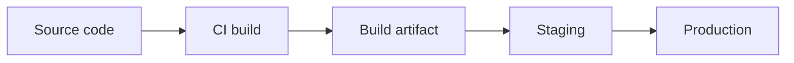

# 배포

> Web Development 101 시리즈 (8/10)


## 이 글에서 다룰 문제

배포가 수동이면 매주 사고가 납니다. 자동화된 배포는 팀 속도 자체를 바꿉니다. 한 번 흐름을 익히면 어떤 플랫폼에서도 통합니다.

> 배포는 기능이 아니라 습관입니다.

## 전체 흐름


코드 → 산출물 → 환경. 같은 산출물이 모든 환경에 갑니다.

## Before/After

**Before (직접 SSH로 복사)**

```bash
scp -r ./app user@server:/var/www/  # 매번 다른 결과
```

**After (CI가 빌드 → 배포)**

```yaml
# 파일: .github/workflows/deploy.yml (요지)
on: { push: { branches: [main] } }
jobs:
  deploy:
    runs-on: ubuntu-latest
    steps:
      - uses: actions/checkout@v4
      - run: pip install -r requirements.txt
      - run: pytest
      - run: ./deploy.sh
```

산출물이 재현 가능해집니다.

## 작은 앱 배포 5단계

### 1단계 — 환경변수로 설정 분리

```python
# app.py
import os
DB_URL = os.environ["DATABASE_URL"]
DEBUG = os.environ.get("DEBUG", "0") == "1"
```

코드에 비밀을 박지 않습니다.

### 2단계 — 의존성 고정

```text
# 파일: requirements.txt
flask==3.0.3
gunicorn==22.0.0
```

같은 버전 → 같은 빌드.

### 3단계 — Dockerfile로 산출물 만들기

```dockerfile
FROM python:3.12-slim
WORKDIR /app
COPY requirements.txt .
RUN pip install -r requirements.txt
COPY . .
CMD ["gunicorn", "-b", "0.0.0.0:8000", "app:app"]
```

이미지 한 개 = 불변 산출물입니다.

### 4단계 — PaaS에 배포 (예: Fly.io / Render)

```bash
# 예: Fly.io
fly launch     # 한 번만
fly deploy     # 매 배포
```

또는 Render는 GitHub 저장소를 연결만 하면 자동 배포됩니다.

### 5단계 — 헬스체크 + 롤백

```python
@app.get("/health")
def health(): return {"status": "ok"}, 200
```

PaaS는 `/health` 가 200을 안 주면 자동 롤백합니다.

## 이 코드에서 주목할 점

- 환경변수는 코드 외부에 둔다.
- 같은 이미지를 staging → prod로 승격한다.
- 헬스체크는 간단해야 빠르다.

## 자주 하는 실수 5가지

1. **비밀을 코드에 커밋한다.** 한 번 새면 영원하다.
2. **환경마다 다른 빌드를 만든다.** 재현이 불가능해진다.
3. **테스트 없이 자동 배포.** CI/CD가 사고 자동화가 된다.
4. **롤백 계획 없음.** 사고 시 30분이 3시간이 된다.
5. **헬스체크가 무거운 작업을 함.** 잘못된 신호로 트래픽 차단.

## 실무에서는 이렇게 쓰입니다

스타트업은 보통 PaaS(Render, Fly.io, Vercel)로 시작합니다. 규모가 커지면 Kubernetes 같은 도구로 옮겨갑니다. 어느 쪽이든 환경변수 + 불변 산출물 + 자동 배포라는 뼈대는 같습니다.

## 체크리스트

- [ ] 환경변수로 설정을 분리한다.
- [ ] CI가 모든 머지 전에 테스트를 돈다.
- [ ] Docker 이미지가 한 번 빌드되어 여러 환경에 쓰인다.
- [ ] 배포 후 헬스체크가 자동 실행된다.
- [ ] 한 번의 명령으로 롤백 가능하다.

## 정리 및 다음 단계

배포는 습관입니다. 다음 글에서는 배포된 앱이 느릴 때 무엇을 봐야 하는지 — 성능과 캐싱 — 을 봅니다.

<!-- toc:begin -->
- [웹은 어떻게 동작하는가?](./01-how-the-web-works.md)
- [HTML, CSS, JavaScript](./02-html-css-javascript.md)
- [브라우저와 DOM](./03-browser-and-dom.md)
- [HTTP와 API](./04-http-and-api.md)
- [Frontend과 Backend](./05-frontend-and-backend.md)
- [인증과 세션](./06-auth-and-sessions.md)
- [데이터베이스 연결](./07-connecting-to-database.md)
- **배포 (현재 글)**
- 성능과 캐싱 (예정)
- 작은 웹앱 만들기 (예정)
<!-- toc:end -->

## 참고 자료

- [The Twelve-Factor App](https://12factor.net/)
- [Docker get started](https://docs.docker.com/get-started/)
- [GitHub Actions quickstart](https://docs.github.com/en/actions/quickstart)
- [Heroku dev center (deploying)](https://devcenter.heroku.com/categories/deployment)

Tags: Computer Science, WebDevelopment, Deployment, DevOps, CICD, Hosting
