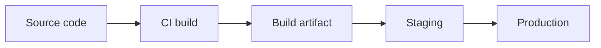

# 배포

로컬에서 잘 돌아가는 앱을 세상에 보여 주는 순간부터 개발은 운영과 연결됩니다. 내 노트북에서는 되는데 서버에서는 안 되는 이유, 환경별 설정이 왜 갈리는지, 비밀 값은 어디에 둬야 하는지, 같은 코드를 어떻게 반복 가능하게 배포할지 모두 배포에서 드러납니다.

이 글은 Web Development 101 시리즈의 여덟 번째 글입니다. 여기서는 환경 분리, 환경 변수와 비밀 관리, 빌드 산출물, PaaS와 IaaS의 차이, 그리고 기본적인 CI/CD 흐름을 함께 정리하겠습니다.

---

## 이 글에서 다룰 문제

- 노트북에서만 돌던 앱을 어떻게 운영 환경으로 옮길까요?
- 개발, 스테이징, 운영 환경은 왜 나눌까요?
- 환경 변수와 비밀 값은 왜 저장소 바깥에서 관리할까요?
- build와 artifact는 각각 무엇을 뜻할까요?
- 수동 배포 대신 CI/CD를 붙이면 무엇이 달라질까요?

> 배포는 코드를 올리는 행위가 아니라 같은 산출물을 여러 환경에 반복 가능하게 옮기는 습관입니다.

## 왜 배포를 따로 배워야 하는가

수동 배포는 자주 사고를 냅니다. 누가 어느 서버에 어떤 파일을 복사했는지 남지 않고, 테스트를 건너뛰기 쉽고, 롤백도 느립니다. 기능 개발만 보던 팀도 배포 자동화를 시작하면 속도와 안정성이 함께 달라집니다.

이 흐름을 한 번 익혀 두면 플랫폼이 바뀌어도 적응이 빠릅니다. Render, Fly.io, Vercel, Kubernetes처럼 도구는 달라져도 환경 분리, 불변 산출물, 자동화된 배포, 헬스 체크라는 기본 뼈대는 거의 같습니다.

## 한눈에 보는 개념 지도



중요한 원칙은 하나입니다. 코드는 빌드되어 산출물이 되고, 같은 산출물이 환경을 옮겨 다녀야 합니다.

## 먼저 알아둘 용어

- **Environment**: 같은 코드에 서로 다른 설정을 주는 실행 환경입니다.
- **Build artifact**: 빌드 결과물입니다. 파일 묶음이나 컨테이너 이미지가 여기에 해당합니다.
- **PaaS**: 운영 부담을 많이 감춘 플랫폼입니다.
- **IaaS**: VM처럼 사용자가 더 많은 운영 책임을 지는 인프라입니다.
- **CI/CD**: push 이후 build, test, deploy를 자동화한 흐름입니다.

## Before / After로 보는 배포 방식

**Before (SSH and copy)**

```bash
scp -r ./app user@server:/var/www/  # 매번 결과가 달라질 수 있습니다
```

**After (CI builds and deploys)**

```yaml
# .github/workflows/deploy.yml (gist)
on: { push: { branches: [main] } }
jobs:
  deploy:
    runs-on: ubuntu-latest
    steps:
      - uses: actions/checkout@v4
      - run: pip install -r requirements.txt
      - run: pytest
      - run: ./deploy.sh
```

자동화된 파이프라인은 같은 입력에서 같은 결과를 반복해서 만들게 해 줍니다. 배포가 사람 손기술에서 시스템 절차로 바뀝니다.

## 작은 앱을 다섯 단계로 배포해 보기

### 1단계 — 설정을 환경 변수로 옮기기

```python
# app.py
import os
DB_URL = os.environ["DATABASE_URL"]
DEBUG = os.environ.get("DEBUG", "0") == "1"
```

비밀 값과 환경별 설정은 코드에 박아 두지 않습니다. 코드 저장소에 들어가면 관리와 회수가 어려워집니다.

### 2단계 — 의존성 버전 고정하기

```text
# requirements.txt
flask==3.0.3
gunicorn==22.0.0
```

의존성 버전이 흔들리면 같은 코드도 환경마다 다르게 동작할 수 있습니다. 재현 가능한 배포의 출발점은 버전 고정입니다.

### 3단계 — Dockerfile로 산출물 만들기

```dockerfile
FROM python:3.12-slim
WORKDIR /app
COPY requirements.txt .
RUN pip install -r requirements.txt
COPY . .
CMD ["gunicorn", "-b", "0.0.0.0:8000", "app:app"]
```

컨테이너 이미지는 불변 산출물 역할을 합니다. 한 번 빌드한 이미지를 여러 환경에 같은 방식으로 올릴 수 있습니다.

### 4단계 — PaaS에 올리기

```bash
# Fly.io
fly launch     # once
fly deploy     # every release
```

Render 같은 PaaS는 저장소를 연결하면 push마다 자동 배포를 수행하기도 합니다. 처음에는 이런 관리형 플랫폼이 진입 장벽을 크게 낮춰 줍니다.

### 5단계 — 헬스 체크와 롤백 준비하기

```python
@app.get("/health")
def health(): return {"status": "ok"}, 200
```

헬스 체크는 배포 이후 앱이 정상인지 판단하는 가장 단순한 신호입니다. 많은 PaaS가 이 엔드포인트를 보고 자동 롤백 여부를 결정합니다.

## 이 코드에서 먼저 봐야 할 점

- 환경 변수는 코드 밖에서 주입됩니다.
- 스테이징과 운영은 같은 이미지를 승격시키는 방식이 좋습니다.
- 헬스 체크는 가볍고 빠르게 끝나야 의미가 있습니다.

## 여기서 자주 헷갈립니다

1. **비밀 값을 저장소에 커밋하는 경우**: 한 번 유출되면 회수가 어렵습니다.
2. **환경마다 다른 빌드를 만드는 경우**: 재현성이 사라집니다.
3. **테스트 없는 자동 배포를 붙이는 경우**: CI/CD가 사고 자동화가 됩니다.
4. **롤백 계획이 없는 경우**: 작은 배포 실패가 긴 장애로 이어집니다.
5. **무거운 헬스 체크를 두는 경우**: 정상 인스턴스도 unhealthy로 보일 수 있습니다.

## 운영에서는 이렇게 보입니다

많은 팀은 초기에 PaaS에서 시작합니다. 운영 부담이 작고 배포 속도가 빠르기 때문입니다. 규모가 커지면 Kubernetes 같은 도구로 넘어가기도 하지만, 여전히 환경 변수, 불변 이미지, 자동화 파이프라인, 모니터링이라는 뼈대는 바뀌지 않습니다.

## 시니어 엔지니어는 이렇게 생각합니다

- 빌드는 항상 재현 가능해야 합니다.
- 비밀 값은 secret store에만 둡니다.
- blue/green이나 canary로 배포 리스크를 나눕니다.
- 모든 배포에는 빠른 rollback 경로가 있어야 합니다.
- 배포와 모니터링은 항상 같이 갑니다.

## 체크리스트

- [ ] 설정이 환경 변수로 분리되어 있습니다.
- [ ] merge마다 CI가 테스트를 실행합니다.
- [ ] 하나의 Docker 이미지가 여러 환경에서 재사용됩니다.
- [ ] 배포 후 헬스 체크를 실행합니다.
- [ ] 한 번의 명령으로 rollback할 수 있습니다.

## 연습 문제

1. 작은 Flask 앱에 Dockerfile을 추가하고 로컬 컨테이너로 실행해 보세요.
2. GitHub Actions로 `push → test → build` 워크플로를 연결해 보세요.
3. PaaS 하나를 골라 hello world를 배포하고 health-check URL을 확인해 보세요.

## 정리와 다음 글

배포는 코드 복사 기술이 아니라 재현 가능한 습관입니다. 환경을 나누고, 같은 산출물을 만들고, 자동화와 헬스 체크를 붙여야 운영이 안정됩니다. 다음 글에서는 배포된 앱이 느릴 때 어디부터 봐야 하는지 성능과 캐싱을 다루겠습니다.

<!-- toc:begin -->
- [웹은 어떻게 동작하는가?](./01-how-the-web-works.md)
- [HTML, CSS, JavaScript](./02-html-css-javascript.md)
- [브라우저와 DOM](./03-browser-and-dom.md)
- [HTTP와 API](./04-http-and-api.md)
- [Frontend와 Backend](./05-frontend-and-backend.md)
- [인증과 세션](./06-auth-and-sessions.md)
- [데이터베이스 연결](./07-connecting-to-database.md)
- **배포 (현재 글)**
- 성능과 캐싱 (예정)
- 작은 웹앱 만들기 (예정)
<!-- toc:end -->

## 참고 자료

- [The Twelve-Factor App](https://12factor.net/)
- [Docker get started](https://docs.docker.com/get-started/)
- [GitHub Actions quickstart](https://docs.github.com/en/actions/quickstart)
- [Heroku dev center (deployment)](https://devcenter.heroku.com/categories/deployment)

Tags: Computer Science, WebDevelopment, Deployment, DevOps, CICD, Hosting
