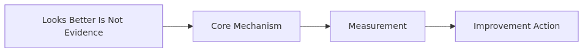
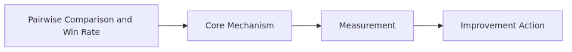
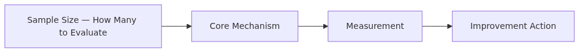
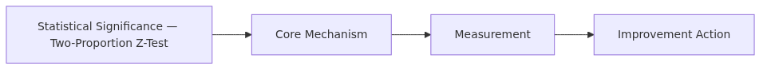

# A/B Testing LLMs — Which Prompt Is Better?

> AI Evaluation 101 Series (9/10)

How do you decide which of two prompts is better? This post covers paired comparison, win rate, statistical significance, and sample size calculation — the practical side of LLM A/B testing.

---


*A/B testing LLMs - which prompt is Better*
## "Looks Better" Is Not Evidence



*"Looks Better" is not evidence*
When a new prompt or model rolls in, the typical evaluation goes:

> "GPT-4o feels more natural. Let's ship it."

This is dangerous. **A 30-sample impression** is not reliable evidence. To know if it is actually better, you need **statistical significance**.

A/B testing applies two variants (A and B) to the same inputs and decides which is significantly better. This post covers:

- Pairwise comparison and win rate
- Sample size — how many samples are enough
- Statistical significance
- Online A/B with production traffic

---

## Pairwise Comparison and Win Rate



*Pairwise comparison and win rate*
Reuse the pairwise judge from Ep4. For each input, get a response from model A and model B, and ask the judge which is better.

```python
# ab/pairwise_winrate.py
from openai import OpenAI
import json

client = OpenAI()

def get_response(model: str, question: str) -> str:
    return client.chat.completions.create(
        model=model,
        messages=[{"role": "user", "content": question}],
        temperature=0,
    ).choices[0].message.content

def judge_pairwise(question, ans_a, ans_b) -> str:
    prompt = f"""Pick the better answer.
Question: {question}
Answer A: {ans_a}
Answer B: {ans_b}
Output JSON: {{"winner": "A" | "B" | "Tie", "reason": "..."}}
"""
    r = client.chat.completions.create(
        model="gpt-4o", temperature=0,
        messages=[{"role": "user", "content": prompt}],
        response_format={"type": "json_object"},
    )
    return json.loads(r.choices[0].message.content)["winner"]

def ab_test(questions: list[str], model_a: str, model_b: str) -> dict:
    results = {"A": 0, "B": 0, "Tie": 0}
    for q in questions:
        ans_a = get_response(model_a, q)
        ans_b = get_response(model_b, q)
        # Control position bias by swapping (Ep4)
        v1 = judge_pairwise(q, ans_a, ans_b)
        v2 = judge_pairwise(q, ans_b, ans_a)
        flip = {"A": "B", "B": "A", "Tie": "Tie"}
        if v1 == flip[v2]:
            results[v1] += 1
        else:
            results["Tie"] += 1
    total = sum(results.values())
    return {
        "win_rate_a": results["A"] / total,
        "win_rate_b": results["B"] / total,
        "tie_rate":   results["Tie"] / total,
        "n":          total,
    }
```

**Reading**:
- A 60%, B 30%, Tie 10% → A looks better.
- But **is it statistically significant?** That is the next question.

---

## Sample Size — How Many to Evaluate



*Sample size - how many to evaluate*
10 samples at 60% vs 40% could easily be chance. 1000 samples at the same ratio is decisive. The required sample size depends on the **effect size** you want to detect.

```python
# ab/sample_size.py
import statsmodels.stats.power as smp

def required_sample_size(p_a: float, p_b: float,
                          alpha: float = 0.05, power: float = 0.8) -> int:
    """Per-group sample size to detect a difference between two proportions."""
    effect_size = smp.proportion_effectsize(p_a, p_b)
    n = smp.NormalIndPower().solve_power(
        effect_size=abs(effect_size),
        alpha=alpha,
        power=power,
        alternative="two-sided",
    )
    return int(n) + 1

# To detect 60% vs 50%
print(required_sample_size(0.6, 0.5))  # ~388

# 55% vs 50% (small difference)
print(required_sample_size(0.55, 0.5))  # ~1565

# 70% vs 50% (large difference)
print(required_sample_size(0.7, 0.5))  # ~93
```

**Rules of thumb**:
- Small effect (5%p) → ~1500 samples
- Medium (10%p) → ~400 samples
- Large (20%p) → ~100 samples

When you build the eval dataset, decide your **target effect size first** and size the dataset accordingly.

---

## Statistical Significance — Two-Proportion Z-Test



*Statistical significance - Two-Proportion Z-Test*
To compare win rates, use a **two-proportion z-test**. The null hypothesis is that the two models win at the same rate; check the p-value.

```python
# ab/significance.py
from statsmodels.stats.proportion import proportions_ztest

def is_significantly_better(wins_a: int, wins_b: int,
                              total: int, alpha: float = 0.05) -> dict:
    # Drop ties from the denominator; compare wins_a vs wins_b
    n_decisive = wins_a + wins_b
    if n_decisive == 0:
        return {"significant": False, "p_value": 1.0, "winner": None}

    count = [wins_a, wins_b]
    nobs = [n_decisive, n_decisive]
    z_stat, p_value = proportions_ztest(count, nobs)

    return {
        "p_value":     p_value,
        "significant": p_value < alpha,
        "winner":      "A" if wins_a > wins_b else "B",
        "win_rate_a":  wins_a / n_decisive,
        "win_rate_b":  wins_b / n_decisive,
    }

print(is_significantly_better(wins_a=240, wins_b=160, total=400))
# {'p_value': 0.0001, 'significant': True, 'winner': 'A', 'win_rate_a': 0.6, ...}

print(is_significantly_better(wins_a=22, wins_b=18, total=40))
# {'p_value': 0.52, 'significant': False, 'winner': 'A', ...}
# Same 60% vs 45% but the sample is too small
```

**Reading**:
- `p_value < 0.05`: 95%+ chance the difference is not random → can switch to A.
- `p_value >= 0.05`: cannot trust the difference → collect more samples or call it a tie.

---

## Effect Size — Significance ≠ Practical Importance

With 10K samples, even 51% vs 50% is statistically significant. But **a 1%p improvement is not practically meaningful.** Always pair significance with effect size.

```python
# ab/effect_size.py
import math

def cohen_h(p1: float, p2: float) -> float:
    """Effect size (Cohen's h) between two proportions."""
    phi1 = 2 * math.asin(math.sqrt(p1))
    phi2 = 2 * math.asin(math.sqrt(p2))
    return abs(phi1 - phi2)

# Interpretation (Cohen, 1988):
# 0.2 = small, 0.5 = medium, 0.8 = large
print(cohen_h(0.51, 0.50))  # 0.020 ← negligible
print(cohen_h(0.60, 0.50))  # 0.201 ← small but meaningful
print(cohen_h(0.70, 0.50))  # 0.412 ← clearly meaningful
```

**Decision rule**:
- p < 0.05 **and** Cohen's h > 0.2 → switch to the new variant.
- p < 0.05 but h < 0.2 → statistically different, practically the same. Decide on cost/latency instead.

---

## Online A/B — Use Production Traffic

Offline eval depends on a static dataset. In production you can split **real user traffic** into two groups.

```python
# ab/online_router.py
import hashlib

def assign_variant(user_id: str, experiment: str) -> str:
    """Stable A/B assignment by hashing user_id."""
    h = hashlib.sha256(f"{experiment}:{user_id}".encode()).hexdigest()
    return "A" if int(h, 16) % 2 == 0 else "B"

def handle_request(user_id: str, question: str) -> str:
    variant = assign_variant(user_id, experiment="prompt-v3-vs-v2")
    model = "gpt-4o" if variant == "A" else "gpt-4o-mini"
    response = get_response(model, question)
    log_metric(user_id, variant, response)
    return response
```

**Online metrics**:
- Thumbs-up / thumbs-down rate
- Re-asking rate (lower is better)
- Time to session close

```python
# ab/online_analysis.py
import pandas as pd
from scipy.stats import ttest_ind

df = pd.read_sql("SELECT variant, thumbs_up FROM events WHERE experiment='...'", conn)
a = df[df.variant == "A"]["thumbs_up"]
b = df[df.variant == "B"]["thumbs_up"]
t, p = ttest_ind(a, b, equal_var=False)
print(f"A satisfaction: {a.mean():.3f}, B: {b.mean():.3f}, p={p:.4f}")
```

**Online traps**: novelty effect (new variants feel fresh at first), weekday/weekend cycles, user segmentation. Run for at least 1 week, ideally 2.

---

## Common Mistakes

### Mistake 1: Ignoring sample size

Twenty samples and "A wins!" is almost certainly a coincidence. **Compute the required sample size for your target effect.**

### Mistake 2: Significance without effect size

With enough data, trivial differences become significant. **Look at p-value and effect size together.**

### Mistake 3: No position-bias control

Pairwise judges prefer the first answer (Ep4). The A/B result could be position bias in disguise. **Always swap order.**

### Mistake 4: Ignoring ties

A 50% tie rate means the two models are effectively the same. Looking only at win rate exaggerates small differences. **Report tie rate**; very high ties signal an ambiguous judge prompt.

### Mistake 5: Running the online A/B too short

Three days mixes novelty effects and weekday cycles. **Minimum 1 week, 2 weeks recommended.**

---

## Key Takeaways

- "Looks better" is not evidence. Pair **win rate, statistical significance, and effect size**.
- Use the pairwise judge for win rate, with **position-bias swap** (Ep4).
- Sample size depends on the effect you want to detect — 5%p needs ~1500, 10%p needs ~400.
- Two-proportion z-test for p-value; Cohen's h for effect size.
- Online A/B uses real production traffic. **Run for at least 1-2 weeks.**

The next post covers **continuous evaluation in production** — sampling live traffic, drift detection.
## References

- [statsmodels — proportions_ztest](https://www.statsmodels.org/stable/generated/statsmodels.stats.proportion.proportions_ztest.html)
- [Cohen, J. (1988). Statistical Power Analysis for the Behavioral Sciences](https://www.routledge.com/Statistical-Power-Analysis-for-the-Behavioral-Sciences/Cohen/p/book/9780805802832)
- [Kohavi, Tang, Xu — Trustworthy Online Controlled Experiments (2020)](https://experimentguide.com/)
- [Chatbot Arena — Crowdsourced LLM A/B (Chiang et al., 2024)](https://arxiv.org/abs/2403.04132)
