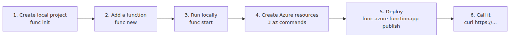

# Deploy a Function App — From Localhost to Azure

The opening chapters set up the mental model. This chapter is about execution: **create a function locally, deploy it to Azure, and get back a real URL you can call**.

By the end, you'll have:

- A local environment for running functions
- A real Function App on Azure
- An HTTPS endpoint you can call from anywhere
- A concrete sense of what redeploy actually does

The sample uses the Python v2 programming model. The overall flow is nearly identical for the other runtimes.

One framing note before we start: this walkthrough uses **Flex Consumption as the primary path**. That matches current Azure guidance for new serverless apps. Classic Consumption still matters for legacy estates and the simplest throwaway demos, but it should no longer be the default mental model for a first production-shaped deployment.

---

## Questions this chapter answers

- Which parameters absolutely must be settled before the first Function App is created?
- Should you start with zip deploy, GitHub Actions, or VS Code direct deploy?
- How does the Function App bind to its associated Storage account, and why does it need one?
- What does function-key versus host-key management actually look like?
- What rollback path do you have if the first deploy is broken?

## Tooling — three pieces

You need three tools.

| Tool | Role | Install |
|---|---|---|
| **Azure Functions Core Tools** | Local runs + deployment command (`func`) | `npm i -g azure-functions-core-tools@4` |
| **Azure CLI** | Create and manage Azure resources | OS-specific install ([official docs](https://learn.microsoft.com/en-us/cli/azure/install-azure-cli)) |
| **Python 3.11+** | Worker runtime | pyenv or the official installer |

You can do all of this from VS Code, but the post sticks to **the CLI only**. Once you've done the full path by hand, the IDE automation is easier to reason about.

Check versions first.

```bash
func --version       # 4.x
az --version         # 2.x
python --version     # 3.11+
```

---

## The full flow on one page



*Flow from local run to Azure*
---

## 1. Create the project

Start from an empty directory.

```bash
mkdir hello-functions && cd hello-functions
func init . --worker-runtime python --model V2
```

That gives you the basic scaffold. The first three files worth noticing are:

- `host.json` — Host configuration
- `local.settings.json` — Environment variables for local runs
- `requirements.txt` — Python dependencies

`local.settings.json` plays the same role as **App Settings** in Azure. Local execution reads from this file; the deployed app reads from App Settings on the Function App. **The code stays the same across that boundary.**

---

## 2. Add a function

Add the simplest HTTP-triggered function.

```bash
func new --template "Http Trigger" --name hello --authlevel anonymous
```

In the Python v2 model, the function definition lives in `function_app.py`. The generated result looks roughly like this.

```python
import azure.functions as func

app = func.FunctionApp(http_auth_level=func.AuthLevel.ANONYMOUS)

@app.function_name(name="hello")
@app.route(route="hello")
def hello(req: func.HttpRequest) -> func.HttpResponse:
    name = req.params.get("name")

    if not name:
        body = req.get_body()
        name = body.decode("utf-8") if body else "world"

    return func.HttpResponse(f"Hello, {name}!")
```

That is enough to run immediately.

---

## 3. Run it locally

```bash
python -m venv .venv
source .venv/bin/activate
pip install -r requirements.txt
func start
```

If you see this near the bottom of the output, you're set:

```
Functions:
        hello: [GET,POST] http://localhost:7071/api/hello
```

Call it from another terminal.

```bash
curl "http://localhost:7071/api/hello?name=Sisyphus"
# Hello, Sisyphus!
```

At this point, `func start` is running **a real Functions Host on your machine**. The Host and Worker from the earlier Host/Worker chapter are both alive, with a gRPC channel between them. It is the same architecture as production, just running on your laptop.

---

## 4. Create Azure resources

Three Azure resources are required.

| Resource | Role |
|---|---|
| **Resource Group** | Logical container for related resources |
| **Storage Account** | Required storage for host state, locks, and trigger metadata |
| **Function App** | The compute resource that runs your functions |


*Required Azure resources before deployment*
> Note: The Storage Account is infrastructure storage for the Functions platform itself. It holds things like trigger leases, invocation metadata, and Timer schedule state. Keep business data in a separate store.

Now create the resources. Names must be globally unique, so adjust them as needed.

```bash
RG=rg-hello
LOC=koreacentral
SA=sthello$RANDOM
APP=func-hello-$RANDOM

# 1) Resource Group
az group create --name $RG --location $LOC

# 2) Storage Account
az storage account create \
    --name $SA --resource-group $RG \
    --location $LOC --sku Standard_LRS

# 3) Function App (Flex Consumption, Python 3.11)
az functionapp create \
    --name $APP --resource-group $RG \
    --storage-account $SA \
    --runtime python --runtime-version 3.11 \
    --functions-version 4 \
    --flexconsumption-location $LOC \
    --instance-memory 2048 \
    --maximum-instance-count 100
```

When the last command finishes, the Function App exists in Azure. The compute target is ready; the code just is not deployed yet.

The `az functionapp create` shape changes by hosting plan. For Flex, the key switch is `--flexconsumption-location`; from there you add the same runtime, Functions version, storage account, and optional sizing limits you want the app to start with. `--instance-memory 2048` is a practical default for Python because it leaves room for imports and common SDKs without immediately jumping to the largest size.

> This example assumes the latest Azure CLI version. If `--flexconsumption-location`, `--instance-memory`, or `--maximum-instance-count` do not appear in `az functionapp create -h`, run `az upgrade` to update the CLI.

When that command finishes, the Azure-side skeleton is ready in the shape most new serverless apps should start from.

### Legacy path — classic Consumption when you explicitly need it

Classic Consumption is still useful when you are maintaining an existing app, staying on a Windows-first legacy footprint, or reproducing an older tutorial exactly. In that case, the create command switches back to the Consumption-specific location flag.

```bash
az functionapp create \
    --name $APP --resource-group $RG \
    --storage-account $SA \
    --consumption-plan-location $LOC \
    --runtime python --runtime-version 3.11 \
    --functions-version 4
```

Use that path deliberately, not by default. For a new app, start from Flex unless a plan-specific constraint pushes you elsewhere.

---

## 5. Deploy

Deployment is one command.

```bash
func azure functionapp publish $APP
```

Under the hood, the flow looks like this.


*Local code deployment into Function App*
You should see something like this at the end.

```
Functions in func-hello-xxxxx:
    hello - [httpTrigger]
        Invoke url: https://func-hello-xxxxx.azurewebsites.net/api/hello
```

That URL is your public endpoint.

---

## 6. Call it from the internet

```bash
curl "https://func-hello-xxxxx.azurewebsites.net/api/hello?name=Sisyphus"
# Hello, Sisyphus!
```

That is the shortest path from local code to a live endpoint on Azure. Run the same command again and you redeploy.

---

## Five production concerns to keep in mind

The flow above is **the shortest demo path**. Production work adds a few layers.

1. **App Settings = environment variables** — Values in `local.settings.json` move to Azure through `az functionapp config appsettings set`. Secrets usually belong behind Key Vault references.
2. **Authentication** — `anonymous` is fine for a demo. Real systems usually front functions with function keys, Microsoft Entra ID, or API Management.
3. **CI/CD** — `func ... publish` is good for local demos. Production teams automate the same flow in GitHub Actions or Azure DevOps.
4. **Logs and monitoring** — Connect Application Insights and you get invocation logs, exceptions, and performance metrics in one place.
5. **Plan choice** — Consumption is a fine teaching path, but for new serverless apps the default candidate is usually Flex Consumption.

---

## Three places people usually get stuck

- **Storage Account name collision** — Storage names are globally unique. Patterns like `sthello$RANDOM` help.
- **`func` behaves differently than expected** — Check that Core Tools v4 is installed.
- **Deployment succeeded but the URL returns 404** — Function indexing failures are common. The portal's Log stream usually shows the reason.

---

## From deployment to plan choice

Once the app is deployed, the next real question is **whether this hosting plan matches the workload**. The plan-selection chapter compares Flex Consumption, classic Consumption, Premium, and Dedicated with engineering trade-offs instead of marketing labels.

---

## Series context

The earlier chapters covered triggers and bindings, then the Host and Worker split; this chapter turns that model into a working deployment path. The next two chapters build from here into plan choice, scaling, and cold-start behavior, which is where most production decisions start.

---

## Operational checklist

- [ ] Verified the global-uniqueness constraints on Function App and Storage names
- [ ] Picked the deployment method (zip deploy vs. continuous) explicitly
- [ ] Decided who owns function keys and host keys long-term
- [ ] Validated health probes and usage metrics after the first deploy
- [ ] Rehearsed the rollback path (slots, previous zip)

<!-- toc:begin -->
## In this series

- [What Is Azure Functions? — A World Where Events Call Your Code](./01-what-is-azure-functions.md)
- [Triggers and Bindings — Everything About Function I/O](./02-triggers-and-bindings.md)
- [Host and Worker — Who Actually Runs Your Functions?](./03-host-and-worker.md)
- **Deploy a Function App — From Localhost to Azure (current)**
- Which Plan Should You Pick? — Consumption / Flex / Premium / Dedicated (upcoming)
- Scaling and Cold Starts — When Serverless Feels Fast and When It Doesn’t (upcoming)
- Monitoring and Operations Fundamentals (upcoming)

<!-- toc:end -->

---

## References

**Official docs**
- [Azure Functions Core Tools](https://learn.microsoft.com/en-us/azure/azure-functions/functions-run-local)
- [`az functionapp` CLI reference](https://learn.microsoft.com/en-us/cli/azure/functionapp)
- [Azure Functions Flex Consumption plan hosting](https://learn.microsoft.com/en-us/azure/azure-functions/flex-consumption-plan)
- [Function scale and hosting options](https://learn.microsoft.com/en-us/azure/azure-functions/functions-scale)
- [Run from package deployment](https://learn.microsoft.com/en-us/azure/azure-functions/run-functions-from-deployment-package)
