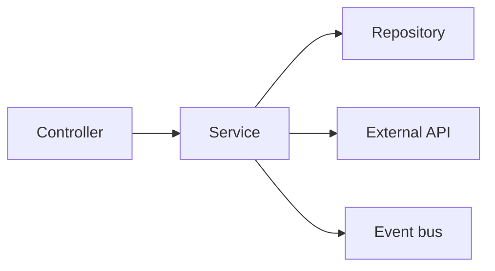

# The Service Layer

> Backend Development 101 series (4/10)

<!-- a-grade-intro:begin -->

**Core question**: Where does *business logic* belong?

> Not in the controller. Not in the repository. In the *service layer*. One business action — register, transfer, refund — becomes one function with a meaningful name.

<!-- a-grade-intro:end -->

## What You Will Learn

- The role of the service layer
- How to split responsibility across controller, service, and repository
- Where to start a transaction
- How to inject dependencies into a service
- Where domain events fit in

## Why It Matters

Putting business logic in controllers spreads the same rule across *three places* — REST, gRPC, batch jobs. Move it into services and *every entry point* enforces the same rule. This single principle determines how long your service survives.

> Business rules do not change when the door changes.

## Concept at a Glance



A service is the *orchestrator* — it coordinates the repo, external APIs, and the event bus.

## Key Terms

- **Service**: an object responsible for one business *use case*.
- **Use case**: a scenario like "create order" or "issue refund".
- **Transaction boundary**: the unit that commits or rolls back together.
- **Domain event**: a message that announces a business action happened.
- **Dependency injection**: receive collaborators through the constructor or arguments.

## Before/After

**Before (controller does everything)**

```python
@app.post("/orders")
def create_order(payload, db, mail):
    if payload.amount <= 0:
        raise HTTPException(400)
    order = db.insert("orders", payload.dict())
    mail.send(payload.email, "ordered")
    return order
```

**After (service owns the rule)**

```python
# services/order_service.py
class OrderService:
    def __init__(self, repo, mailer):
        self.repo = repo
        self.mailer = mailer

    def create(self, payload):
        if payload.amount <= 0:
            raise ValueError("amount must be > 0")
        order = self.repo.save(payload)
        self.mailer.send(payload.email, "ordered")
        return order

# routers/orders.py
@router.post("")
def create_order(payload, svc: OrderService = Depends(get_order_service)):
    return svc.create(payload)
```

The controller is *thin* and the same service can be reused from a batch job.

## Hands-on: Five Steps to Designing a Service

### Step 1 — The smallest service

```python
# 1_service.py
class GreetService:
    def hello(self, name: str) -> str:
        return f"hello, {name}"
```

### Step 2 — Inject dependencies

```python
# 2_di.py
class UserService:
    def __init__(self, repo):
        self.repo = repo

    def register(self, name: str):
        return self.repo.insert({"name": name})
```

### Step 3 — Transaction boundary

```python
# 3_tx.py
class TransferService:
    def __init__(self, accounts, tx):
        self.accounts = accounts
        self.tx = tx

    def transfer(self, src, dst, amount):
        with self.tx.begin():
            self.accounts.debit(src, amount)
            self.accounts.credit(dst, amount)
```

### Step 4 — Integrate an external call

```python
# 4_external.py
class CheckoutService:
    def __init__(self, repo, payment_gw):
        self.repo = repo
        self.gw = payment_gw

    def checkout(self, cart):
        receipt = self.gw.charge(cart.total)
        return self.repo.save_order(cart, receipt.id)
```

### Step 5 — Publish a domain event

```python
# 5_event.py
class OrderService:
    def __init__(self, repo, bus):
        self.repo = repo
        self.bus = bus

    def place(self, payload):
        order = self.repo.save(payload)
        self.bus.publish("OrderPlaced", {"id": order.id})
        return order
```

## What to Notice in This Code

- A service *receives* its dependencies — it does not construct them.
- The transaction starts *inside the service*, not the repository.
- External calls are validated before the next step runs.

## Five Common Mistakes

1. **Passing the HTTP request directly into the service.** Services accept *plain inputs*.
2. **Throwing `HTTPException` from a service.** Translate domain errors at the controller.
3. **Opening a transaction in the repository.** A use case becomes two transactions.
4. **Letting services import each other.** Cycles appear — use the event bus instead.
5. **Stuffing every method into one service.** One service per domain reads better.

## How This Shows Up in Production

Large backends keep one service directory per domain (`services/orders/`, `services/payments/`). One use case maps to one service method — that single rule lets a new teammate ramp up in thirty minutes. Even without full DDD, this split helps every backend.

## How a Senior Engineer Thinks

- One use case, one method — long methods are a *split signal*.
- Treat services as functions of *input to result*.
- Make transaction boundaries explicit.
- Decide retry policies inside the service, not the call site.
- The service file alone should explain the business rules.

## Checklist

- [ ] You can describe controller / service / repository duties.
- [ ] You can inject dependencies into a service.
- [ ] You can start a transaction inside a service.
- [ ] You can tell HTTP exceptions from domain exceptions.
- [ ] You know what a domain event is.

## Practice Problems

1. Build a `RefundService.refund(order_id)` and raise `RefundError` for invalid IDs.
2. Add an *insufficient funds* check to `TransferService`.
3. When a service method gets long, refactor it into a new service.

## Wrap-up and Next Steps

The service layer is the *home of business rules*. Next, we go a layer deeper to the *Database Layer*, where data finally lives.

<!-- toc:begin -->
- [What Is Backend Development?](./01-what-is-backend-development.md)
- [Building an HTTP Server](./02-building-an-http-server.md)
- [Routing and Controllers](./03-routing-and-controllers.md)
- **The Service Layer (current)**
- The Database Layer (upcoming)
- Authentication and Authorization (upcoming)
- Logging and Error Handling (upcoming)
- Testing the Backend (upcoming)
- Deploying the Backend (upcoming)
- A Production-Ready Backend Structure (upcoming)
<!-- toc:end -->

## References

- [Service Layer pattern (Martin Fowler)](https://martinfowler.com/eaaCatalog/serviceLayer.html)
- [DDD reference (Eric Evans)](https://www.domainlanguage.com/ddd/reference/)
- [Architecture Patterns with Python](https://www.cosmicpython.com/)
- [FastAPI dependencies](https://fastapi.tiangolo.com/tutorial/dependencies/)
