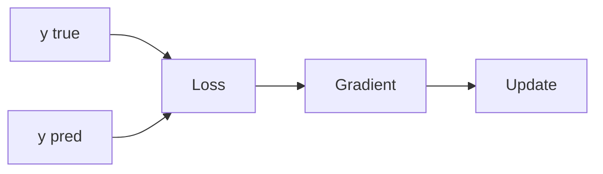

# Loss Function

> Calculus for ML 101 series (6/10)

<!-- a-grade-intro:begin -->

**Core question**: What *function* should we use to *score* how well an ML model did?

> A *loss function* turns the *gap* between *prediction* and *truth* into a *number*, and its *gradient* drives training.

<!-- a-grade-intro:end -->

## What You Will Learn

- The definition of *loss*
- *MSE* for regression
- *Cross entropy* for classification
- The meaning of the *gradient*
- *Training signal* intuition

## Why It Matters

The *wrong loss* yields the *wrong model*. *Choosing the loss* is *defining the problem*.

## Concept at a Glance



## Key Terms

- **loss**: a *number* representing *error*.
- **MSE**: *mean squared error*.
- **CE**: *cross entropy*.
- **signal**: the *training signal*.
- **objective**: the *optimization target*.

## Before/After

**Before**: judge predictions by *eye*.

**After**: judge with a *numeric* loss.

## Hands-on: Mini Loss Kit

### Step 1 — MSE

```python
def mse(y, p):
    return sum((yi - pi) ** 2 for yi, pi in zip(y, p)) / len(y)
```

### Step 2 — MSE Gradient

```python
def mse_grad(y, p):
    n = len(y)
    return [-2 * (yi - pi) / n for yi, pi in zip(y, p)]
```

### Step 3 — Binary Cross Entropy

```python
import math

def bce(y, p, eps=1e-7):
    return -sum(yi * math.log(pi + eps) + (1 - yi) * math.log(1 - pi + eps) for yi, pi in zip(y, p)) / len(y)
```

### Step 4 — Compare Losses

```python
y = [1, 0, 1]
p = [0.9, 0.2, 0.7]
loss = bce(y, p)
```

### Step 5 — Training Signal

```python
def signal(y, p):
    return sum(abs(yi - pi) for yi, pi in zip(y, p)) / len(y)
```

## What to Notice in This Code

- *MSE* fits *regression*.
- *BCE* fits *classification*.
- The *signal* is the *gradient magnitude*.

## Five Common Mistakes

1. **Using a *classification* loss for *regression*.**
2. **Forgetting to handle *log(0)*.**
3. **Confusing *mean* vs *sum* scales.**
4. **Forgetting that *MSE* is *outlier-sensitive*.**
5. **Mismatching *label encoding*.**

## How This Shows Up in Production

*Loss curve monitoring*, *loss weighting*, and *class imbalance correction* are all loss-design choices.

## How a Senior Engineer Thinks

- The *loss* defines the *problem*.
- Match *MSE/BCE* to the task.
- Prioritize *numerical stability*.
- Monitor the *training signal*.
- Compensate for *imbalance*.

## Checklist

- [ ] Match *loss* to *task type*.
- [ ] Ensure *numerical stability*.
- [ ] Align *scales*.
- [ ] Monitor the *learning curve*.

## Practice Problems

1. Define *MSE* in one line.
2. Define *BCE* in one line.
3. State the meaning of *training signal* in one line.

## Wrap-up and Next Steps

Next post: *Gradient Descent*.

<!-- toc:begin -->
- [What Is a Derivative](./01-what-is-derivative.md)
- [Functions and Slope](./02-functions-and-slope.md)
- [Partial Derivatives](./03-partial-derivatives.md)
- [Gradient](./04-gradient.md)
- [Chain Rule](./05-chain-rule.md)
- **Loss Function (current)**
- Gradient Descent (upcoming)
- Optimization (upcoming)
- Backpropagation Intuition (upcoming)
- Calculus in Deep Learning (upcoming)
<!-- toc:end -->

## References

- [Loss Functions - PyTorch](https://pytorch.org/docs/stable/nn.html#loss-functions)
- [Cross Entropy - CS231n](https://cs231n.github.io/linear-classify/)
- [Deep Learning Book - Loss](https://www.deeplearningbook.org/contents/mlp.html)
- [Class Imbalance - scikit-learn](https://scikit-learn.org/stable/modules/svm.html#unbalanced-problems)
