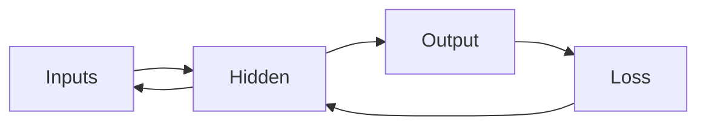

# Backpropagation Intuition

> Calculus for ML 101 series (9/10)

<!-- a-grade-intro:begin -->

**Core question**: How do we compute gradients for *thousands of weights* *all at once*?

> *Backpropagation* applies the *chain rule backward* and produces *every gradient efficiently*.

<!-- a-grade-intro:end -->

## What You Will Learn

- The *computation graph*
- The *forward pass*
- The *backward pass*
- *Gradient accumulation*
- Intuition for *autograd*

## Why It Matters

*Frameworks* compute gradients for you, so understanding the *principle* enables *debugging*.

## Concept at a Glance



## Key Terms

- **graph**: a *graph of computations*.
- **forward**: *input -> output*.
- **backward**: *gradients flow back*.
- **autograd**: *automatic differentiation*.
- **node**: a *single op*.

## Before/After

**Before**: numerically differentiate *each weight*.

**After**: *one backward pass* covers all.

## Hands-on: Mini Backprop Kit

### Step 1 — Node

```python
class Node:
    def __init__(self, val, parents=()):
        self.val = val
        self.parents = parents
        self.grad = 0.0
```

### Step 2 — Add

```python
def add(a, b):
    n = Node(a.val + b.val, (a, b))
    n.local = (1.0, 1.0)
    return n
```

### Step 3 — Mul

```python
def mul(a, b):
    n = Node(a.val * b.val, (a, b))
    n.local = (b.val, a.val)
    return n
```

### Step 4 — Backward Pass

```python
def backward(n):
    n.grad = 1.0
    stack = [n]
    while stack:
        x = stack.pop()
        for p, lg in zip(x.parents, x.local):
            p.grad += x.grad * lg
            stack.append(p)
```

### Step 5 — Mini Example

```python
a, b, c = Node(2.0), Node(3.0), Node(4.0)
y = mul(add(a, b), c)
backward(y)
# a.grad == 4.0, b.grad == 4.0, c.grad == 5.0
```

## What to Notice in This Code

- The *forward* pass produces *values*.
- The *backward* pass produces *gradients*.
- Each *node* carries *local* derivatives.

## Five Common Mistakes

1. **Forgetting to *zero* gradients (they accumulate).**
2. **Mixing the *order* of forward and backward.**
3. **Skipping accumulation at *shared nodes*.**
4. **Skipping *value caching* and breaking memory tradeoffs.**
5. **Forgetting *detach* and keeping graphs alive.**

## How This Shows Up in Production

*PyTorch*, *TensorFlow*, and *JAX* all run backprop *automatically*.

## How a Senior Engineer Thinks

- Backprop is the *implementation* of the chain rule.
- Be *explicit* about *gradient accumulation*.
- Call *zero_grad* in every step.
- Use *numerical checks* to verify.
- The *graph* is *memory*.

## Checklist

- [ ] Call *zero_grad*.
- [ ] One *backward* pass.
- [ ] *Numerical verification*.
- [ ] *Detach* unused branches.

## Practice Problems

1. Define *backpropagation* in one line.
2. State the meaning of *zero_grad* in one line.
3. Define *autograd* in one line.

## Wrap-up and Next Steps

Next post: the *Calculus in Deep Learning* capstone.

<!-- toc:begin -->
- [What Is a Derivative](./01-what-is-derivative.md)
- [Functions and Slope](./02-functions-and-slope.md)
- [Partial Derivatives](./03-partial-derivatives.md)
- [Gradient](./04-gradient.md)
- [Chain Rule](./05-chain-rule.md)
- [Loss Function](./06-loss-function.md)
- [Gradient Descent](./07-gradient-descent.md)
- [Optimization](./08-optimization.md)
- **Backpropagation Intuition (current)**
- Calculus in Deep Learning (upcoming)
<!-- toc:end -->

## References

- [Backpropagation - CS231n](https://cs231n.github.io/optimization-2/)
- [Calculus on Computational Graphs - Olah](https://colah.github.io/posts/2015-08-Backprop/)
- [PyTorch Autograd](https://pytorch.org/tutorials/beginner/blitz/autograd_tutorial.html)
- [JAX Autograd Cookbook](https://jax.readthedocs.io/en/latest/notebooks/autodiff_cookbook.html)
