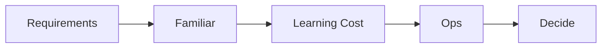

# Choosing the Tech Stack

> Capstone Project 101 series (7/10)

<!-- a-grade-intro:begin -->

**Core question**: *Why* is the *newest stack* not always the *right* one?

> *Learning cost* and *ops burden* eat into your *schedule*.

<!-- a-grade-intro:end -->

## What You Will Learn

- Assessing *familiarity*
- Comparing *learning curves*
- Checking the *ecosystem*
- Estimating *ops cost*
- Comparing *alternatives*

## Why It Matters

*The right choice* creates *focus*.

## Concept at a Glance



## Key Terms

- **familiarity**: prior *experience*.
- **learning curve**: *learning cost*.
- **ecosystem**: libraries and *community*.
- **ops**: *deploy* and *run*.
- **alternative**: a *backup choice*.

## Before/After

**Before**: Always use the *newest* stack.

**After**: Choose by *familiarity + cost*.

## Hands-on: Decision Table

### Step 1 — List candidates

```python
candidates = ["FastAPI", "Flask", "Django"]
```

### Step 2 — Score familiarity

```python
familiar = {"FastAPI": 4, "Flask": 5, "Django": 2}
```

### Step 3 — Estimate learning cost

```python
learning_cost = {"FastAPI": 2, "Flask": 1, "Django": 4}
```

### Step 4 — Estimate ops burden

```python
ops = {"FastAPI": 2, "Flask": 1, "Django": 3}
```

### Step 5 — Compute scores

```python
score = {k: familiar[k] - learning_cost[k] - ops[k] for k in candidates}
```

## What to Notice in This Code

- *Score* is *familiarity minus cost*.
- *Alternatives* are *three or fewer*.
- The *decision* is *documented*.

## Five Common Mistakes

1. **Choosing by *popularity* only.**
2. **Ignoring *familiarity*.**
3. **Forgetting *ops cost*.**
4. **Not recording the *decision*.**
5. **No *alternative* comparison.**

## How This Shows Up in Production

Companies record decisions in *ADRs*.

## How a Senior Engineer Thinks

- *Familiarity* is *speed*.
- *Learning* is a *cost*.
- *Ops* is *ongoing*.
- *Alternatives* are *written*.
- *Decisions* are *reversible*.

## Checklist

- [ ] *Three* candidates.
- [ ] *Familiarity* score.
- [ ] *Learning cost*.
- [ ] *Decision* record.

## Practice Problems

1. State the meaning of *ADR* in one line.
2. State why *familiarity* matters in one line.
3. Define *ops burden* in one line.

## Wrap-up and Next Steps

Next post: *Schedule Management*.

<!-- toc:begin -->
- [What is a Capstone Project](./01-what-is-capstone.md)
- [Choosing a Topic](./02-choosing-a-topic.md)
- [Defining the Problem](./03-defining-the-problem.md)
- [Organizing Requirements](./04-organizing-requirements.md)
- [Splitting Team Roles](./05-splitting-team-roles.md)
- [Designing the MVP](./06-designing-the-mvp.md)
- **Choosing the Tech Stack (current)**
- Schedule Management (upcoming)
- Building Presentation Materials (upcoming)
- Project Retrospective (upcoming)
<!-- toc:end -->

## References

- [Architecture Decision Records](https://adr.github.io/)
- [Choose Boring Technology - Dan McKinley](https://boringtechnology.club/)
- [The Twelve-Factor App](https://12factor.net/)
- [Tech Radar - Thoughtworks](https://www.thoughtworks.com/radar)
