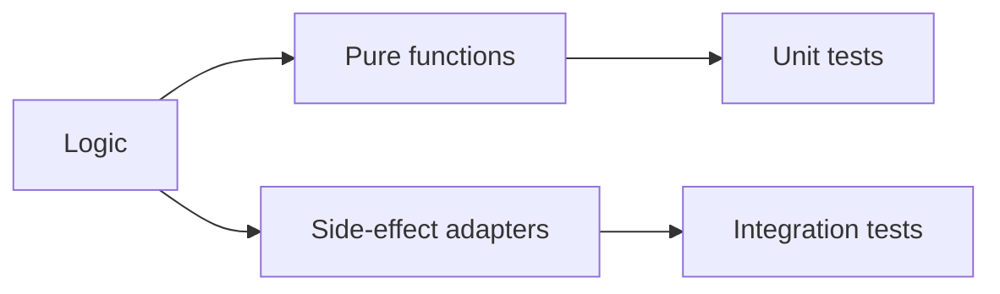

# Testable Code

> Clean Code 101 series (8/10)

<!-- a-grade-intro:begin -->

**Core question**: Why is some code one line to test while other code resists testing entirely?

> The way side effects and dependencies are handled decides it. Separate them and tests fall out naturally.

<!-- a-grade-intro:end -->

## What You Will Learn

- Separating pure logic from side effects
- Creating seams with dependency injection
- Fakes and spies as test doubles
- Handling non-deterministic dependencies (time, randomness)
- Refactorings that improve testability

## Why It Matters

Hard-to-test code is a sign of hard-to-change structure. Testability is a measure of design quality.

> Testability is not an outcome. It is a result of design.

## Concept at a Glance



A pure core surrounded by thin adapters.

## Key Terms

- **Pure function**: Same input → same output, no side effects.
- **Dependency Injection**: Pass external dependencies as arguments.
- **Seam**: A point where behavior can be swapped.
- **Fake**: A simplified working implementation for tests.
- **Spy**: A test double that records calls.

## Before/After

**Before**

```python
import datetime, requests
def is_business_hour():
    now = datetime.datetime.now()
    return 9 <= now.hour < 18

def fetch_user(uid):
    return requests.get(f"https://api/users/{uid}").json()
```

**After**

```python
def is_business_hour(now):
    return 9 <= now.hour < 18

def fetch_user(uid, http):
    return http.get(f"/users/{uid}").json()
```

Time and HTTP arrive from the outside.

## Hands-on: Five Steps to Testability

### Step 1 — Extract pure logic

```python
# 1_pure.py
def total(items):
    return sum(it.price * it.qty for it in items)
```

IO-free computation should always be pure.

### Step 2 — Inject time

```python
# 2_clock.py
from datetime import datetime
def is_overdue(due, now=None):
    now = now or datetime.now()
    return now > due
```

Tests pin `now` to a fixed value.

### Step 3 — Fake objects

```python
# 3_fake.py
class FakeRepo:
    def __init__(self): self.users = {}
    def save(self, u): self.users[u.id] = u
    def get(self, uid): return self.users.get(uid)

def register(repo, user):
    repo.save(user); return user
```

Test domain logic without a database.

### Step 4 — Recording calls (Spy)

```python
# 4_spy.py
class EmailSpy:
    def __init__(self): self.sent = []
    def send(self, to, body): self.sent.append((to, body))

def notify(email, user):
    email.send(user.email, "welcome")
```

Verify call count and arguments in tests.

### Step 5 — Isolate external calls

```python
# 5_adapter.py
class HttpClient:
    def get(self, path): ...

def fetch_user(uid, http: HttpClient):
    return http.get(f"/users/{uid}").json()
```

Concentrate external calls in a single adapter.

## What to Notice in This Code

- The core logic knows nothing about IO.
- Time and randomness are always injected.
- Tests run fast against fake implementations.

## Five Common Mistakes

1. **Calling `datetime.now()` inside the function.** Tests break as time passes.
2. **Coupling DB and network with domain logic.** Unit tests disappear.
3. **Relying solely on mock libraries.** Hidden tight coupling remains.
4. **Public methods only for tests.** Encapsulation breaks.
5. **Global singletons.** Hard to isolate.

## How This Shows Up in Production

Strong teams use hexagonal / ports-and-adapters to keep the domain core away from IO. Thousands of unit tests still finish in under a second.

## How a Senior Engineer Thinks

- Starts with pure functions.
- Receives dependencies as arguments.
- Prefers fakes over mocks.
- Pushes time, randomness, and IO to the edges.
- Treats slow tests as a design smell.

## Checklist

- [ ] Is the core logic pure?
- [ ] Are external dependencies injected?
- [ ] Are time and randomness injected?
- [ ] Can tests run without IO using fakes?
- [ ] Do unit tests finish in under one second?

## Practice Problems

1. Replace one `datetime.now()` call in your code with an injected argument.
2. Unit-test one DB-bound function using a Fake.
3. Extract one external HTTP call into an adapter class.

## Wrap-up and Next Steps

Testability mirrors design. Next: how to safely change code — refactoring basics.

<!-- toc:begin -->
- [What Is Clean Code?](./01-what-is-clean-code.md)
- [Naming](./02-naming.md)
- [Small Functions](./03-small-functions.md)
- [Simplifying Conditionals](./04-simplifying-conditionals.md)
- [Removing Duplication](./05-removing-duplication.md)
- [Error Handling](./06-error-handling.md)
- [Comments and Documentation](./07-comments-and-docs.md)
- **Testable Code (current)**
- Refactoring Basics (upcoming)
- Good Code Review Standards (upcoming)
<!-- toc:end -->

## References

- [Working Effectively with Legacy Code (M. Feathers)](https://www.oreilly.com/library/view/working-effectively-with/0131177052/)
- [Hexagonal Architecture (Alistair Cockburn)](https://alistair.cockburn.us/hexagonal-architecture/)
- [Mocks Aren't Stubs (Martin Fowler)](https://martinfowler.com/articles/mocksArentStubs.html)
- [Pytest — Fixtures](https://docs.pytest.org/en/stable/how-to/fixtures.html)
