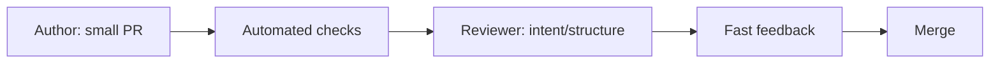

# Good Code Review Standards

> Clean Code 101 series (10/10)

<!-- a-grade-intro:begin -->

**Core question**: What should a good code review actually look at?

> Everything this series taught — names, functions, branches, duplication, errors, tests, refactoring — checked at one moment.

<!-- a-grade-intro:end -->

## What You Will Learn

- PR size and reviewability
- A clean-code review checklist
- The shape of a good review comment
- Roles of the reviewer and the author
- What to push into automation

## Why It Matters

Review is the last quality gate and the largest learning channel a team has.

> Review is not where defects are caught. It is where the team finds a better answer together.

## Concept at a Glance



Automation handles chores. Humans look at intent.

## Key Terms

- **PR (Pull Request)**: A unit of change.
- **Review comment**: An opinion on the change.
- **Approval**: Signal that a PR is ready to merge.
- **CI (Continuous Integration)**: Automated build and test.
- **Style guide**: Shared rules for the team.

## Before/After

**Before**

```text
"This function is too long."
```

**After**

```text
"order_total is 60 lines. Splitting into subtotal/with_coupon/with_member
would make the body read like a table of contents (see ep03, ep05).
Options: (a) split in this PR, (b) follow-up PR with an issue link."
```

The comment is actionable.

## Hands-on: Five Steps to a Solid Review Process

### Step 1 — Push toil into automation

```yaml
# 1_ci.yml
- run: ruff check .
- run: black --check .
- run: pytest -q
```

Style, format, and tests should never reach human eyes.

### Step 2 — Keep PRs small

```text
# 2_small_pr.txt
Recommended: under 400 lines diff, one responsibility
```

Small PRs are the foundation of fast review.

### Step 3 — Read intent first

```markdown
<!-- 3_pr_template.md -->
## What
What is changing
## Why
Why it changes (issue link)
## How
How it was verified (tests/screenshots)
## Risk
What could go wrong
```

A PR without context cannot be reviewed.

### Step 4 — Write actionable comments

```text
# 4_comment.txt
NIT: minor (optional)
SUGG: suggestion (recommended for this PR)
MUST: must address before merge
QUESTION: clarification
```

Labels make priority explicit.

### Step 5 — Learn through retrospectives

```text
# 5_retro.txt
- Move repeated comments into lints/docs.
- Build a guide for splitting big PRs.
- Measure review time and treat it as an improvement target.
```

Refactor the review process itself.

## What to Notice in This Code

- What automation finishes is not re-checked by humans.
- Comments carry priority labels.
- The PR description provides context for the change.

## Five Common Mistakes

1. **Giant PRs.** No one reviews them in full.
2. **Taste comments.** They only create friction.
3. **Overusing MUST.** Trust erodes.
4. **Humans doing what automation can do.** Wasted time.
5. **Approve without learning record.** The same mistakes repeat.

## How This Shows Up in Production

Strong teams measure average PR size, time to first response, and merge lead time. When the numbers slip, the review process itself is refactored.

## How a Senior Engineer Thinks

- Strongly advocates for small PRs.
- Refuses to do work automation can do.
- Reads intent first, then code.
- Leaves actionable comments with priority labels.
- Treats review time itself as a metric.

## Checklist

- [ ] Does the PR cover one responsibility?
- [ ] Is CI green?
- [ ] Is the description (What/Why/How/Risk) sufficient?
- [ ] Do comments carry priority labels?
- [ ] Can repeated comments be moved into automation?

## Practice Problems

1. Measure your team's average PR size and try to halve it.
2. Convert three frequently repeated comments into lint rules.
3. Adopt a PR template and run a retrospective in one month.

## Wrap-up and Next Steps

A good review is a mirror of clean code. Names, functions, branches, duplication, errors, comments, tests, refactoring, and reviews — every topic in this series points to one thing: code that the next person can change more easily. The next series scales these principles to a larger unit — software design.

<!-- toc:begin -->
- [What Is Clean Code?](./01-what-is-clean-code.md)
- [Naming](./02-naming.md)
- [Small Functions](./03-small-functions.md)
- [Simplifying Conditionals](./04-simplifying-conditionals.md)
- [Removing Duplication](./05-removing-duplication.md)
- [Error Handling](./06-error-handling.md)
- [Comments and Documentation](./07-comments-and-docs.md)
- [Testable Code](./08-testable-code.md)
- [Refactoring Basics](./09-refactoring-basics.md)
- **Good Code Review Standards (current)**
<!-- toc:end -->

## References

- [Google Engineering Practices — Code Review](https://google.github.io/eng-practices/review/)
- [Conventional Comments](https://conventionalcomments.org/)
- [Best Kept Secrets of Peer Code Review (Smart Bear)](https://smartbear.com/resources/ebooks/best-kept-secrets-of-peer-code-review/)
- [Microsoft Engineering Fundamentals — Code Review](https://microsoft.github.io/code-with-engineering-playbook/code-reviews/)
