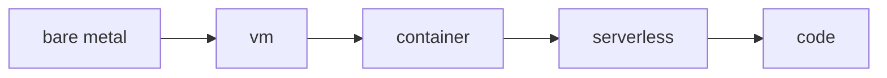

# Compute

> Cloud Computing 101 series (4/10)

<!-- a-grade-intro:begin -->

**Core question**: Among VMs, containers, and Lambda, *when do you pick which*?

> *Compute is anything that runs your code — VM vs container vs serverless trades control for automation.*

<!-- a-grade-intro:end -->

## What You Will Learn

- The four compute styles (VM / container / serverless / bare metal)
- What Auto Scaling actually does
- Reserved vs On-Demand vs Spot
- How to read instance type names
- Five common pitfalls

## Why It Matters

Compute choice drives roughly 60% of your bill and most of your operational pain.

## Concept at a Glance



## Key Terms

- **EC2**: AWS VM service.
- **AMI**: a VM image.
- **Auto Scaling Group**: demand-based instance management.
- **Spot**: spare capacity at a discount.
- **Reserved**: 1-3 year commitment for a discount.

## Before/After

**Before**: a permanently large server sized for the peak (waste).

**After**: an Auto Scaling group that grows and shrinks with demand.

## Hands-on: EC2 with boto3

### Step 1 — Client

```python
import boto3
ec2 = boto3.client("ec2", region_name="us-east-1")
```

### Step 2 — Launch an instance (example)

```python
def launch(ami: str, type_: str = "t3.micro"):
    res = ec2.run_instances(
        ImageId=ami, InstanceType=type_, MinCount=1, MaxCount=1,
    )
    return res["Instances"][0]["InstanceId"]
```

### Step 3 — Status

```python
def status(instance_id: str):
    res = ec2.describe_instances(InstanceIds=[instance_id])
    return res["Reservations"][0]["Instances"][0]["State"]["Name"]
```

### Step 4 — Terminate

```python
def terminate(instance_id: str):
    ec2.terminate_instances(InstanceIds=[instance_id])
```

### Step 5 — Parse instance type

```python
def parse_type(t: str) -> dict:
    family, size = t.split(".")
    return {"family": family, "size": size}

print(parse_type("t3.micro"))
print(parse_type("m5.large"))
```

## What to Notice in This Code

- The AMI is the VM's birth photo.
- `terminate` is irreversible.
- Instance type is `family.size`.

## Five Common Mistakes

1. **Using Spot for the database.**
2. **No Auto Scaling — peaks take you offline.**
3. **Buying Reserved without flexibility headroom.**
4. **Believing "stopped instance = zero cost".**
5. **Terminating instances without log shipping — evidence is gone.**

## How This Shows Up in Production

Web tier runs On-Demand inside an ASG, batch jobs ride Spot, the database lives on Reserved, and unpredictable workloads land on Lambda.

## How a Senior Engineer Thinks

- Map workload to compute, not the other way around.
- Auto Scaling is the default.
- Spot belongs where retries are cheap.
- Reserve only your stable baseline.
- Serverless wins when human time costs more than compute.

## Checklist

- [ ] Each workload mapped to a compute style.
- [ ] Auto Scaling evaluated for every tier.
- [ ] Reserved/Spot ratio is intentional.
- [ ] Termination policy is documented.

## Practice Problems

1. What design constraints does Lambda's max execution time impose?
2. How do you implement graceful shutdown for Spot interruptions?
3. Compare `t3` vs `m5` from a workload-fit angle.

## Wrap-up and Next Steps

Compute moves data — and data has to live somewhere. The next post covers Storage.

<!-- toc:begin -->
- [What is Cloud Computing?](./01-what-is-cloud-computing.md)
- [IaaS, PaaS, SaaS](./02-iaas-paas-saas.md)
- [Region and Availability Zone](./03-region-and-availability-zone.md)
- **Compute (current)**
- Storage (upcoming)
- Network (upcoming)
- Identity and Security (upcoming)
- Monitoring (upcoming)
- Cost Management (upcoming)
- Cloud Architecture Basics (upcoming)
<!-- toc:end -->

## References

- [AWS EC2 user guide](https://docs.aws.amazon.com/AWSEC2/latest/UserGuide/concepts.html)
- [AWS Auto Scaling](https://docs.aws.amazon.com/autoscaling/)
- [AWS — Spot Instances](https://docs.aws.amazon.com/AWSEC2/latest/UserGuide/using-spot-instances.html)
- [AWS Lambda overview](https://docs.aws.amazon.com/lambda/latest/dg/welcome.html)
