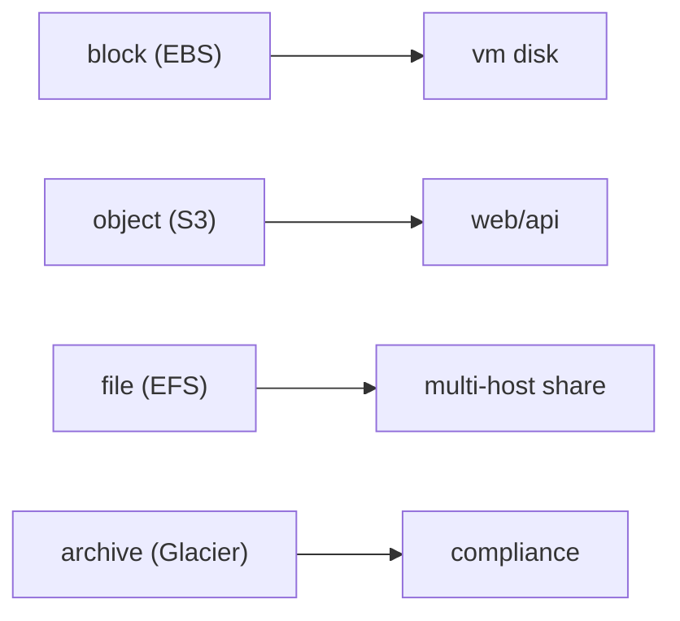

# Storage

> Cloud Computing 101 series (5/10)

<!-- a-grade-intro:begin -->

**Core question**: Why do S3, EBS, EFS, and Glacier all exist *separately*?

> *Cloud storage splits into object, block, file, and archive based on access pattern and durability/cost tradeoffs.*

<!-- a-grade-intro:end -->

## What You Will Learn

- The four storage types
- Durability vs availability
- Lifecycle policies
- Encryption basics
- Five common pitfalls

## Why It Matters

The wrong storage choice is *expensive, slow, and fragile*. The right one quietly works for years.

## Concept at a Glance



## Key Terms

- **Object**: key-value with metadata (S3).
- **Block**: a disk-like surface in fixed blocks (EBS).
- **File**: a POSIX directory (EFS).
- **Durability**: probability your data survives (e.g., 11 nines).
- **Lifecycle**: tier transitions over time.

## Before/After

**Before**: every file lives on the VM disk, backups become a nightmare.

**After**: objects in S3 with a Glacier transition rule.

## Hands-on: S3 Object Lifecycle

### Step 1 — Client

```python
import boto3
s3 = boto3.client("s3")
```

### Step 2 — Put

```python
def put(bucket, key, body):
    s3.put_object(Bucket=bucket, Key=key, Body=body)
    return f"s3://{bucket}/{key}"
```

### Step 3 — Get

```python
def get(bucket, key):
    res = s3.get_object(Bucket=bucket, Key=key)
    return res["Body"].read()
```

### Step 4 — Lifecycle policy

```python
policy = {
    "Rules": [{
        "ID": "to-glacier-after-90d",
        "Status": "Enabled",
        "Filter": {"Prefix": "logs/"},
        "Transitions": [{"Days": 90, "StorageClass": "GLACIER"}],
    }]
}
```

### Step 5 — Apply

```python
def apply_lifecycle(bucket, policy):
    s3.put_bucket_lifecycle_configuration(
        Bucket=bucket, LifecycleConfiguration=policy,
    )
```

## What to Notice in This Code

- Prefixes group objects under a policy.
- Transitions are how you actually save money.
- EBS is typically attached to a single VM at a time.

## Five Common Mistakes

1. **Public ACLs that expose buckets.**
2. **No lifecycle — costs grow forever.**
3. **No EBS snapshots.**
4. **Assuming EFS gives you high IOPS.**
5. **Forgetting Glacier restore time when you actually need data.**

## How This Shows Up in Production

Logs land in S3 and transition to Glacier after 90 days. Database volumes use EBS gp3. Shared directories live on EFS.

## How a Senior Engineer Thinks

- The access pattern decides the storage.
- Encryption is the default, not a feature request.
- Define lifecycle on day one.
- Restore cost is part of total cost.
- Backup is not the same as replication.

## Checklist

- [ ] Default encryption enabled.
- [ ] Lifecycle policies defined.
- [ ] Public access blocked by default.
- [ ] At least one restore drill per year.

## Practice Problems

1. Name the three Glacier restore speed tiers.
2. Describe a sensible scenario for enabling S3 versioning.
3. EBS vs EFS for sharing — explain the difference in one sentence.

## Wrap-up and Next Steps

Once data sits somewhere, you have to *connect* to it. The next post covers Network.

<!-- toc:begin -->
- [What is Cloud Computing?](./01-what-is-cloud-computing.md)
- [IaaS, PaaS, SaaS](./02-iaas-paas-saas.md)
- [Region and Availability Zone](./03-region-and-availability-zone.md)
- [Compute](./04-compute.md)
- **Storage (current)**
- Network (upcoming)
- Identity and Security (upcoming)
- Monitoring (upcoming)
- Cost Management (upcoming)
- Cloud Architecture Basics (upcoming)
<!-- toc:end -->

## References

- [AWS S3 user guide](https://docs.aws.amazon.com/AmazonS3/latest/userguide/Welcome.html)
- [AWS EBS](https://docs.aws.amazon.com/ebs/latest/userguide/ebs-volume-types.html)
- [AWS EFS](https://docs.aws.amazon.com/efs/latest/ug/whatisefs.html)
- [AWS Glacier — restore options](https://docs.aws.amazon.com/AmazonS3/latest/userguide/restoring-objects-retrieval-options.html)
