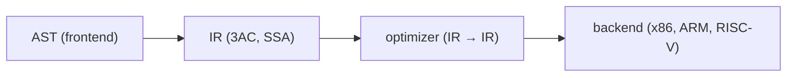

# intermediate representation

> Compilers 101 series (6/10)

<!-- a-grade-intro:begin -->

**Core question**: Why not just go from the AST straight to machine code? Why insert another stage in the middle?

> An intermediate representation (IR) is a language simpler than an AST and more abstract than machine code. Optimization and multi-backend support all live on top of it.

<!-- a-grade-intro:end -->

## What You Will Learn

- What an IR is and why it exists
- The shape of three-address code (3AC)
- The intuition for SSA (static single assignment)
- The structure that lets one IR target many architectures
- Writing AST → IR lowering by hand

## Why It Matters

The AST is a form for humans. Machine code is a form for the CPU. Without an IR between them, optimization is tightly coupled to the AST, and supporting a new CPU means rewriting every analysis. The IR splits the compiler cleanly into two halves — frontend and backend.

> The bridge that turns "M languages × N architectures" into "M + N" is the IR.

## Concept at a Glance



Once the IR is well defined, the optimizer and the backend only need to know the IR.

## Key Terms

- **IR (intermediate representation)**: the middle language used inside the compiler.
- **Three-address code**: at most three operands per line, like `t1 = a + b`.
- **Basic block**: a straight-line sequence of instructions with no branches.
- **CFG (control flow graph)**: a graph whose nodes are basic blocks.
- **SSA**: every variable is assigned exactly once. It makes optimization simple.

## Before/After

**Before — tree-based evaluation**

```python
ast = Bin("+", Num(1), Bin("*", Num(2), Num(3)))
# evaluate recursively over the tree
```

**After — flat instruction sequence**

```text
t1 = 2 * 3
t2 = 1 + t1
return t2
```

It is much easier to analyze instruction by instruction.

## Hands-on: AST → IR lowering

### Step 1 — Define IR instructions

```python
# 1_ir.py
from dataclasses import dataclass
@dataclass
class Inst:
    op: str
    dst: str
    src1: object
    src2: object = None
```

Four fields `(op, dst, src1, src2)` express almost every arithmetic, compare, or assignment.

### Step 2 — Generating temporaries

```python
# 2_temps.py
class TempGen:
    def __init__(self): self.n = 0
    def fresh(self):
        self.n += 1; return f"t{self.n}"

g = TempGen()
print(g.fresh(), g.fresh(), g.fresh())  # t1 t2 t3
```

Each intermediate value of an expression needs a name. A counter is enough.

### Step 3 — Expression → 3AC

```python
# 3_lower.py
def lower(node, code, g):
    kind = node[0]
    if kind == "NUM":
        t = g.fresh(); code.append(("LOAD", t, node[1])); return t
    if kind == "BIN":
        l = lower(node[2], code, g)
        r = lower(node[3], code, g)
        t = g.fresh(); code.append((node[1], t, l, r)); return t

g = TempGen(); code = []
ast = ("BIN","+",("NUM",1),("BIN","*",("NUM",2),("NUM",3)))
result = lower(ast, code, g)
for inst in code: print(inst)
print("result:", result)
```

A single tree walk produces a flat instruction list. The result is in the last temporary.

### Step 4 — Basic blocks and the CFG

```python
# 4_cfg.py
class Block:
    def __init__(self, name):
        self.name, self.insts, self.next = name, [], []

entry = Block("entry"); body = Block("body"); exit_ = Block("exit")
entry.next = [body]; body.next = [body, exit_]   # loop
```

The moment conditional branches and jumps appear, the IR becomes a graph. Optimization and analysis run on top of this graph.

### Step 5 — A taste of SSA

```python
# 5_ssa.py
# code that assigns the same variable several times
# x = 1
# x = x + 2
# return x

# in SSA:
# x1 = 1
# x2 = x1 + 2
# return x2
```

Index every variable to enforce "single assignment." That is SSA. Data-flow analysis becomes very simple.

## What to Notice in This Code

- One operation per line is the heart of an IR.
- You can mint temporaries freely (the register allocator cleans up later).
- The AST is a tree; the IR is (usually) a graph.
- SSA is a representation for analysis, not for execution.

## Five Common Mistakes

1. **Trying to optimize directly on the AST.** The form is too rich on a tree, and analysis explodes.
2. **Reusing temporary names too early to "optimize."** You lose the benefit of SSA.
3. **Forgetting that basic blocks split at labels too, not only at branches.**
4. **Making the IR too architecture-dependent.** New backends become painful.
5. **Making the IR too abstract.** Good code generation becomes hard.

## How This Shows Up in Production

LLVM IR is the canonical example. Many languages (C/C++/Rust/Swift, etc.) lower to the same IR, share the same optimizations, and emit code for diverse architectures. CPython bytecode and Java bytecode are also a kind of IR.

## How a Senior Engineer Thinks

- When meeting a new language, they first ask "can it lower to the existing IR?"
- IR design is a balance between simplicity and enough expressive power.
- They keep SSA as the default form for analysis.
- They carry source-level information (line, column) all the way through the IR (debug info).
- They keep backends written only against the IR, separated from the frontend.

## Checklist

- [ ] Can you say in one sentence why an IR exists?
- [ ] Can you write down the shape of three-address code?
- [ ] Can you state the definition of a basic block?
- [ ] Do you have intuition for why SSA simplifies analysis?
- [ ] Have you accepted that the IR is the dividing line between frontend and backend?

## Practice Problems

1. Add comparison operators (`<`, `>`) to the lower function above.
2. Convert a single line `if (x < 10) { ... } else { ... }` to IR by hand.
3. Convert code that assigns the same variable twice into SSA form by hand.

## Wrap-up and Next Steps

The IR is the bridge that cleanly splits the compiler in half. The next post looks at the simplest — and most frequently used — two or three optimizations that run on top of it.

<!-- toc:begin -->
- [What Is a Compiler?](./01-what-is-a-compiler.md)
- [lexical analysis](./02-lexical-analysis.md)
- [parsing and AST](./03-parsing-and-ast.md)
- [semantic analysis](./04-semantic-analysis.md)
- [symbol table and scope](./05-symbol-table-and-scope.md)
- **intermediate representation (current)**
- optimization basics (upcoming)
- code generation (upcoming)
- JIT vs AOT (upcoming)
- building a tiny interpreter (upcoming)
<!-- toc:end -->

## References

- [Three-address code (Wikipedia)](https://en.wikipedia.org/wiki/Three-address_code)
- [Static single-assignment form (Wikipedia)](https://en.wikipedia.org/wiki/Static_single-assignment_form)
- [LLVM Language Reference](https://llvm.org/docs/LangRef.html)
- [Control-flow graph (Wikipedia)](https://en.wikipedia.org/wiki/Control-flow_graph)
