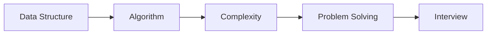

# Data Structures and Algorithms

> Computer Science Major 101 series (3/10)

<!-- a-grade-intro:begin -->

**Core question**: Why are *data structures* and *algorithms* the *core* course for *every* CS major?

> Because they are the *common language* of *problem solving*.

<!-- a-grade-intro:end -->

## What You Will Learn

- Meaning of *data structures*
- Meaning of *algorithms*
- *Time and space complexity*
- Study *order*
- Link to coding *interviews*

## Why It Matters

*Complexity* thinking is the first *standard* of *code quality*.

## Concept at a Glance



## Key Terms

- **array**: *contiguous* memory.
- **list**: *linked* structure.
- **tree**: *hierarchical* structure.
- **graph**: *relations*.
- **complexity**: *growth rate*.

## Before/After

**Before**: You only write *for loops*.

**After**: You think in *complexity*.

## Hands-on: Mini DSA Kit

### Step 1 — Array sum

```python
def total(xs):
    return sum(xs)
```

### Step 2 — Linear search

```python
def find(xs, t):
    return any(x == t for x in xs)
```

### Step 3 — Binary search

```python
def bsearch(xs, t):
    lo, hi = 0, len(xs) - 1
    while lo <= hi:
        m = (lo + hi) // 2
        if xs[m] == t:
            return m
        if xs[m] < t:
            lo = m + 1
        else:
            hi = m - 1
    return -1
```

### Step 4 — Stack

```python
stack = []
stack.append(1)
stack.pop()
```

### Step 5 — Graph BFS

```python
from collections import deque
def bfs(g, s):
    seen, q = {s}, deque([s])
    while q:
        u = q.popleft()
        for v in g[u]:
            if v not in seen:
                seen.add(v); q.append(v)
    return seen
```

## What to Notice in This Code

- *Linear* and *log* differ.
- *Stack/queue* are *simple* but *fundamental*.
- *BFS* shines on *shortest path*.

## Five Common Mistakes

1. **Never *measuring* complexity.**
2. **Forgetting *recursion stack* limits.**
3. **Using *hash* everywhere.**
4. **Mixing *graph representations*.**
5. **Underestimating *input size*.**

## How This Shows Up in Production

Most API *latency* problems start at *data structure choice*.

## How a Senior Engineer Thinks

- *Complexity* is intuition.
- *Data shape* drives the algorithm.
- Look at *worst* and *best*.
- Write *invariants*.
- *Tests* are evidence.

## Checklist

- [ ] *Complexity* labeled.
- [ ] *Input limit* known.
- [ ] *Invariant* stated.
- [ ] *Tests* pass.

## Practice Problems

1. Define *hash table* in one line.
2. Define *graph* in one line.
3. State the meaning of *Big O* in one line.

## Wrap-up and Next Steps

Next post: *Understanding Systems Subjects*.

<!-- toc:begin -->
- [What Computer Science Majors Learn](./01-what-cs-majors-learn.md)
- [Understanding First Year Subjects](./02-first-year-subjects.md)
- **Data Structures and Algorithms (current)**
- Understanding Systems Subjects (upcoming)
- Database and Network (upcoming)
- AI and Data Science (upcoming)
- Project Subjects (upcoming)
- How to Study Computer Science (upcoming)
- Build Your Portfolio (upcoming)
- Skills to Have Before Graduation (upcoming)
<!-- toc:end -->

## References

- [CLRS Introduction to Algorithms](https://mitpress.mit.edu/9780262046305/introduction-to-algorithms/)
- [Open Data Structures](https://opendatastructures.org/)
- [Visualgo - Algorithm Visualization](https://visualgo.net/en)
- [LeetCode Patterns](https://seanprashad.com/leetcode-patterns/)
