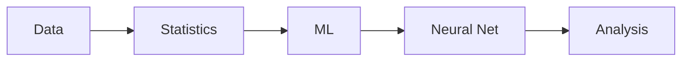

# AI and Data Science

> Computer Science Major 101 series (6/10)

<!-- a-grade-intro:begin -->

**Core question**: *How* do *AI* and *data science* *split* and *connect* inside the major?

> *Data* is the *common input*, *AI* is the *model*, *analysis* is the *interpretation*.

<!-- a-grade-intro:end -->

## What You Will Learn

- *Statistics* basics
- *Machine learning* intro
- *Deep learning* basics
- *Data analysis*
- The *division of labor* between the two

## Why It Matters

*Data sense* is the *core skill* of every *modern engineer*.

## Concept at a Glance



## Key Terms

- **feature**: *input* variable.
- **label**: *target* value.
- **training**: *learning*.
- **inference**: *prediction*.
- **dataset**: *collection* of data.

## Before/After

**Before**: You only look at *models*.

**After**: You look at *data quality* and *distribution*.

## Hands-on: Mini ML Pipeline

### Step 1 — Data

```python
xs = [1, 2, 3, 4]
ys = [2, 4, 6, 8]
```

### Step 2 — Mean

```python
avg = sum(ys) / len(ys)
```

### Step 3 — Regression slope

```python
def slope(xs, ys):
    mx, my = sum(xs)/len(xs), sum(ys)/len(ys)
    num = sum((x-mx)*(y-my) for x, y in zip(xs, ys))
    den = sum((x-mx)**2 for x in xs)
    return num / den
```

### Step 4 — Prediction

```python
m = slope(xs, ys)
pred = m * 5
```

### Step 5 — Evaluation

```python
mae = sum(abs(m*x - y) for x, y in zip(xs, ys)) / len(xs)
```

## What to Notice in This Code

- *Statistics* underlies the *model*.
- *Prediction* is *function application*.
- *Evaluation* validates *learning*.

## Five Common Mistakes

1. **Creating *data leakage*.**
2. **Mixing *train and test* sets.**
3. **Comparing *without scaling*.**
4. **Reaching for *complex models* first.**
5. **Leaving *metrics* vague.**

## How This Shows Up in Production

Detecting *distribution shift* is the *core* skill of *model operations*.

## How a Senior Engineer Thinks

- *Data* matters more than the *model*.
- *Baseline* first.
- *Evaluation* is *evidence*.
- Think about *interpretability*.
- Secure *reproducibility*.

## Checklist

- [ ] *Train/test* split.
- [ ] *Baseline* model.
- [ ] *Metric* stated.
- [ ] *Seed* fixed.

## Practice Problems

1. Define *feature* in one line.
2. Define *label* in one line.
3. State the meaning of *model* in one line.

## Wrap-up and Next Steps

Next post: *Project Subjects*.

<!-- toc:begin -->
- [What Computer Science Majors Learn](./01-what-cs-majors-learn.md)
- [Understanding First Year Subjects](./02-first-year-subjects.md)
- [Data Structures and Algorithms](./03-data-structures-and-algorithms.md)
- [Understanding Systems Subjects](./04-systems-subjects.md)
- [Database and Network](./05-database-and-network.md)
- **AI and Data Science (current)**
- Project Subjects (upcoming)
- How to Study Computer Science (upcoming)
- Build Your Portfolio (upcoming)
- Skills to Have Before Graduation (upcoming)
<!-- toc:end -->

## References

- [An Introduction to Statistical Learning](https://www.statlearning.com/)
- [Deep Learning Book - Goodfellow](https://www.deeplearningbook.org/)
- [Pattern Recognition and Machine Learning](https://www.microsoft.com/en-us/research/uploads/prod/2006/01/Bishop-Pattern-Recognition-and-Machine-Learning-2006.pdf)
- [scikit-learn User Guide](https://scikit-learn.org/stable/user_guide.html)
