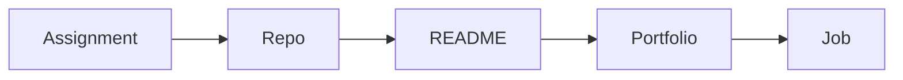

# Build Your Portfolio

> Computer Science Major 101 series (9/10)

<!-- a-grade-intro:begin -->

**Core question**: *How* can a *class assignment* become a *portfolio piece*?

> *Documentation* and *publishing* turn *assignments* into *evidence*.

<!-- a-grade-intro:end -->

## What You Will Learn

- Definition of *portfolio*
- Using *GitHub*
- Writing a *README*
- *Documentation* patterns
- Meaning of *going public*

## Why It Matters

You need *visible results* to start a *conversation* during *applications*.

## Concept at a Glance



## Key Terms

- **repo**: code *repository*.
- **README**: *first impression*.
- **license**: *use rights*.
- **commit**: change *unit*.
- **release**: *distribution* unit.

## Before/After

**Before**: *Assignment folders* live *locally*.

**After**: *Public repo* + *README* + *demo*.

## Hands-on: Mini Portfolio Setup

### Step 1 — Repo name

```python
name = "schedule-checker"
```

### Step 2 — README sections

```python
sections = ["overview", "demo", "stack", "run", "license"]
```

### Step 3 — One-line overview

```python
overview = "Conflict checker for course schedules"
```

### Step 4 — Run commands

```python
run = ["pip install -r requirements.txt", "python app.py"]
```

### Step 5 — Demo link

```python
demo = "https://example.com/demo"
```

## What to Notice in This Code

- The *name* drives *searchability*.
- *README sections* set *expectations*.
- A *demo* is *evidence*.

## Five Common Mistakes

1. **An *empty README*.**
2. **All commit messages saying *'update'*.**
3. **No *license*.**
4. **No *screenshots*.**
5. **Unclear *run instructions*.**

## How This Shows Up in Production

Interviewers read the *README* before the *code*.

## How a Senior Engineer Thinks

- *Publishing* is *learning*.
- *Docs* matter as much as *code*.
- Brag about *small PRs*.
- A *license* is basic.
- A *demo link* is the strongest.

## Checklist

- [ ] Five *README* sections.
- [ ] *License* added.
- [ ] *Screenshot*.
- [ ] *Run command* listed.

## Practice Problems

1. Define *README* in one line.
2. Define *license* in one line.
3. State the meaning of *demo* in one line.

## Wrap-up and Next Steps

Next post: *Skills to Have Before Graduation*.

<!-- toc:begin -->
- [What Computer Science Majors Learn](./01-what-cs-majors-learn.md)
- [Understanding First Year Subjects](./02-first-year-subjects.md)
- [Data Structures and Algorithms](./03-data-structures-and-algorithms.md)
- [Understanding Systems Subjects](./04-systems-subjects.md)
- [Database and Network](./05-database-and-network.md)
- [AI and Data Science](./06-ai-and-data-science.md)
- [Project Subjects](./07-project-subjects.md)
- [How to Study Computer Science](./08-how-to-study-cs.md)
- **Build Your Portfolio (current)**
- Skills to Have Before Graduation (upcoming)
<!-- toc:end -->

## References

- [Make a README](https://www.makeareadme.com/)
- [Choose a License](https://choosealicense.com/)
- [GitHub Profile README Guide](https://docs.github.com/en/account-and-profile/setting-up-and-managing-your-github-profile/customizing-your-profile/managing-your-profile-readme)
- [Awesome README](https://github.com/matiassingers/awesome-readme)
