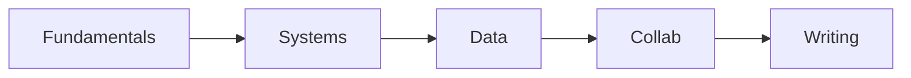

# Skills to Have Before Graduation

> Computer Science Major 101 series (10/10)

<!-- a-grade-intro:begin -->

**Core question**: *Beyond* the *diploma*, *which skills* actually *land* at work?

> Five axes — *fundamentals + systems + data + collaboration + writing* — are the field standard.

<!-- a-grade-intro:end -->

## What You Will Learn

- *Fundamental* skills
- *Systems* sense
- *Data* sense
- *Collaboration* tools
- *Writing* ability

## Why It Matters

Your *first six months* set the *baseline* for your *whole career*.

## Concept at a Glance



## Key Terms

- **fundamentals**: *base strength*.
- **systems sense**: *runtime feel*.
- **data sense**: *data intuition*.
- **collab**: *teamwork*.
- **writing**: *documentation*.

## Before/After

**Before**: *GPA* equals *skill*.

**After**: *Evidence* equals *skill*.

## Hands-on: Graduation Self Check

### Step 1 — Data structures

```python
fund = ["array", "list", "tree", "graph", "hash"]
```

### Step 2 — Systems

```python
sys_topics = ["process", "memory", "io", "network"]
```

### Step 3 — Data

```python
data_topics = ["sql", "stats", "ml_basic"]
```

### Step 4 — Collab

```python
collab = ["git", "review", "issues", "ci"]
```

### Step 5 — Docs

```python
docs = ["readme", "design_doc", "post_mortem"]
```

## What to Notice in This Code

- The *list* is your *self check sheet*.
- *3 to 5 items* per area is enough.
- *Evidence* lives in both *code* and *docs*.

## Five Common Mistakes

1. **Listing *certificates* only.**
2. **Emphasizing *GPA* only.**
3. **An *empty GitHub*.**
4. **Not a single *doc*.**
5. **No *retrospectives*.**

## How This Shows Up in Production

Hiring looks at the *balance* of all *five axes* — a *zero* anywhere shakes the *whole*.

## How a Senior Engineer Thinks

- *Fundamentals* decide.
- *Systems* means *debugging*.
- *Data* is the *common language*.
- *Collaboration* is *evidence*.
- *Docs* are *wealth*.

## Checklist

- [ ] *Five-axis* self check.
- [ ] *Evidence* mapped.
- [ ] *Weak areas* marked.
- [ ] *Next study* plan.

## Practice Problems

1. Define *fundamentals* in one line.
2. Define *systems sense* in one line.
3. State the meaning of *writing ability* in one line.

## Wrap-up and Next Steps

This series ends here. Next: *Capstone Project 101*.

<!-- toc:begin -->
- [What Computer Science Majors Learn](./01-what-cs-majors-learn.md)
- [Understanding First Year Subjects](./02-first-year-subjects.md)
- [Data Structures and Algorithms](./03-data-structures-and-algorithms.md)
- [Understanding Systems Subjects](./04-systems-subjects.md)
- [Database and Network](./05-database-and-network.md)
- [AI and Data Science](./06-ai-and-data-science.md)
- [Project Subjects](./07-project-subjects.md)
- [How to Study Computer Science](./08-how-to-study-cs.md)
- [Build Your Portfolio](./09-build-your-portfolio.md)
- **Skills to Have Before Graduation (current)**
<!-- toc:end -->

## References

- [Teach Yourself Computer Science](https://teachyourselfcs.com/)
- [Google Engineering Practices](https://google.github.io/eng-practices/)
- [The Missing Semester of Your CS Education](https://missing.csail.mit.edu/)
- [Patterns of Software - Richard Gabriel](https://www.dreamsongs.com/Files/PatternsOfSoftware.pdf)
