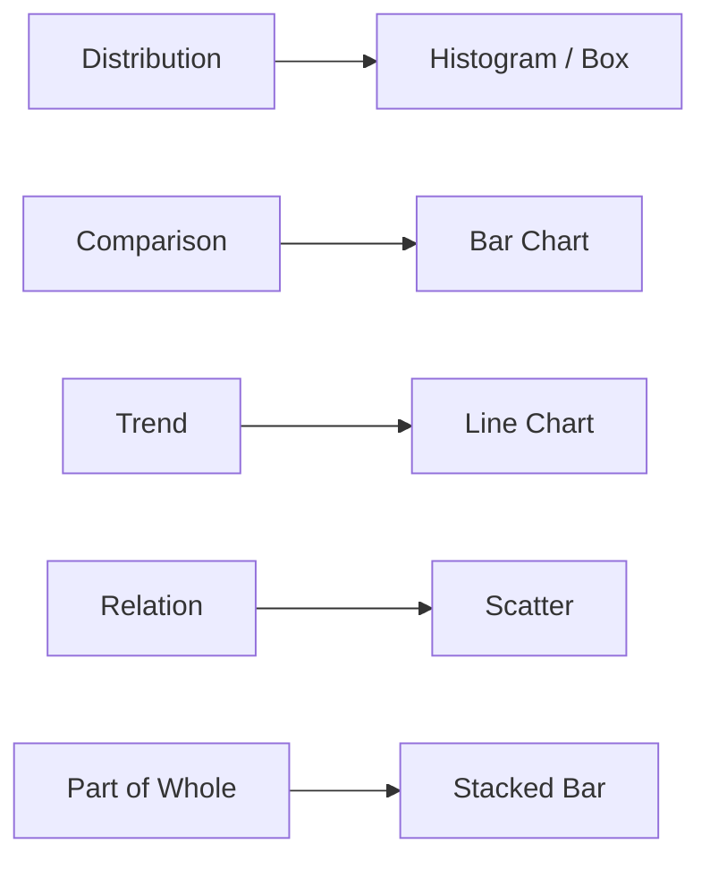

# Visualization

> Data Science 101 series (6/10)

<!-- a-grade-intro:begin -->

**Core question**: *Which chart* fits *which message*, and how do you keep the picture *honest*?

> *One good picture beats *three pages* of writing.*

<!-- a-grade-intro:end -->

## What You Will Learn

- A mapping from *5 messages* to *5 charts*
- Basic rules for *axis, color, labels*
- Patterns that *mislead* the reader
- A 5-step visualization exercise
- Five common pitfalls

## Why It Matters

Data is fastest to read as a *picture*. The wrong chart leads to the *wrong decision*. A clear *message-to-chart* mapping eliminates *half* of the misreadings.

> *Visualization is the *last line* of an analysis.*

## Concept at a Glance



## Key Terms

- **Encoding**: mapping data to *position, length, color*.
- **Scale**: *linear, log* — the axis transform.
- **Faceting**: *small multiples* for comparison.
- **Annotation**: *notes and highlights* on the chart.
- **Colorblind-safe**: a palette that works for color-vision deficiencies.

## Before / After

**Before**: a *3D pie chart* makes proportions *impossible to compare*.

**After**: a *horizontal bar chart* makes them *exactly comparable*.

## Hands-on: 5-step Visualization

### Step 1 — Distribution (histogram)

```python
import matplotlib.pyplot as plt
df["amount"].plot.hist(bins=30, title="amount distribution")
plt.show()
```

### Step 2 — Comparison (bar)

```python
(
    df.groupby("country")["amount"]
      .sum()
      .sort_values()
      .plot.barh(title="revenue by country")
)
plt.show()
```

### Step 3 — Trend (line)

```python
df.groupby("order_date")["amount"].sum().plot(title="daily revenue")
plt.show()
```

### Step 4 — Relation (scatter + facet)

```python
import seaborn as sns
sns.relplot(
    data=df.sample(2000),
    x="quantity",
    y="amount",
    col="country",
    col_wrap=3,
)
```

### Step 5 — Annotation and color

```python
ax = df.groupby("order_date")["amount"].sum().plot()
ax.axvline(pd.Timestamp("2026-04-01"), color="red", linestyle="--", label="campaign")
ax.legend()
```

## What to Notice in This Code

- The *message-to-chart* mapping comes *first*.
- The *axis scale* changes the *reading*.
- *Annotations* save the reader from a paragraph of explanation.

## Five Common Mistakes

1. **Using *3D charts*.** Comparisons become *hard*.
2. **Overusing *dual axes*.** A common source of *misreading*.
3. **Encoding categories *only by color*.** Unfriendly to *colorblind* users.
4. **Bar charts that don't start at *zero*.** They *exaggerate* differences.
5. **Charts without *labels*.** Not reusable next week.

## How This Shows Up in Production

Analysts mix *Tableau / Looker* dashboards with *Python* charts. A *dashboard* is the standard *unit of a weekly report*.

## How a Senior Engineer Thinks

- Write the *message first*, then pick the *chart*.
- Always fill in *axis and labels*.
- Default to a *colorblind-safe palette*.
- Use *annotations* to provide *context*.
- A dashboard should reach a *decision* within *3 screens*.

## Checklist

- [ ] I know the *5 message-to-chart* pairings.
- [ ] I value *axis and labels*.
- [ ] I know *colorblind-safe* palettes.
- [ ] I add *annotations* to aid interpretation.

## Practice Problems

1. Plot the *same data* with *3 different charts* and pick the clearest.
2. Take a *misleading* chart and *fix* it.
3. Sketch a *one-page dashboard* using *3 charts*.

## Wrap-up and Next Steps

Visualization is the *bridge from analysis to decision*. Next we move into *modeling* — using data to *predict*.

<!-- toc:begin -->
- [What Is Data Science?](./01-what-is-data-science.md)
- [Turning a Problem into a Data Problem](./02-problem-to-data-problem.md)
- [Data Collection](./03-data-collection.md)
- [Data Cleaning](./04-data-cleaning.md)
- [Exploratory Data Analysis](./05-exploratory-data-analysis.md)
- **Visualization (current)**
- Modeling (upcoming)
- Evaluation (upcoming)
- Result Interpretation (upcoming)
- End-to-End Data Project Flow (upcoming)
<!-- toc:end -->

## References

- [matplotlib — Tutorials](https://matplotlib.org/stable/tutorials/index.html)
- [seaborn — Tutorial](https://seaborn.pydata.org/tutorial.html)
- [Cole Knaflic — Storytelling with Data](https://www.storytellingwithdata.com/)
- [Tableau — Visual Best Practices](https://www.tableau.com/learn/articles/data-visualization-tips)
