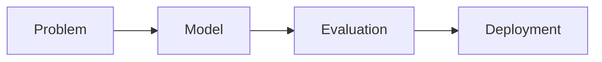

# The ML Interview

> Data Science Career 101 series (6/10)

<!-- a-grade-intro:begin -->

**Core question**: What does the *ML interview* actually ask?

> Fundamentals, model choice, evaluation, traps, systems.

<!-- a-grade-intro:end -->

## What You Will Learn

- *Fundamentals* questions
- *Model choice* logic
- *Evaluation* metrics
- *Production* traps
- *ML system* design

## Why It Matters

Memorizing models without "why" misses the point.

## Concept at a Glance



## Key Terms

- **bias-variance**: The balance between underfit and overfit.
- **overfitting**: Memorizing training data.
- **AUC**: Area under the ROC curve.
- **precision/recall**: Trade-off between false positives and negatives.
- **drift**: Change in data distribution over time.

## Before/After

**Before**: "Random Forest is always good."

**After**: "I pick the model from problem and metric."

## Hands-on: Five Answer Patterns

### Step 1 — Fundamentals

```text
Explain bias-variance in one line.
```

### Step 2 — Model Choice

```text
- assumptions: linear vs tree vs neural
- data size, interpretability
```

### Step 3 — Evaluation

```python
from sklearn.metrics import precision_score, recall_score, roc_auc_score
```

### Step 4 — Production Traps

```text
- data leakage
- class imbalance
- time leakage
```

### Step 5 — System Design

```text
- data -> train -> serve -> monitor
- retraining cadence
- drift detection
```

## What to Notice in This Code

- The metric decides the answer.
- Mentioning traps signals seniority.
- Think in systems.

## Five Common Mistakes

1. **Random Forest as the answer to everything.**
2. **Watching AUC only.**
3. **Not knowing leakage.**
4. **No retraining plan.**
5. **Ignoring interpretability.**

## How This Shows Up in Production

Interviewers spend more time on operations than on accuracy.

## How a Senior Engineer Thinks

- Start from problem definition.
- Metric chooses the model.
- Mention traps first.
- Think system-level.
- Plan for drift.

## Checklist

- [ ] Five metrics.
- [ ] Compare three models.
- [ ] Memorize three traps.
- [ ] One system diagram.

## Practice Problems

1. One line: define overfitting.
2. One line: example of drift.
3. One line: AUC vs recall.

## Wrap-up and Next Steps

Next post covers *The Case Interview*.

<!-- toc:begin -->
- [What Is a Data Career](./01-what-is-data-career.md)
- [Analyst vs Scientist vs Engineer](./02-analyst-scientist-engineer.md)
- [Designing the Learning Path](./03-learning-path.md)
- [The Data Portfolio](./04-data-portfolio.md)
- [SQL and Analytics Interviews](./05-sql-and-analytics-interview.md)
- **The ML Interview (current)**
- The Case Interview (upcoming)
- Settling into the First Data Job (upcoming)
- Building Domain Expertise (upcoming)
- The Path to Senior in Data (upcoming)
<!-- toc:end -->

## References

- [Designing Machine Learning Systems](https://www.oreilly.com/library/view/designing-machine-learning/9781098107956/)
- [scikit-learn metrics](https://scikit-learn.org/stable/modules/model_evaluation.html)
- [ML Interview Book](https://huyenchip.com/ml-interviews-book/)
- [Rules of ML](https://developers.google.com/machine-learning/guides/rules-of-ml)
