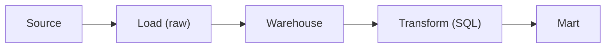

# ETL and ELT

> Data Warehouse 101 series (6/10)

<!-- a-grade-intro:begin -->

**Core question**: Should we transform *before* loading or *after*? The answer hinges on *how warehouse compute has evolved*.

> *Yesterday it was *transform then load*. Today it is *load then transform in SQL*.*

<!-- a-grade-intro:end -->

## What You Will Learn

- The difference between *ETL* and *ELT*
- *Where* to put transformations
- Why modern warehouses lean toward *ELT*
- Five-step pipeline hands-on
- Five common pitfalls

## Why It Matters

As warehouse *compute became cheap*, loading the *raw source* and *transforming with SQL* turned into the *default*. Transformations live as *SQL files* under *version control*, and *replay is easy*.

> *Pull transforms into SQL. Visibility and reproducibility come along for the ride.*

## Concept at a Glance



## Key Terms

- **ETL**: Extract → Transform → Load. Transform *before* loading.
- **ELT**: Extract → Load → Transform. Transform *after* loading.
- **Staging**: The first layer that *preserves the raw source*.
- **dbt**: A SQL-based *transformation tool* with *built-in tests*.
- **Idempotent**: Multiple runs yield *the same result*.

## Before/After

**Before**: A mid-ETL *transform fails*; replaying is painful because the *raw is already gone*.

**After**: Raw stays in *staging*; rerunning the *SQL transform* is a 30-minute job.

## Hands-on: Pipeline in Five Steps

### Step 1 — Load raw

```sql
COPY raw.orders
FROM 's3://bucket/orders/2026-05-04/'
FORMAT AS PARQUET;
```

### Step 2 — Staging model

```sql
CREATE OR REPLACE TABLE staging.orders AS
SELECT
    order_id::BIGINT AS order_id,
    user_id::BIGINT AS user_id,
    amount::NUMERIC(12, 2) AS amount,
    created_at::TIMESTAMP AS created_at
FROM raw.orders;
```

### Step 3 — Transform model

```sql
CREATE OR REPLACE TABLE marts.fact_orders AS
SELECT
    order_id,
    user_id,
    amount,
    DATE(created_at) AS order_date
FROM staging.orders
WHERE amount > 0;
```

### Step 4 — Test

```sql
-- No negative amounts allowed
SELECT COUNT(*) AS bad
FROM marts.fact_orders
WHERE amount <= 0;
```

### Step 5 — Rerun

```sql
-- Raw stays put; only the transform replays
TRUNCATE marts.fact_orders;
INSERT INTO marts.fact_orders SELECT ...;
```

## What to Notice in This Code

- The flow is *raw → staging → mart*, three layers.
- Transformation lives in *one SQL file*.
- The rerun is *idempotent*.

## Five Common Mistakes

1. **Overwriting the *raw source*.** *Point-in-time replay* becomes *impossible*.
2. **Hiding transforms inside *Python functions*.** *Visibility drops* and *debugging suffers*.
3. **Loading without *tests*.** Bad data leaks into *dashboards*.
4. **Reruns *change the result*.** Without idempotency, *trust collapses*.
5. **Stuffing all transforms into *one model*.** *Smaller models* are *easier to maintain*.

## How This Shows Up in Production

*Fivetran/Airbyte* for loading, *dbt* for transforms, *Airflow/Dagster* for orchestration — this combo is the *current standard*. Transformations live as *SQL models* in *Git*.

## How a Senior Engineer Thinks

- *Treat raw as a *legal record* — preserve it.*
- *Concentrate transforms in *SQL files*.*
- *Every model lives next to a *test*.*
- *Idempotency* is another name for *reproducibility*.
- *Version-control the *pipeline itself*.*

## Checklist

- [ ] You can distinguish *ETL* from *ELT*.
- [ ] You know what *staging* is for.
- [ ] You can define *idempotent*.
- [ ] You can attach a *test* to a transform.

## Practice Problems

1. Name a case where *ETL is better*.
2. List *three* risks of skipping *staging*.
3. Give an example of a *non-idempotent* transform.

## Wrap-up and Next Steps

ELT is the shape of the *SQL era*. Next, we look at *BI and dashboards* — turning data into a story.

<!-- toc:begin -->
- [What Is a Data Warehouse?](./01-what-is-data-warehouse.md)
- [OLTP and OLAP](./02-oltp-and-olap.md)
- [Fact and Dimension](./03-fact-and-dimension.md)
- [Star Schema](./04-star-schema.md)
- [Partition and Clustering](./05-partition-and-clustering.md)
- **ETL and ELT (current)**
- BI and Dashboard (upcoming)
- Data Mart (upcoming)
- Performance Optimization (upcoming)
- Warehouse Design Example (upcoming)
<!-- toc:end -->

## References

- [dbt — What Is dbt?](https://docs.getdbt.com/docs/introduction)
- [Fivetran — ELT vs ETL](https://www.fivetran.com/blog/elt-vs-etl)
- [Airbyte — Modern Data Stack](https://airbyte.com/blog/modern-data-stack)
- [Designing Data-Intensive Applications](https://dataintensive.net/)
