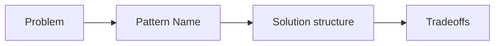

# What Are Design Patterns?

> Design Patterns 101 series (1/10)

<!-- a-grade-intro:begin -->

**Core question**: Why do we even need design patterns?

> Because solving the same problem from scratch every time is exhausting. Patterns are name tags for solutions that have already been proven.

<!-- a-grade-intro:end -->

## What You Will Learn

- A working definition of a design pattern
- The GoF classification of 23 patterns
- The real problems patterns try to solve
- A sane order to learn them in
- The moments where patterns hurt instead of help

## Why It Matters

Patterns are vocabulary, not answers. The biggest payoff is that "let's pull this into a Strategy" makes everyone in the room picture the same shape.

> Patterns shine in conversation before they shine in code.

## Concept at a Glance



The name calls up the solution.

## Key Terms

- **Design pattern**: A proven solution to a recurring design problem.
- **GoF**: Gang of Four — the 23 patterns the four authors codified.
- **Creational / Structural / Behavioral**: The three pattern families.
- **Antipattern**: A common but harmful "solution".
- **Idiom**: A small pattern tied to a specific language.

## Before / After

**Before**

```python
# "if kind" branching scattered everywhere
if kind == "credit": process_credit(...)
elif kind == "paypal": process_paypal(...)
```

**After**

```python
# Strategy pattern in one line
processor = PROCESSORS[kind]
processor.charge(...)
```

A named solution carries the intent.

## Hands-on: Five Steps to Learn a Pattern

### Step 1 — Recognize the problem

```python
# 1_problem.py
# Same branch, same object construction, same notification flow recurring?
# That is the stage for a pattern.
```

Define the problem first.

### Step 2 — Name the pattern

```python
# 2_name.py
# Branching? Strategy. Construction? Factory. Notifications? Observer.
```

The name pulls the solution along.

### Step 3 — Sketch the structure

```python
# 3_structure.py
# Draw the class diagram before writing code.
```

Structure first, code second.

### Step 4 — Apply small

```python
# 4_small.py
# Try it in one module before applying it system-wide.
```

Try small and verify the payoff.

### Step 5 — Write down the tradeoffs

```python
# 5_tradeoff.md
# - Gained: branching gone, easier to extend
# - Lost: more classes to read
```

Patterns are always trades.

## What to Notice in This Code

- A pattern changes the *conversation* before it changes the code.
- Every pattern carries tradeoffs.
- Application is usually local, not global.

## Five Common Mistakes

1. **Patterns everywhere.** Simple code becomes complex.
2. **Memorizing names without the problems.** You miss the moment to apply.
3. **Ignoring language traits.** Insisting on Singleton in Python where a module is enough.
4. **Ignoring tradeoffs.** All you get is a class explosion.
5. **Believing the pattern is the answer.** A simpler solution slips by.

## How This Shows Up in Production

Patterns earn their keep most often as code-review vocabulary — "drop an Adapter here", "pull this into a Strategy". The name is the agreement.

## How a Senior Engineer Thinks

- They treat patterns as vocabulary.
- They identify the problem and then attach a name.
- They start small, not system-wide.
- They are conscious of the tradeoffs.
- They ask one last time whether a simpler solution exists.

## Checklist

- [ ] Have you written down the problem in one line?
- [ ] Does a fitting pattern name come to mind?
- [ ] Have you sketched the structure?
- [ ] Have you written down the tradeoffs?
- [ ] Is there a simpler solution?

## Practice Problems

1. Find a place in your code where the same branching shape appears at least three times.
2. Suggest one pattern name that fits.
3. After applying it, write down two tradeoffs.

## Wrap-up and Next Steps

Patterns are vocabulary. From the next article on we tour the 23 GoF patterns in three groups — Creational, Structural, and Behavioral.

<!-- toc:begin -->
- **What Are Design Patterns? (current)**
- Creational Patterns (upcoming)
- Structural Patterns (upcoming)
- Behavioral Patterns (upcoming)
- Strategy Pattern (upcoming)
- Adapter Pattern (upcoming)
- Observer Pattern (upcoming)
- Factory and Dependency Injection (upcoming)
- How Not to Overuse Patterns (upcoming)
- Pythonic Patterns (upcoming)
<!-- toc:end -->

## References

- [Design Patterns: Elements of Reusable Object-Oriented Software (GoF)](https://en.wikipedia.org/wiki/Design_Patterns)
- [refactoring.guru — Design Patterns](https://refactoring.guru/design-patterns)
- [Patterns of Enterprise Application Architecture](https://martinfowler.com/eaaCatalog/)
- [Head First Design Patterns](https://www.oreilly.com/library/view/head-first-design/9781492077992/)
