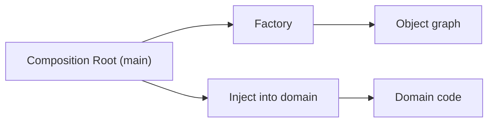

# Factory and Dependency Injection

> Design Patterns 101 series (8/10)

<!-- a-grade-intro:begin -->

**Core question**: *When, where, and who* should create the objects in our system?

> Not inside the domain. Assemble them in *one outside place* and inject them. That place is the Composition Root, and the tools are Factory and DI.

<!-- a-grade-intro:end -->

## What You Will Learn

- The cost of scattered creation responsibility
- The role of the Factory
- The thinking behind Dependency Injection
- What the Composition Root is
- When a DI container starts to earn its keep

## Why It Matters

When the domain creates its own dependencies, it learns *how to make* them. Factory and DI separate "*what* you use" from "*how* it is built".

> Separating "use" from "assembly" makes testing and substitution easy.

## Concept at a Glance



Assemble in one place; use in many.

## Key Terms

- **Factory**: a function or object that encapsulates creation steps.
- **Dependency Injection**: providing dependencies from outside.
- **Composition Root**: the single entry point that wires the object graph.
- **Constructor injection**: injection through `__init__`.
- **DI container**: an automatic wiring tool (use only when needed).

## Before/After

**Before**

```python
class OrderService:
    def __init__(self):
        self.repo = PostgresOrderRepo("dsn")
        self.mailer = SmtpMailer("smtp.example.com")
        self.bus = EventBus()
```

**After**

```python
class OrderService:
    def __init__(self, repo, mailer, bus):
        self.repo, self.mailer, self.bus = repo, mailer, bus
```

`OrderService` does not *choose* its collaborators.

## Hands-on: Five Steps to Practice Factory and DI

### Step 1 — Factory function

```python
# 1_factory.py
def make_mailer(env):
    if env == "prod":
        return SmtpMailer("smtp.example.com")
    return InMemoryMailer()
```

Lift the construction branch out of the domain.

### Step 2 — Constructor injection

```python
# 2_ctor.py
class OrderService:
    def __init__(self, repo, mailer):
        self.repo, self.mailer = repo, mailer
```

The domain works with whatever is *given* to it.

### Step 3 — Composition Root

```python
# 3_main.py
def main():
    repo = PostgresOrderRepo(os.environ["DSN"])
    mailer = make_mailer(os.environ["ENV"])
    service = OrderService(repo, mailer)
    service.run()

if __name__ == "__main__":
    main()
```

Assemble in `main` (or a bootstrap function) — one place.

### Step 4 — Injection in tests

```python
# 4_test.py
def test_submit():
    repo = InMemoryOrderRepo()
    mailer = InMemoryMailer()
    svc = OrderService(repo, mailer)
    svc.submit(...)
    assert mailer.sent == 1
```

Tests bypass `main` and assemble *directly*.

### Step 5 — DI container (optional)

```python
# 5_container.py
# A tiny hand-rolled container — only when truly needed.
class Container:
    def __init__(self): self._reg = {}
    def register(self, key, factory): self._reg[key] = factory
    def get(self, key): return self._reg[key]()
```

For most projects, hand-wiring is simpler.

## What to Notice in This Code

- The domain only *receives* dependencies.
- Environment differences (prod/dev/test) live as a single branch in the Composition Root.
- Tests *create* fakes and inject them.

## Five Common Mistakes

1. **Domain code reading environment variables.** Assembly leaks in.
2. **Factory holding business logic.** Creation and policy mix.
3. **Overusing a DI container.** Invisible magic explodes debugging cost.
4. **Routing around cycles via the container.** Hides a design problem.
5. **Injecting a container everywhere.** Heavyweight for simple work.

## How This Shows Up in Production

FastAPI's `Depends`, Spring's `@Autowired`, Guice/Dagger, backend selection in Django settings — all DI/Factory in shape. Composition Root thinking carries straight into microservice bootstraps.

## How a Senior Engineer Thinks

- Always ask "who builds this object?"
- Assembly *outside*, use *inside*.
- Reach for a container only at real scale.
- Environment differences belong in the Composition Root.
- Factories *create only* — policy stays in the domain.

## Checklist

- [ ] Does the domain avoid reading environment variables?
- [ ] Is the Composition Root in *one place*?
- [ ] Does the Factory hold no policy?
- [ ] Have you considered whether a container is really needed?
- [ ] Can tests assemble objects on their own?

## Practice Problems

1. Write a Factory that returns a different Mailer per environment.
2. Refactor `OrderService` to constructor injection and add tests.
3. Wire DB, mailer, and event bus together in a Composition Root.

## Wrap-up and Next Steps

Factory and DI separate "assembly" from "use". The next post turns the lens on the *cost* of patterns — how to avoid overuse.

<!-- toc:begin -->
- [What Are Design Patterns?](./01-what-are-design-patterns.md)
- [Creational Patterns](./02-creational-patterns.md)
- [Structural Patterns](./03-structural-patterns.md)
- [Behavioral Patterns](./04-behavioral-patterns.md)
- [The Strategy Pattern](./05-strategy-pattern.md)
- [The Adapter Pattern](./06-adapter-pattern.md)
- [The Observer Pattern](./07-observer-pattern.md)
- **Factory and Dependency Injection (current)**
- Avoiding Pattern Overuse (upcoming)
- Pythonic Patterns (upcoming)
<!-- toc:end -->

## References

- [Factory Method (refactoring.guru)](https://refactoring.guru/design-patterns/factory-method)
- [Inversion of Control Containers and the Dependency Injection pattern (Martin Fowler)](https://martinfowler.com/articles/injection.html)
- [Composition Root (Mark Seemann)](https://blog.ploeh.dk/2011/07/28/CompositionRoot/)
- [FastAPI Dependencies](https://fastapi.tiangolo.com/tutorial/dependencies/)
