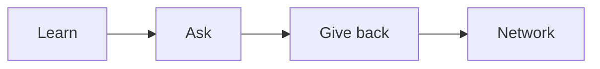

# Mentoring and Networking

> Developer Career 101 series (9/10)

<!-- a-grade-intro:begin -->

**Core question**: How do you find a *mentor* and grow a *network*?

> Small contributions, polite requests, sustained contact.

<!-- a-grade-intro:end -->

## What You Will Learn

- Finding a *mentor*
- Asking *good questions*
- Joining a *community*
- Making the most of *conferences*
- Building an *online presence*

## Why It Matters

Solo learning has a ceiling. Connection is a shortcut.

## Concept at a Glance



## Key Terms

- **mentor**: An experience-sharing guide.
- **mentee**: The advice receiver.
- **office hours**: A scheduled consultation slot.
- **community**: A shared-interest group.
- **paying it forward**: Helping the next person.

## Before/After

**Before**: "I just read docs alone."

**After**: "Monthly mentor session plus a weekly community post."

## Hands-on: Build the Network

### Step 1 — List Mentor Candidates

```text
- senior at work
- open source maintainer
- author of a blog you read
```

### Step 2 — Polite First Message

```text
Hi, I am interested in X and trying Y.
Could you spare 30 minutes to discuss Z?
```

### Step 3 — Join a Community

```text
- pick one Discord/Slack
- post one helpful reply, twice a week
```

### Step 4 — Conference Recap

```bash
# write one recap within 24 hours of the conference
```

### Step 5 — Online Presence

```text
- GitHub README
- one blog post per month
- LinkedIn updates
```

## What to Notice in This Code

- A prepared question gets an answer.
- Contribution comes before connection.
- Consistency builds trust.

## Five Common Mistakes

1. **Cold-asking "be my mentor."**
2. **Vague questions.**
3. **No follow-up thanks.**
4. **Pure venting.**
5. **No public writing.**

## How This Shows Up in Production

Companies run mentorship programs and internal guilds.

## How a Senior Engineer Thinks

- Connection compounds.
- Give first.
- Ask specifically.
- Pay it forward.
- Public work creates opportunity.

## Checklist

- [ ] Three mentor candidates.
- [ ] One community.
- [ ] One blog post per month.
- [ ] Thank-you habit.

## Practice Problems

1. One line: define mentor.
2. One line: example of paying it forward.
3. One line: criterion for a good question.

## Wrap-up and Next Steps

Next post covers *The Path to Senior*.

<!-- toc:begin -->
- [What Is a Developer Career](./01-what-is-developer-career.md)
- [Understanding Roles](./02-understanding-roles.md)
- [Building a Learning Plan](./03-learning-plan.md)
- [Resume and Portfolio](./04-resume-and-portfolio.md)
- [Preparing for Coding Interviews](./05-coding-interview.md)
- [System Design Interviews](./06-system-design-interview.md)
- [Settling into the First Job](./07-first-job.md)
- [Side Projects and Learning](./08-side-projects.md)
- **Mentoring and Networking (current)**
- The Path to Senior (upcoming)
<!-- toc:end -->

## References

- [The Mentor's Guide](https://www.lindajzachary.com/)
- [How to ask good questions](https://jvns.ca/blog/good-questions/)
- [CNCF Mentoring](https://github.com/cncf/mentoring)
- [Pay it Forward](https://en.wikipedia.org/wiki/Pay_it_forward)
