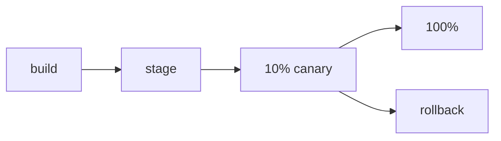

# CD and Deployment Strategies

> DevOps 101 series (3/10)

<!-- a-grade-intro:begin -->

**Core question**: Is the *fear of deployment* really about *not being able to roll back*?

> A good deploy strategy turns a release into *small, reversible changes*.

<!-- a-grade-intro:end -->

## What You Will Learn

- The definition of *CD* and its relationship with *CI*
- A comparison of *Rolling, Blue-Green, and Canary* strategies
- *Feature flags* to separate *code deploy* from *feature activation*
- *Rollback* strategies
- Five common pitfalls

## Why It Matters

Deployment is *the most dangerous moment*. A good strategy *shrinks the blast radius* and *makes rollback easy*.

> *Deployability* and *feature activation* must be *separated*.

## Concept at a Glance



## Key Terms

- **CD**: *Continuous Delivery/Deployment*. *Automated deployment*.
- **Rolling**: replace servers *one at a time* with the new version.
- **Blue-Green**: keep *two environments* and *switch traffic* between them.
- **Canary**: send *a slice of traffic* to the new version.
- **Feature flag**: *deploy the code* but *toggle the feature*.

## Before/After

**Before (big-bang deploy)**

```text
- All servers move to the new version *at once*
- A problem means *full outage*
- Rollback takes *more than 30 minutes*
```

**After (Canary + flag)**

```text
- New version receives *10%* of traffic
- After 5 minutes of monitoring, *50% then 100%*
- On failure, *flag off* blocks it *immediately*
```

## Hands-on: Five Steps to a Safe Deploy

### Step 1 - Auto-deploy to staging

```yaml
deploy-stage:
  if: github.ref == 'refs/heads/main'
  runs-on: ubuntu-latest
  steps:
    - run: ./deploy.sh stage
```

### Step 2 - Smoke test

```bash
curl -f https://stage.example.com/health || exit 1
pytest tests/smoke/ --base-url=https://stage.example.com
```

### Step 3 - Canary (10%)

```bash
kubectl set image deploy/api api=myapp:v2 --record
kubectl scale deploy/api-v2 --replicas=1   # 10%
```

### Step 4 - Monitor for 5 minutes

```text
- error rate < 0.1%
- p95 latency < 200ms
- 5xx counts within normal range
```

### Step 5 - Promote or rollback

```bash
# OK
kubectl scale deploy/api-v2 --replicas=10

# NG
kubectl rollout undo deploy/api
```

## What to Notice in This Code

- *Staging* must mirror *production*.
- The *baseline metrics* for the canary are *defined in advance*.
- *Rollback commands* live in the *runbook*.

## Five Common Mistakes

1. **Automated CI but *manual CD*.** Humans inject *mistakes*.
2. **Staging differs from production.** Bugs become *unreproducible*.
3. **Promoting to 100% *without checking metrics* after canary.** The canary loses its meaning.
4. **Never cleaning up feature flags.** After six months you *cannot tell which flags are alive*.
5. **No rollback drill.** A real incident becomes *the first practice*.

## How This Shows Up in Production

Large services automate *Canary Analysis (CAA)* with tools that compare metrics for them. Spinnaker and Argo Rollouts are common examples.

## How a Senior Engineer Thinks

- *Every deploy* must be *reversible*.
- *Feature releases* go through *flags*. Decoupled from deployment.
- *Canary metrics* are agreed by the *whole team*.
- *DB migrations* must be *backward compatible*.
- *Higher deploy frequency* makes things *safer*.

## Checklist

- [ ] *Auto-deploy to staging* exists.
- [ ] *Smoke tests* are automated.
- [ ] *Rollback commands* are *documented*.
- [ ] A *feature flag* system exists.

## Practice Problems

1. *Sketch* the deploy stages of your service.
2. Add *rollback commands* to the *runbook*.
3. Agree on *three canary metrics* with your team.

## Wrap-up and Next Steps

CD is *a stream of small, reversible changes*. In the next post we cover *configuration management* across environments.

<!-- toc:begin -->
- [What Is DevOps?](./01-what-is-devops.md)
- [CI Pipeline](./02-ci-pipeline.md)
- **CD and Deployment Strategies (current)**
- Environments and Configuration (upcoming)
- Infrastructure as Code (upcoming)
- Containers and Build (upcoming)
- Monitoring and Alerting (upcoming)
- Logging and Analysis (upcoming)
- Incident Response and On-Call (upcoming)
- An Operable DevOps Flow (upcoming)
<!-- toc:end -->

## References

- [Martin Fowler — Continuous Delivery](https://martinfowler.com/bliki/ContinuousDelivery.html)
- [Argo Rollouts](https://argoproj.github.io/rollouts/)
- [LaunchDarkly — Feature Flags](https://launchdarkly.com/blog/what-are-feature-flags/)
- [Spinnaker](https://spinnaker.io/)
