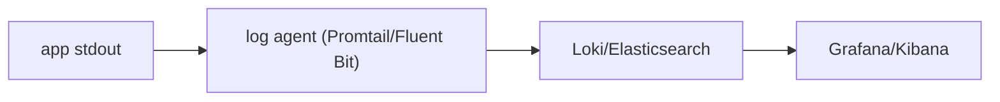

# Logging and Analysis

> DevOps 101 series (8/10)

<!-- a-grade-intro:begin -->

**Core question**: Out of 100 servers, can you find *where the error happened* in one query?

> Logs only have value when they are *collected and searchable*.

<!-- a-grade-intro:end -->

## What You Will Learn

- The difference between *structured* and *unstructured* logs
- Why *central log aggregation* matters
- *Loki* vs *ELK* at a glance
- How to use a *correlation ID*
- Five common pitfalls

## Why It Matters

The era of *ssh-ing* into a single server and running *grep* is over. In distributed systems, you must view logs from *many instances* in *one place*.

> You read logs *three weeks later* far more often than you do *right now*.

## Concept at a Glance



## Key Terms

- **Structured log**: a log emitted as *key-value* pairs, usually JSON.
- **Log level**: DEBUG, INFO, WARN, ERROR, CRITICAL.
- **Correlation ID**: a *unique ID* that *traces one request*.
- **Log aggregator**: a system that *centralizes* distributed logs.
- **Retention**: how long logs are *kept*.

## Before/After

**Before (print-style logs)**

```python
print("user logged in", user_id)
# ssh server-01 && grep "logged in" /var/log/app.log
```

**After (structured + central collection)**

```python
import structlog
log = structlog.get_logger()
log.info("user.login", user_id=user_id, request_id=req_id)
# In Grafana, search with {service="api"} |= "user.login"
```

## Hands-on: Five Logging Steps

### Step 1 — Switch to JSON logs

```python
import structlog
structlog.configure(
    processors=[structlog.processors.JSONRenderer()],
)
log = structlog.get_logger()
```

### Step 2 — Inject a correlation ID

```python
import uuid
@app.middleware("http")
async def add_request_id(request, call_next):
    rid = request.headers.get("X-Request-ID", str(uuid.uuid4()))
    structlog.contextvars.bind_contextvars(request_id=rid)
    return await call_next(request)
```

### Step 3 — Write to stdout

```text
The container-era principle is *stdout, not files*.
The runtime collects them for you.
```

### Step 4 — Ship to Loki via Promtail

```yaml
scrape_configs:
  - job_name: containers
    docker_sd_configs:
      - host: unix:///var/run/docker.sock
```

### Step 5 — Write meaningful queries

```text
{service="api", level="error"} | json | line_format "{{.user_id}} {{.msg}}"
```

## What to Notice in This Code

- A *request ID* lets you trace *frontend to API to DB* on *one line*.
- Send to *stdout* and let the *infrastructure* do the collection.
- *PII* must be *masked*.

## Five Common Mistakes

1. **Leaving DEBUG logs on in production.** Cost explodes and noise floods your dashboards.
2. **Logging PII (personal data) raw.** This is a *compliance violation*.
3. **No log retention policy.** Logs pile up past 30 days and *bills* explode.
4. **No correlation ID.** Debugging means *jumping around* line by line.
5. **Error logs without stack traces.** You cannot diagnose root cause.

## How This Shows Up in Production

Mature teams keep *trace_id* as a *common key* across *logs, metrics, and traces*. With one ID, they cross-correlate *all three signals*.

## How a Senior Engineer Thinks

- *Logs are a cost*. They are conscious of level and retention.
- *Structured logs* are *the foundation of search*.
- *Sensitive data* is masked *in code*, not later.
- *trace_id* ties the *three signals* together.
- For *INFO and below*, sampling is on the table.

## Checklist

- [ ] Logs are emitted as *JSON*.
- [ ] Every log carries a *Request ID*.
- [ ] *PII masking* is applied.
- [ ] A *retention policy* is set.

## Practice Problems

1. Convert your own app to *structlog*.
2. Add a *Request ID* middleware.
3. Set up central collection with *Loki* or *Elasticsearch*.

## Wrap-up and Next Steps

Logs are a *time-machine for your system*. In the next post we combine every signal to *respond to incidents*.

<!-- toc:begin -->
- [What is DevOps?](./01-what-is-devops.md)
- [The CI Pipeline](./02-ci-pipeline.md)
- [CD and Deployment Strategies](./03-cd-and-deployment.md)
- [Environments and Configuration](./04-environments-and-config.md)
- [Infrastructure as Code](./05-infrastructure-as-code.md)
- [Containers and Builds](./06-containers-and-build.md)
- [Monitoring and Alerting](./07-monitoring-and-alerting.md)
- **Logging and Analysis (current)**
- Incident Response and On-Call (upcoming)
- An Operable DevOps Flow (upcoming)
<!-- toc:end -->

## References

- [structlog](https://www.structlog.org/)
- [Grafana Loki](https://grafana.com/docs/loki/latest/)
- [Elastic Stack](https://www.elastic.co/elastic-stack)
- [OpenTelemetry Logs](https://opentelemetry.io/docs/specs/otel/logs/)
