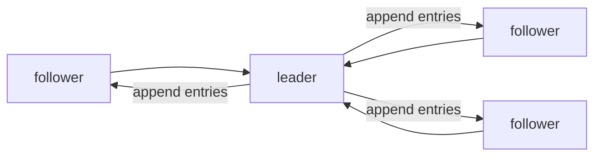

# Consensus and Raft

> Distributed Systems 101 series (6/10)

<!-- a-grade-intro:begin -->

**Core question**: What does it actually take for five nodes to agree on a single decision?

> Consensus is the hardest problem in distributed systems, and Raft is the algorithm that finally made the answer human-readable.

<!-- a-grade-intro:end -->

## What You Will Learn

- The definition of the consensus problem and its safety/liveness properties
- The three roles in Raft (leader, follower, candidate)
- The meaning of term, log, index, and commit
- Why a majority (quorum) is required
- A one-line comparison of Paxos and Raft

## Why It Matters

A consensus algorithm sits at the heart of etcd, ZooKeeper, Consul, and CockroachDB. The Kubernetes control plane stands on top of etcd. Once you understand consensus, half of "why does this system behave this way?" answers itself.

> Consensus is the value of agreement in a distributed system.

## Concept at a Glance



A single leader receives the log and replicates it to followers. Only entries received by a majority count as committed.

## Key Terms

- **Consensus**: The problem of N nodes agreeing on a single value.
- **Term**: A monotonically increasing epoch. Each new leader gets a new term.
- **Log**: A sequence of entries, identified by index.
- **Commit**: An entry received by a majority becomes a permanent promise.
- **Quorum**: f+1 out of 2f+1, usually a majority.

## Before/After

**Before — leader decides alone**

```text
fast, but consistency breaks if the leader lies
```

**After — agreement of a majority**

```text
slightly slower, but safe even if a node dies or lies
```

A majority is the safety device of distributed systems.

## Hands-on: Raft's Core in Short Code

### Step 1 — define the state

```python
# 1_state.py
from dataclasses import dataclass, field
@dataclass
class Node:
    role: str = "follower"
    term: int = 0
    log: list = field(default_factory=list)
    commit_index: int = -1
    voted_for: int | None = None
```

term, log, commit_index — the variables on the first page of the Raft paper.

### Step 2 — election (simplified)

```python
# 2_election.py
def election_timeout(self, peers):
    self.term += 1
    self.role = "candidate"
    self.voted_for = self.id
    votes = 1
    for p in peers:
        if p.request_vote(self.term, self.id):
            votes += 1
    if votes > len(peers) // 2 + 1:
        self.role = "leader"
```

The first node to time out becomes a candidate and gathers votes. Win a majority and you become leader.

### Step 3 — log replication

```python
# 3_replicate.py
def append_entries(self, term, prev_index, entries):
    if term < self.term: return False
    if prev_index >= 0 and self.log[prev_index]["term"] != term:
        return False  # mismatch
    self.log = self.log[:prev_index+1] + entries
    return True
```

The leader sends its log to followers. Followers reject when entries do not match. Consistency is enforced via the previous index/term pair.

### Step 4 — commit

```python
# 4_commit.py
def maybe_commit(self, peers):
    for i in range(self.commit_index + 1, len(self.log)):
        acks = 1 + sum(1 for p in peers if p.match_index >= i)
        if acks > len(peers) // 2 + 1:
            self.commit_index = i
```

Once a majority has the entry, commit it. From that point on the entry never disappears.

### Step 5 — partition scenario

```python
# 5_partition.py (pseudocode)
# 5 nodes, only 2 (leader included) on one side of a partition
# - that side has no majority -> cannot elect a new leader -> cannot accept writes
# - the other side has 3 nodes -> majority -> elects a new leader -> keeps working
```

The side without a majority intentionally stops. This is the core design that prevents split-brain.

## What to Notice in This Code

- The term is monotonically increasing. Messages from old terms are always rejected.
- Order is essential to the log — matching is checked by the (index, term) pair.
- Commit is the promise that "a majority has it," not "everyone has it."
- The right answer for a partitioned side is to stop.

## Five Common Mistakes

1. **Believing one leader is enough for safety.** Elections must be correct for safety.
2. **Treating "leader received it" as commit.** Commit is the moment a majority received it.
3. **Using identical timeouts on all nodes.** Split votes happen often (Raft uses randomized timeouts).
4. **Skipping the log-matching check.** Wrong entries get committed.
5. **Assuming the partitioned side can keep working.** Without a majority it must stop.

## How This Shows Up in Production

etcd (the Kubernetes data store), Consul, ZooKeeper (ZAB, a Paxos variant), CockroachDB, and TiKV all stand on top of consensus algorithms. Database leader election, distributed locks, and configuration storage are textbook use cases.

## How a Senior Engineer Thinks

- They do not call consensus often (it is expensive — only for metadata).
- They randomize timeouts based on measurement.
- They keep the node count odd (3, 5, 7).
- They design client retries that handle leader changes safely.
- They consciously decide whether reads are leader-only or use a lease.

## Checklist

- [ ] Can you state the definition of consensus in one line?
- [ ] Can you explain the relationship between term, log, and commit?
- [ ] Can you say how many nodes can fail in a 5-node cluster?
- [ ] Do you know how split votes are prevented?
- [ ] Do you let "etcd is on top of consensus" inform your system design?

## Practice Problems

1. Compare the fault tolerance of a 3-node and a 5-node cluster.
2. Explain how Raft's randomized election timeout reduces split votes.
3. Write one paragraph on how you would build a distributed lock with etcd.

## Wrap-up and Next Steps

Consensus is the hardest problem in distributed systems, and Raft is its human-friendly form. In the next post we cover the larger picture of choosing a leader on top of consensus — leader election.

<!-- toc:begin -->
- [What Is a Distributed System?](./01-what-is-a-distributed-system.md)
- [Failure Models](./02-failure-model.md)
- [RPC and Message Passing](./03-rpc-and-message-passing.md)
- [Consistency and CAP](./04-consistency-and-cap.md)
- [Replication](./05-replication.md)
- **Consensus and Raft (current)**
- leader election (upcoming)
- message queues and event sourcing (upcoming)
- distributed transactions (upcoming)
- patterns for operable distributed systems (upcoming)
<!-- toc:end -->

## References

- [Raft consensus algorithm](https://raft.github.io/)
- [In Search of an Understandable Consensus Algorithm (Raft paper)](https://raft.github.io/raft.pdf)
- [Paxos (Wikipedia)](https://en.wikipedia.org/wiki/Paxos_(computer_science))
- [etcd documentation](https://etcd.io/docs/)
